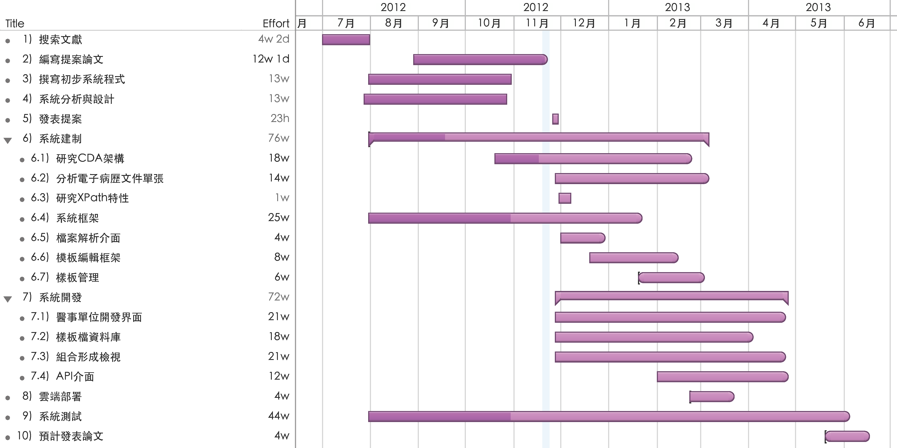

**以雲端運算平台建置電子病歷檢視器系統之整合設計與實作**
===============================================
### *Design and implementation of a viewer in cloud computing platform for electronic medical records*
- - - - - - - - - - - - - - - - - - - - - - - - - - - - - - - - - - - - - - - -
# 提案摘要
國內電子病歷已施行多年，但這些資料仍存放於各醫療單位的資訊系統內，民眾就醫過程中並無法使用這些散落的資料。近年來，衛生署實施的『醫院實施電子病歷及互通補助計畫』與『加速診所實施電子病歷推廣案』中，公告與實作四個單張作為交換使用。但在交換之後若沒有該病歷單張的匯入轉碼程式，則失去交換的意義。本研究將以公告的標準文件來設計一套電子病歷檢視器，並部署到雲端平台上使用，提供使用者在任何環境皆能使用此一平台瀏覽手邊的病歷資料，並讓醫療院所能自行設計每個單張所對應的檢視畫面，且不影響資料交換。除資料交換之外，也能呼叫引用本研究之系統成為內嵌檢視器，使電子病歷檢視之應用更具多元化。

**關鍵字：_電子病歷、可延伸標記式語言、臨床文件架構、雲端運算、檢視器、超文本標記語言第五版_**
- - - - - - - - - - - - - - - - - - - - - - - - - - - - - - - - - - - - - - - -
# 第一章 緒論

## 第一節 研究背景
國內電子病歷已施行多年，但這些資料仍存放在各家醫療單位所屬的資訊系統，導致醫療資源無法有效的整合與利用，民眾在每次的就醫過程中更是無法使用散落在各醫療院所的病歷資料。在民國九十八年依據醫療院所在實際使用的經驗上優先選取了常用的108份表單，並且制定了電子病歷表單的欄位與資料格式標準，直至目前為止，在民國九十九年衛生署實施的『醫院實施電子病歷及互通補助計畫』中，公告了「111\_醫療影像報告」、「113\_血液檢驗報告」、「114\_門診用藥」與「115\_出院病歷摘要」等四張病歷單張交換的欄位與格式之標準，做為目前醫院與醫院或診所間電子病歷交換互通的單張規範。同時，『加速診所實施電子病歷推廣案』中，制定了「118\_西醫門診單」、「119\_中醫門診單」和「120\_牙醫門診單」等三張門診病歷單張給診所交換使用。  
而目前一〇一年衛生署即將推行「全民健康雲」計畫，該先導計畫率先使用微軟的公有雲平台，整合就醫紀錄，並將個人健康履歷管理權交給國民[[1], [2]]。現階段產生符合標準CDA文件對於醫療單位已是必備條件，為了日後的政策及趨勢，資料交換已經不是主要重點，而是資料交換後要如何有效地被利用與如何有效的讓這些資料的擁有者更有效的使用，這些重點就是在於如何呈現這些資料的結果，電子病歷的呈現方式在目前仍有極大的發展空間！

## 第二節 研究動機
目前政府積極發展電子病歷，各醫療院所也皆致力於開發各種電子病歷交換編解碼程式，但資料若在交換之後要到其他醫療院所使用，則必須在該院所有建置各種病歷單張的匯入解碼程式。倘若沒有建置此一部分程式，則就失去了資料交換的意義，也因此無法簡單快速的瀏覽該病歷資料。若能有一平台可以統一的讓醫護人員直接瀏覽這些還無法匯入或轉換至各院所的醫療資訊系統內的資料，則能夠大幅提升資料交換的可用性。同時也提供了未來民眾若是可以自行攜帶電子病歷出院，則民眾也可以透過此一平台瀏覽自己的病歷資料，而此一平台只需要醫療院所有提供專用的顯示樣板檔即可讓民眾隨時檢視資料。  
本研究將會以HL7 CDA文件架構及行政院衛生署公告的電子病歷交換標準文件為例，並且將目前實際運作的四個正式單張與診間使用的三張門診單張來製作通用的樣板檔，同時提供給各醫療院所能夠製作樣板的編輯器，使能夠開發未來還尚未正式使用的108張單張的樣板。

## 第三節 研究目的
本研究目的在於建立一套得以使各家醫療院所產出的電子病歷互通檢視的雲端平台，透過各家醫療院所客製化的表單至其他單位檢視使用，也可協助病患自行使用此平台，迅速檢視自己的病歷資料。本系統提供給醫療院所及病患使用兩種途徑，並在系統中區分出檢視器及編輯器兩大部分。本研究具體目的為下列所述：

1. 建置一套電子病歷檢視器雲端平台可供任何使用者與單位在任何地方使用
2. 參考HL7 CDA文件架構及行政院衛生署公告之電子病歷交換標準規範書來實作本研究之檢視器及編輯器，並可將單張範本存回病歷檔增加可攜性及可用性，且符合文件標準規格，不影響單張在跨院之間交換
3. 提供全國醫療院所可以將建立的電子病歷表單單張範本上傳，並且可在跨院所檢視病歷時自動套用該單張產出的單位所設計的最新檢視樣板
4. 能使引進本系統功能的醫療資訊系統利用本系統的API自動產生電子報表

- - - - - - - - - - - - - - - - - - - - - - - - - - - - - - - - - - - - - - - -
# 第二章 文獻探討
本章節依照研究目的，首先探討電子病歷，再進一步的探討目的中所使用醫療資訊標準中的臨床文件架構及國內電子病歷規範，最後探討可延伸標記式語言在電子病歷中的重要性，以及超文本標記語言第五版與雲端運算在本研究中的重要度。

## 第一節 電子病歷
電子病歷(Electronic Medical Record, `EMR`)是一種由電子化方式擷取、傳送、儲存、取回、連結與處理的多媒體資料，電子病歷主要的用途為協助醫療或其相關服務。其資料內容包括病患的個人資料、問題、SOAP(Subjective, 主觀陳訴, Objective, 客觀陳訴, Assessment, 評估, Plan, 計畫)、病程紀錄、護理計畫、護理記錄、生命徵象記錄、藥物使用記錄、過去病史、家族病史、預防接種記錄，與其相關的醫療實驗室的檢驗資料與報告，和相關的檢查資料與報告，凡是相關病情必要之資訊，如相對於疫情的旅遊史，則亦可成為電子病歷的一環而成為電子病歷的資料內容[[3]]。

### 壹 國內電子病歷規範
在民國94年12月衛生署完成了「醫療院所病歷電子化現況調查」，在結果中顯示了國內醫院的病歷電子化發展已經相當普及，其中共計約有半數醫院的病歷資料已進行電腦化，大約三成醫院病歷電子化已進展至院內整合階段並逐漸邁向院際之分享與交換應用，顯示出在過去推動病歷電子化之發展已具有初步成效[[4]]。  
病歷電子化之願景希望讓病人可在任何一家醫院，透過健保IC卡及醫師之醫事憑證IC卡，且在病人同意及醫師授權之情形下，完整的取得病人過去病史資料，提供無縫隙的照護。如此可以提供兩點目標達成：

1. 加速推動醫療院所醫療作業資訊化及病歷電子化，提升醫療照護品質及病人安全。
2. 發展健康資訊技術，促進院際病歷互通整合，減少病患重複檢驗檢查及用藥，提升醫療資源運用效能。

其中，在衛生署的計畫中指出，至目前為止，推動的工作年度目標中，實際通過申請補助的醫院家次應該有如表1所示：

表1 電子病歷推動計劃補助款項及申請醫院家次統計(參考於衛生署網站[[5]])

|     項目/年度     |  99年度  | 100年度 | 101年度 |
|------------------|---------|--------|---------|
|      補助預算     | 3.89億元 | 2.2億元 | 5.8千萬元|
|  已申請之醫院家次  |  164家   |    -   |    -    |
|已申請檢查之醫院家次 |    -    |  120家  |    -    |
|已申請查驗之醫院家次 |    -    |   57家  |  >170家 |
|  已申請之補助金額  | 3.27億元 | 2.2億元 | 5.8千萬元|
|    補助款餘額     |6.17千萬元|   0元   |   0元   |

除以上達成的目標以外，在民國99年也已經推廣了國內兩千家以上的診所，符合「醫療機構電子病歷製作及管理辦法」各項條款規定。在「醫院實施電子病歷及互通補助計畫」中，建置了電子病歷交換中心，並計有142家醫院完成交換[[4]]。

## 第二節 臨床文件架構
HL7臨床文件架構(Clinical Document Architecture, `CDA`)是一個應用於臨床文件上的可延伸標記式語言(eXtensible Markup Language, `XML`)，並且是根據HL7第三版的參考資訊模型(Reference Information Model, `RIM`)、資料型別及詞彙等標準所組成的檔案格式。CDA標準也被國際標準組織及美國國家標準協會(American National Standards Institute, `ANSI`)認可。在早期，CDA稱為病人記錄架構(Patient Record Architecture, `PRA`)，而CDA R1在1991年時被HL7會員所認同且在2000年被ANSI認可，它是根據初期HL7 RIM草案、資料型別及詞彙而來。CDA R2在2005年1月被HL7所認可，隔年成為ANSI的標準[[6]]。  
CDA定義了完整的訊息項目，內容中可以包含文字、影像、聲音和其他多媒體內容。一份CDA文件應具有下列六個特點[[7]]：

1.	不變性(Persistence)：一份臨床文件必須在不被修改的情況下，依照規定的時間保存且不可再被修改(採用XML格式可用電子檔案的方式永久儲存)
2.	管理性(Stewardship)：儲存後的文件必須交由可信賴的機構管理
3.	驗證性(Potential for authentication)：一份由各種資訊所組成的臨床文件應包含有法律效力的認證
4.	關聯性(Context)：一份臨床文件有一定的基本格式並且互相關聯
5.	完整性(Wholeness)：整份文件須經過認證簽署而非只有部份文件且不可分塊
6.	易讀性(Human readability)：一份臨床文件必須要是人們可以閱讀的

一份CDA文件是由Header與Body兩部份所組成，整份文件是由`<ClinicalDocument>`的標籤所包含起來。Header的內容是要用來識別文件，其中包含簽章者、病人、提供者與其他參與醫療服務人員的資訊，並可以分為`Attributes`及`Participant`與`Relationships`等三大類。而Body的內容則包含所有臨床上的資訊，如醫囑、醫令、檢驗報告等等，並將每個內容分成區塊再加以描述，在內包含有兩種資料型態，一種是非結構化區塊`<NonXMLBody>`，另一種是結構化區塊`<StructuredBody>`。  
在`NonXMLBody`中，是表示一序列非結構化的資料，因此會將資料直接存放至`<text>`元素中。在裡面可以描述任何包含人類可讀數據的資料類型，如：文字檔(txt、rtf、html或pdf)或影像檔(gif、jpg、jpeg、png、tiff)，若描述的資料可用XML表示，則不會放在`NonXMLBody`之中[[8]]。  
`StructureBody`是一個結構化的標記資料，由一個或多個區段組件(Section Component)所組成，且是一個可以接受巢狀元素的組合。透過Section的方式來描述臨床內容，如檢驗結果、診斷內容等等，且Section與Section之間不會互相影響，而在Section中常用來描述文件內容的有`Code`與`Title`及`Text`等三個元素來描述一個臨床上的敘述或者報告的內容。  
因為Section是屬於一種敘述型態的區塊，它是Human-Readable的內容，相對於電腦在此就無法準確的處理與解析，而Entry就代表著在CDA文件之中可由電腦處理的部份，Entry規範了Section內容應包含哪些欄位及編碼的細項資訊。在CDA之中有定義了數種Entry，分別為：

* `Observation`：觀察的說明或是具體事實的描述
* `RegionOfInterest`：描述某個參考資源的特定區域
* `ObservationMedia`：描述該文件所包含的媒體參考，此媒體在意義上屬於該文件的某一部份，但文件本身並不內嵌該媒體
* `SubstanceAdministration`：用來描述與藥物有關的事件
* `Supply`：用來描述一個供應支援的請求項目
* `Procedure`：描述手術的相關內容
* `Encounter`：描述與病患相關事項
* `Organizer`：描述事件的共同關係或組織
* `Act`：不能用上述類別描述之事件皆用此描述

## 第三節 XML
可延伸標記式語言(eXtensible Markup Language, `XML`)是一種標記式語言。標記指電腦所能理解的訊息符號，使用此種標記，電腦與電腦之間可以互相處理包含各種訊息的資料。XML是從標準通用標記式語言(Standard Generalized Markup Language, `SGML`)中簡化修改出來的。它主要用到的有可延伸標記式語言、可延伸樣式語言(eXtensible Stylesheet Language, `XSL`)、可擴展商業報告語言(eXtensible Business Reporting Language, `XBRL`)和XML路徑語言(XML Path Language, `XPath`)等[[9]]。  
XML是設計用來傳輸及儲存資料資訊，不是用來顯示或呈現資料，相對的HTML則是用來呈現資料，所以XML的主要用途如下[[9]]：

1. 豐富文件(Rich Documents)自定義檔案的描述並使其具有更豐富的內容
	* 屬於以檔案為主的應用
	* 標記是用來定義資料應該如何呈現
2. 中繼資料(Metadata)描述其它檔案或網路資訊
	* 屬於以資料為主的應用
	* 標記是用來說明資料的意義
3. 配置檔(Configuration Files)描述軟體設定的參數
	* 屬於以屬性為主的應用
	* 標記是用來配置資料或應用程式的設定

依照W3C組織的Tim等人[[10], [11]]所提出的XML規範定義中指出，XML的設計目標是：

1. XML應該要直接可用於網際網路上
2. XML應該可支援使用於各種應用上
3. XML應能與SGML相容
4. 處理XML文件應該易於寫入程序
5. 在XML文件中可選擇的功能應減至最少，最好為無
6. XML文件應該要是人可閱讀的且明確理解的
7. XML設計應可迅速編寫
8. XML文件設計應該要正式且簡潔的
9. XML文件應該要易於建立
10. 簡潔的XML標記是基本的

## 第四節 HTML5
超文本標記語言第五版(Hyper-Text Markup Language 5, HTML5)草案的前身名為Web Applications 1.0，是在2004年由WHATWG提出，再於2007年獲W3C接納，並成立了新的HTML工作團隊。它是HTML下一個主要的版本，現在仍處於發展階段。目標是要取代1999年所制定的HTML 4.01和XHTML 1.0標準，以期望能在網際網路應用迅速發展的時候，使網路標準符合現代的網路需求。廣義的說HTML5，實際指的就是包括HTML、CSS和JavaScript在內的一套技術集合。它希望能夠減少瀏覽器需要外掛程式的豐富性網路應用服務(plug-in-based Rich Internet Application, `RIA`)，如Adobe Flash、Microsoft Silverlight，與Oracle JavaFX的需求，並且能夠提供更多有效增強網路應用的標準[[12]]。  
在2010年的4月時Steve Jobs發表了一篇名為「對Flash的思想」的文章[[13]]，內容中指出隨著HTML5的發展，觀看視訊或其它內容時，Adobe Flash將不再是必須的。這引發了開發人員間的爭論，包括HTML5雖然提供了增強的功能，但開發人員必須考慮到不同瀏覽器對標準不同部分的支援程度的不同，以及HTML5和Flash間的功能差異。  
在HTML5中，比起HTML 4.01多出了更多的RIA支援，也增加了以往要使用Flash等外掛程式才能使用的API資源，這些API現在都透過瀏覽器原生就可以存取使用[[12], [14]]，其規範和相關的技術詳細請參考[[12], [15]]。

* 即時二維繪圖(Canvas API)：有關動態產出與渲染圖形、圖表、圖像和動畫的API
* 定時媒體播放(HTML5音訊與視頻)：HTML5裡新增的元素，它們為開發者提供了一套通用的、整合的、腳本式的處理音訊與視頻的API，而無需安裝任何外掛程式
* 離線儲存資料庫(離線網路應用程式)[[16]]：可以讓網頁不需要網路的狀態下儲存資料或存取資料，等有網路的時候再依照設計的模型決定是否要與伺服器同步資料
* 編輯：讓網頁直接編輯，不再需要透過編輯器或所見即得編輯器
* 拖放：使檔案的選擇不需要經由系統的對話視窗選擇即可使用拖放的方式將檔案放置在網頁中讓應用程式讀取資料
* 跨文件通訊[[17]]：可以跨不同的頁面或者網站的文件通訊，前提是有設定好一致的通訊tag
* 通訊/網路(Communication APIs)：構建實時和跨域(Cross-Origin)通訊的兩大基礎：跨文件通訊(Cross Document Messaging)與XMLHttpRequest Level 2
* 瀏覽歷史管理
* MIME和協議處理程式時表頭登記
* 微資料

以上技術是WHATWG HTML說明文件所列述的內容，但並沒有全部包括在W3C HTML5的文件裡。[[18]]一些相關的技術，像下面所列的，並沒有包括在這兩份文件中的任何一份中。W3C給這些技術單獨公開了說明文件。

* Geolocation API：使用者可共享地理位置，並在Web應用程式的協助下使用位置感知服務(Location-Aware Services)
* 索引資料庫API(Indexed Database API, 以前為WebSimpleDB)[[19]]
* 檔案API：處理檔案上傳和操縱檔案[[20]]
* 目錄和檔案系統：這個API是為了滿足客戶端在沒有好的資料庫支援情況下的檔案儲存要求[[21]]
* 檔案寫入：從網路應用程式向檔案裡寫資料內容[[22]]

目前對於HTML5普遍的誤解是HTML5能夠在網頁中提供動畫效果。實際上HTML5的動畫效果是由JavaScript和CSS互相使用而達成的。

## 第五節 雲端運算
雲端運算是一種基於網際網路的運算方式，這種方式是繼1980年代的大型電腦到主從式架構的大轉變之後的再次巨變。雲端運算通常可以認為包括以下三個層次的服務：基礎設施即服務(Infrastructure as a service, `IaaS`)，即是使用「基礎運算資源」，如處理能力、儲存空間、網路元件或中介軟體，使用者能掌握作業系統、儲存空間及已部署的應用程式和網路元件(如防火牆、負載平衡器等)，但並不掌握雲端基礎架構。例如: Amazon AWS；平台即服務(Platform as a service, `PaaS`)，即是使用主機操作應用程式，使用者有掌控運作應用程式的環境(也擁有主機部分掌控權)，但並不掌控作業系統、硬體或運作的網路基礎架構。使用的平台通常是應用程式基礎架構。例如: Google App Engine；軟體即服務(Software as a service, `SaaS`)，即是使用應用程式，但並不擁有作業系統、硬體或運作的網路基礎架構，是一種服務的觀念基礎，軟體服務的供應商以租賃的方式提供客戶服務，而非購買，比較常見的模式是提供帳號密碼來操作使用。例如: Microsoft CRM。這些雲端運算服務通常透過瀏覽器存取，讓軟體和資料可在資料中心儲存和使用。  
根據美國國家標準和技術研究院的定義[[23]]，雲端運算服務應該具備以下幾條特徵：

* 需要時即可使用的自助服務：不需要人的操作即可以自動化的將需要的資源啟用
* 寬頻網路存取：使用任何的網路或裝置存取
* 資源池：可以將資源集合在一起，並且可以提供多人共享使用
* 可快速重新佈署：當有需求的時候可以自動化的重製來擴展服務寬度
* 可被監控與量測的服務：讓系統可以很清楚的知道使用的狀況，並且可以控制和優化使用的資源

除此之外通常還有以下認知特徵[[24]]：

* 基於虛擬化技術快速部署資源或獲得服務
* 減少使用者端的處理負擔
* 降低使用者對於IT專業知識的依賴

在具有上述特徵的狀況下，三層次的服務還可以衍變為下列七種服務模式[[25]]：

1. 儲存即服務(Storage as a service, `STaaS`)
2. 安全即服務(Security as a service, `SECaaS`)
3. 資料即服務(Data as a service, `DaaS`)
4. 測試環境即服務(Test environment as a service, `TEaaS`)
5. 桌面虛擬化(Desktop virtualization)
6. 應用程式界面即服務(API as a service, `APIaaS`)
7. (行動)終端即服務((Mobile) Backend as a service, `(M)BaaS`)

在雲端運算的部署方式在美國國家標準和技術研究院的定義下主要分為四種[[23]]：

1. 公用雲(`Public Cloud`)：可透過網路及第三方服務供應者開放給客戶使用，但並不一定代表「免費」，可能代表免費或相當廉價，公用雲並不表示使用者資料可供任何人檢視，供應者通常會對使用者設定使用存取控制機制，公用雲作為解決方案是既有彈性又具備成本效益
2. 私有雲(`Private Cloud`)：具備許多公用雲環境的優點，例如彈性、適合提供服務，兩者差在於私有雲的資料與程式皆在組織內管理，且與公用雲不同，不會受到網路頻寬、安全疑慮或法規限制影響；此外，私有雲服務讓供應者及使用者更能掌控雲端基礎架構、改善安全與彈性，因為使用者與網路都受到特殊限制
3. 社群雲(`Community Cloud`)：由眾多利益相仿的組織掌控及使用，例如特定安全需求、共同宗旨等。社群成員共同使用雲端資料及應用程式
4. 混合雲(`Hybrid Cloud`)：結合公用雲及私有雲，在這種模式中，使用者通常將非企業關鍵資訊外包，並在公用雲上處理，但同時掌控企業關鍵服務及資料

集合了上述的各種特徵與部署方式，雲端運算的核心特性至少要有下述幾點[[24], [25]]：

1. 應用程式介面(API)的可達性是指允許軟體與雲端以類似「人機互動這種使用者介面的互動相互一致的方式」來互動
2. 裝置允許使用者透過網頁瀏覽器來獲取資源，而不論使用者是透過何種裝置，或在何地使用(如：電腦、筆記型電腦或手機、行動裝置等)，使用者可以從任何地方來以網際網路的方式取得資源
3. 如果使用多個站點，則改進可靠性，這讓設計的雲端運算符合商業一致性以及災難備援
4. 效能受到監控，同時使用Web Services作為系統的管理介面
5. 維護雲端運算應用程式應該是很簡單的，因為使用者已經不再需要在本機上進行安裝。一旦更新到了使用者端，它們將更容易的得到支援以及改進

## 第六節 其他相關研究
與本研究相關的研究尚有陳榮駿(2011)撰寫之『應用於電子病歷呈現的臨床文件架構樣版管理平台之設計與建置』研究論文，該篇論文中使用了可延伸樣式表語言來作為電子病歷檔案轉換套用成為顯示畫面的結果，其中包含了一個醫學詞彙代碼的資料庫，裡面可以將電子病歷文件中的代碼利用`code`與`codeSystem`所描述的代碼與OID資料做轉換的對應，並且在文件輸出的時候自動地將該代碼轉換為可辨識的文字輸出。而在管理平台中可以選擇是否要建立或者套用可延伸樣式表，並在樣式表內將電子病歷中的欄位名稱前後皆加上`#`符號作為區別。  
本研究中不包含醫學詞彙代碼資料庫，但該資料庫的功能將會在樣板檔中實現，為使得樣式表的編輯可以更加的活性，顯示電子病歷的資料時會使用引用套件的方式來將結果呈現，另外該篇研究內容中僅只有使用四張交換用單張，並無包含額外三張門診交換單張的內容，其餘關於本研究內之系統架構請參考下一章內容。
- - - - - - - - - - - - - - - - - - - - - - - - - - - - - - - - - - - - - - - -
# 第三章 研究方法
本章節依序說明研究步驟、系統需求分析與設計、相關技術應用及開發環境與工具。

## 第一節 研究步驟
本研究會設計一個電子病歷的檢視平台，並且提供各醫療院所及民眾使用，主要提供醫療院所做為一個資料交換後的檢視平台，以便還尚未部屬完成電子病歷匯入程式的單位使用，並且可以在線上開發其他單張所需的檢視模板，並提供給民眾使用。最後將探討電子病歷之架構及相關電子病歷之雲端應用研究，並且以實作的方式建立此系統平台完成本研究之計畫。其詳細的研究流程從研究背景、動機及目的、文獻探討、研究方法如圖1所示。

### 壹 研究流程
  
圖1 研究流程圖

### 貳 系統建置流程
1. 研究CDA文件架構  
	研究CDA文件內的架構與模型、參考方式、資料屬性及詞彙等，研究文件的階層及儲存位置還有形態等內容。
	
2. 分析電子病歷文件單張  
	為了區分出每個單張的不同，以及辨識不同單張所需的樣板檔，必須先瞭解電子病歷文件中所記錄的代碼為何種意義，以便瞭解哪個代碼的特性為何，並且針對該代碼來作為區分用途。
	
3. 研究XPath使用特性  
	在電子病歷文件中接使用XML來儲存內容，若要萃取出資料則必須要有選擇，而在XML文件中要萃取出需要的資料則是要先瞭解XPath內的特性以及使用方式。
	
4. 訂定系統需求與系統設計  
	針對本研究之系統訂定系統需求與系統設計，依照使用對象的不同區分為兩大部份，並在完成這兩大部份後完成本系統平台之設計。
	
	1. 醫事單位表單開發設計人員  
		由於醫事單位有開發上的需求以及會有內部人員的需要，故在此部分會要有一個特別設計的編輯模式可供這些醫事單位可以用所見即得的方式在線上編輯樣板檔，並且可以隨時發佈變更給所有的使用者使用。
		
	2. 醫事人員與一般民眾  
		依照使用者的喜好與習慣為原則，因此這部分會用一個類似於文件檢視器的形式來呈現最後解析處理後的電子病歷結果。
		
5. 系統開發  
	本研究主要分為四個開發部分，並且在一連串的建置與測試後，經由電子病歷文件的引入來確認是否能夠符合不失去原始內容的呈現。
	
	1. 建置系統框架  
		建置系統框架，提供使用者直覺的檢視資料。其中必須提供檢視工具，包含上一頁、下一頁、直接換頁，若在個人資料法的允許下則會提供列印的功能。在檢視器的畫面中呈現出如同真實紙本資料的畫面，並且可以直接顯示圖表，或者可程式化的互動介面，使電子病歷不再只是作為資料交換的用途。而在畫面上會提供使用者可以使用拖拉的方式將檔案置入檔案解析介面中開始解析檔案。
		
	2. 檔案解析介面  
		讓使用者可以將檔案匯入至頁面中解析資料，並且可以結合模板互相搭配呈現畫面。其中會依據電子病歷檔案內的屬性來判斷該檔案是為哪一單張的資料結構，隨之自動的配合相對應的單張樣板檔來呈現該單張的顯示介面以及互動介面。
		
	3. 模板編輯框架  
		模板編輯器的界面可以提供醫療院所設計每個不同的單張所專用的顯示結果，甚至可以設計模組套件，在設計完成後即可發佈給其他設計者引用協做。
		
	4. 模板管理  
		管理已經設計好的模板，並且可以編輯或者引用其他設計者所設計好的介面，另外提供版本歷程的記錄，以避免版本變更後的不預期問題發生。
	
6. 雲端部署  
	本研究為雲端運算平台，為提供軟體服務，且沒有隱私資料的保存，故選擇使用Cloud Foundry平台，並使用公用雲部署模式，由於其基礎架構與平台架構的最低應體需求極高[[26]]，因此皆改採用其他廠商提供的Cloud Foundry架構的PaaS平台來部署本系統，所以本階段只需要利用廠商提供的部署工具將系統部署至平台上即可使用(如下圖所示)，因此下一節中將不再探討雲端運算之內容。  
  
圖2 雲端部署架構示意圖
	
7. 研究成果撰寫  
	撰寫系統建置與實作結果的文件，並討論發表過程中的問題與困難點，以提供後續研究或者導入本系統之單位的後續發展與參考。

## 第二節 系統需求分析與設計
本部份分為兩個部份，第一個部份會根據需求來分析與系統架構，在第二部份會根據第一部份的結果來做系統分析與系統架構的設計。

### 壹 需求分析
為了使電子病歷最終可以顯示成為圖表化的病歷資料，如同實際在紙本作業程序中的感受一致，故依照系統使用的相關人員而區分為三大類，以下分別說明：

* 醫事單位表單開發設計人員：負責文件樣板的設計以及開發，讓醫事人員以及一般民眾可以很容易的使用本系統瀏覽由醫院所輸出的電子病歷資料，以及和其他系統的整合應用
* 醫事人員：可以使用本系統作為一個電子病歷的檢視，讓醫事人員可以不用等待資訊系統的匯入等待時間即可立即瀏覽內容，也可以經由本系統導入資料至醫事單位所開發整合的系統中作為存儲
* 一般民眾：僅只有電子病歷的檢視功能，最終顯示的方式使用HTML5的方式呈現

### 貳 系統分析與設計
系統中主要有四個部分組成運作，分別為(1)醫事單位開發界面;(2)樣板檔資料庫;(3)樣板檔組合電子病歷形成檢視;(4)外部使用的API介面，其中以開發界面最為重要，因為包含了形成檢視的檢視畫面以外，還必須有設計的功能，並且還要結合樣板檔資料庫，以便開發中引用其他樣板做進一步開發。以下將對這幾部分加以探討：

1. 醫事單位開發界面  
	在眾多使用者與醫療單位的使用之下，為了電子病歷呈現的問題，這需要有設計好的樣板檔當作顯示的底層才有辦法呈現出資料及格式，故系統中需要一個可以提供給醫事單位使用的開發及設計界面，為了方便使用這個界面的醫事單位可以快速的將客製化後的表單直接使用，這個開發界面會結合模板編輯器以及檔案解析介面的系統功能，並且可以存入樣板檔資料庫中，以供再次編輯或者引用至其它樣板檔中作為物件來再次開發。而作為物件開發時，即可重複利用該樣板檔中的資料，節省重複開發所造成的耗時問題。在醫事單位開發的流程上就會有如圖3所示：  
  
圖3 醫事單位開發界面流程圖  
因此，醫事單位僅需要將要開發的單張匯入至系統開發界面中即會把可用的內容或欄位資料解析條列出來，若系統中已經有病歷內容所需的顯示組件，則會在所見即得編輯器(WYSIWYG)中顯示該可用的組件，以供開發者可以將其引用進入樣板檔中，最後編輯完成後即可存檔供日後使用。
	
2. 樣板檔資料庫  
	樣板檔資料庫內，會以各單張來區分，在區分之後會再以醫療機構OID來細分各醫療機構專用的樣板檔。當使用者使用了某醫療機構的單張，則系統會以以下規則來查詢樣板檔：
	1. 以單張代碼為主，醫療機構OID為輔來查詢樣板
	2. 若上述規則無樣板檔，則以單張代碼為主，找尋該單張代碼使用的公用樣板檔
	3. 若上述規則無樣板檔，則直接使用通用樣板檔  
	
	其詳細的描述結構有如圖4所示：  
  
圖4 樣板檔資料庫示意圖
	
3. 樣板檔組合電子病歷形成檢視  
	在單張讀取的時候，本系統會根據單張的資料及屬性，使用前項所述之規則找尋樣板檔，並在樣板檔找到的時候，使用Web Components技術呈現電子病歷資料。在Web Components元件內，可供開發者自行加入更多元化的設計，甚至可以自動的載入形成各區塊的病歷資料或圖表，以及內容的排版位置。形成檢視的過程中，系統會有如圖5所示的流程：  
  
圖5 樣板檔組合電子病歷形成檢視流程圖
	
4. 外部使用的API介面  
	當系統是在醫事單位內使用時，可以利用API的介面進行遠端呼叫或者引用系統檢視的功能，在使用API的時候可以當作嵌入式檢視器，甚至可以將本系統整合進入至該醫事單位的HIS系統畫面中，也可以當作匯入電子病歷檔案至HIS資料庫的媒介，如此可以節省開發電子病歷資料的匯入與轉換及呈現的時間。詳細API會提供的呼叫方式及功能結構如圖6所示：  
  
圖6 外部使用的API介面示意圖

## 第三節 系統架構
依照前面兩節所描述的需求分析與設計，可歸類出系統與其相關使用者的關係架構如圖7所示。  
  
圖7 使用者與系統關聯圖  
若依照系統架構區分，則本系統分為兩種使用者架構及四個子系統，在使用者架構中區分為登入使用者與一般使用者。在登入使用者中，則是醫事單位的開發人員或者醫事人員，在四個子系統中，所有的使用者皆能檢視電子病歷的畫面，醫事人員可以使用API介面決定是否要將電子病歷匯入至該單位的資料庫中，而開發人員可以使用全部功能。其餘詳細的架構如圖8所示。  
  
圖8 系統架構圖

## 第四節 相關技術及開發工具
本研究準備使用的開發環境、開發工具、開發程式語言如下：

- 開發環境：Macintosh OS X Mountain Lion 10.8.3、Microsoft Window 8 Pro
- 開發工具：Sublime Text 2、SourceTree、Google Chrome、Mou
- 開發語言：HTML 5、JavaScript、jQuery、jQuery UI、CSS、php、mySQL、Markdown

- - - - - - - - - - - - - - - - - - - - - - - - - - - - - - - - - - - - - - - -
# 第四章 研究結果
## 第一節 電子病歷檢視器
本研究完成一套電子病歷檢視器的雲端應用平台，資料僅需要透過拖拉的方式即可匯入資料到瀏覽器中讀取(不需要上傳至伺服器)(如圖9及圖10畫面所示)，並且已經能夠直接顯示現行各種單張的解碼及提供將資料視覺化至自動分頁的畫面中的功能(如圖11畫面所示)，最終可以呈現不同單張與不同醫療機構的版本。  
為了在檢視電子病歷資料的同時，要如同是觀看真實文件一般的直覺化操作，界面上呈現的樣式和列印出來的格式及樣貌必須皆完全一致。而一般使用者不論是否在有網路環境時，皆能使用此一平台瀏覽電子病歷資料。醫療院所也可以自行設計對應到每個單張的樣板檔及該單位專用的樣式至本系統或者插入到電子病歷檔中，讓使用者可以直接瀏覽使用而不影響檔案在各單位之間的資料交換，除資料交換以外也能讓醫療資訊系統呼叫引用本系統的檢視功能，本系統將能使電子病歷檢視之應用更具多元化。  
  
圖9 系統匯入資料到瀏覽器中的畫面  
  
圖10 匯入CDA資料到瀏覽器後的畫面  
  
圖11 系統自動分頁畫面  

## 第二節 文件讀取及解析模組
由於本系統讀取電子病歷文件時不需要將檔案上傳即可瀏覽，因此本系統會將檔案使用Drag & Drop的方式讓使用者輸入檔案，並且在接收到OnDrag Event的時候會處理資料的解析與讀取。
在資料讀取的時候，為了要確定使用者輸入的檔案確實為符合臨床文件架構的電子病歷資料，故本系統會有以下規則來檢查是否為正確的文件格式：

1. 確認是否有XML的文件宣告
2. 檢查是否有ClinicalDocument的Root Element，並且有Element結尾
3. 檢查是否有xmlns宣告為urn:hl7-org:v3的schema
4. 其使用的RegExp檢查式為：`/<\?xml[^?>]+\?>\s*(<\?xml-stylesheet[^\?]+\?>)?\s*(<\?[^xml-][^\?]+\?>\s*){0,}<([\w]*:)?ClinicalDocument[^>]+>([\s\w\W]*)<\/([\w]*:)?ClinicalDocument>([\s\w\W]*)/`
5. 但本系統不會根據宣告的schema去驗證XML是否符合schema的宣告

在判斷為正確的檔案格式之後，即開始將檔案區分為兩個部分：CDA Header與CDA Body。其區分的方式為下列XPath表示：

* 取得CDA Header：`*:ClinicalDocument/(* except self::*/*:component)`
* 取得CDA Body：`*:ClinicalDocument/*:component`

在區分之後，將會分別以`cdaHeader`與`cdaBody`的tag包裝起來，放入`cda2g`這個tag內使用Web Components的API處理在這個tag內的資料讀取。在資料處理的時候，會根據樣板檔的描述，去決定選擇header的資料或者是body的資料，並且使用XPath的方式提供資料的選取。在選取的過程中，可以指定輸出的方式為具有格式化的資料或者純資料選取的方式輸出，若選取的資料不存在，則選取的時候不會有任何的資料輸出。  
資料選取與輸出的處理完成之後，就會把Web Components元件內的資料讀取出來並且銷毀，以便分頁處理顯示畫面。而畫面的輸出處理，則主要會以一個單張資料為一頁，若該單張的資料過多，則會在分頁處截斷至下一頁處理，並且將截斷前的頁面屬性延伸到截斷後的新頁面上。

若使用者一次輸入多個檔案的時候，本系統也會按照輸入順序依序讀取及檢查格式是否為電子病歷文件，並且依照上述流程產生文件與解讀結果於畫面中。

## 第三節 資料內嵌處理模組
由於電子病歷資料可以內嵌其他附件資料(例如：圖片、文件)，所以這些資料都會儲存於電子病歷內的`observationMedia`段，並且會以base64的方式儲存資料的內容。而本系統使用HTML5的File API來產生檔案的轉換及下載輸出，在檔案轉換輸出的時候會有以下流程(如圖12所示)：

1. Base64使用瀏覽器`atob` function轉換為binary string資料
2. 將binary string資料轉換回正確的binary資料
3. 使用`Blob` class將binary資料轉換成瀏覽器的blob資料
4. 建立blob URL
5. 輸出為圖片帶超連結或者文件資訊帶超連結

圖12 檔案轉換輸出流程  

在檔案轉換輸出後，會根據檔案的形態來決定是否要內嵌於畫面當中。如果是圖片的格式，則會限制最大不超過頁面大小，並且內嵌於畫面上，也可以直接將圖形儲存於電腦上，檔名則是根據電子病歷文件內設定的檔案名稱來自動存檔。若不是圖片格式，則本系統會於畫面中顯示其檔名，以及檔案的大小於畫面中，並且具有超聯結可供使用者從系統內部快取中下載該檔案並儲存於使用者電腦上的任意位置。

## 第四節 樣板處理與頁面構成模組

## 第五節 樣板管理模組

- - - - - - - - - - - - - - - - - - - - - - - - - - - - - - - - - - - - - - - -
# 第五章 討論
## 第一節 系統功能與限制
* 雲端平台建置：由於要實際建置一個雲端平台的硬體需求過高[[26]]，因此目前採用該平台的協力廠商來做為目前的替代方案，所以現行架構上是使用Cloud Foundry方案來作為本研究的基礎環境。
* 電子病歷交換標準單張：由於目前上線使用的交換單張有「111\_醫療影像報告」、「113\_血液檢驗報告」、「114\_門診用藥」與、「115\_出院病歷摘要」等四張病歷單張，以及「118\_西醫門診單」、「119\_中醫門診單」和「120\_牙醫門診單」等三張門診病歷單張。雖然系統有對應單張代碼的機制，但實際上線使用的並無更多單張，故無法實際公開實驗測試開發者會遇到的問題。
- - - - - - - - - - - - - - - - - - - - - - - - - - - - - - - - - - - - - - - -
# 第六章 結論與建議
## 結論
本研究之系統的完成為了在各醫療院所可以更直覺的使用電子病歷文件，作為資料交換用的文件，也可以在尚未部署解碼程式的時候使用與解碼。  
因此，本研究完成的系統可以將病歷資料取出，並及時對應出適當的單張範本，自動結合並且解析，隨之呈現於瀏覽器畫面中。使用者在使用的時候並不需要瞭解電子病歷的規範與格式，僅需要做最簡單的檔案拖拉即可呈現電子病歷的內容，如此可以讓各醫療院所節省電子病歷轉換解碼的程序及減少開發時所遇到的問題，並且達到可以在任何地方使用之目的。

## 未來努力方向
針對本研究系統之建議如下，可提供未來研究者參考：

1. 本系統僅只有實作單張樣板之對應，並無結合代碼轉換之功能。
2. 未來可與多家醫院結合使用，使之可以不用建置電子病歷解碼程式。

- - - - - - - - - - - - - - - - - - - - - - - - - - - - - - - - - - - - - - - -
# 第七章 時程進度
本研究時程進度規劃為一年期，從一〇一年七月起至一〇二年七月訖。詳細時程規劃進度如圖11所示：  
  
圖11 時程進度規劃圖

- - - - - - - - - - - - - - - - - - - - - - - - - - - - - - - - - - - - - - - -
# 參考文獻
1. [全民健康雲啟動 整合個人健康履歷][1]
2. [DIGITIMES - 全民健康雲][2]
3. [電子病歷 - Wikipedia][3]
4. [行政院衛生署電子病歷推動專區 - 簡介][4]
5. [行政院衛生署電子病歷推動專區 - 歷年補助案][5]
6. [K. W. Boone, "The CDA Book": Springer-Verlag London, 2011.][6]
7. [Robert H, Liora A, Sandy B, Calvin B, Fred M, Paul V, Amnon S, “HL7 Clinical Document Architecture, Release 2.0,” ANSI, 2005.][7]
8. [T. Benson, "Clinical Document Architecture", Principles of Health Interoperability HL7 and SNOMED, pp. 145-160, 2010.][8]
9. [XML - Wikipedia][9]
10. [Tim Bray, Jean Paoli, C. M. Sperberg-McQueen, Extensible Markup Language (XML) 1.0, W3C Recommendation 10-February-1998][10]
11. [Tim Bray, Jean Paoli, C. M. Sperberg-McQueen, Eve Maler, François Yergeau, Extensible Markup Language (XML) 1.0 (Fifth Edition), W3C Recommendation 26 November 2008][11]
12. [HTML5 - Wikipedia][12]
13. [Steve Jobs, Thoughts on Flash, Apple Inc., 2010][13]
14. [Anne van Kesteren, Simon Pieters, HTML5 differences from HTML4, W3C Working Draft 25 October 2012][14]
15. [Sergey Mavrody, Sergey's HTML5 & CSS3: Quick Reference. HTML5, CSS3 and APIs. Full Color (2nd Edition), 2012, ISBN: 0983386722][15]
16. [Ian Hickson, Web Storage, W3C Candidate Recommendation][16]
17. [Ian Hickson, HTML5 Web Messaging, W3C Candidate Recommendation][17]
18. [Ian Hickson, HTML Living Standard, WHATWG][18]
19. [Nikunj Mehta, Jonas Sicking, Eliot Graff, Andrei Popescu, Jeremy Orlow, Indexed Database API, W3C Working Draft][19]
20. [Arun Ranganathan, Jonas Sicking, File API, W3C Working Draft][20]
21. [Eric Uhrhane, File API: Directories and System, W3C Working Draft][21]
22. [Eric Uhrhane, File API: Writer, W3C Working Draft][22]
23. [Peter Mell, Timothy Grance, The NIST Definition of Cloud Computing, National Institute of Standards and Technology Special Publication 800-145, 2011][23]
24. [雲端運算 - Wikipedia][24]
25. [Cloud Computing - Wikipedia][25]
26. [Cloud Foundry Documentation - Deploying Cloud Foundry on vSphere - Hardware Requirement][26]

[1]: http://video.udn.com/video/Item/ItemPage.do?sno=324-233-2B3-2F3-2B3d4-233-2B3d3d3b34324-2334 "全民健康雲啟動 整合個人健康履歷"
[2]: http://www.digitimes.com.tw/tw/dt/n/shwnws.asp?CnlID=10&Cat=35&id=303217 "DIGITIMES - 全民健康雲"
<!--以上全民健康雲參考-->

[3]: http://zh.wikipedia.org/zh-tw/%E7%94%B5%E5%AD%90%E7%97%85%E5%8E%86 "電子病歷 - Wikipedia"
[4]: http://emr.doh.gov.tw/introduction.aspx "行政院衛生署電子病歷推動專區 - 簡介"
[5]: http://emr.doh.gov.tw/allowance.aspx "行政院衛生署電子病歷推動專區 - 歷年補助案"
<!--以上電子病歷參考-->

[6]: http://www.medlib.am/Fulltexts/The%20CDA%20TM%20BOOK%202011.pdf "K. W. Boone, "The CDA Book": Springer-Verlag London, 2011., ISBN: 978-0-85729-335-0, e-ISBN: 978-0-85729-336-7, DOI: 10.1007/978-0-85729-336-7"
[7]: http://www.ncbi.nlm.nih.gov/pmc/articles/PMC1380194/pdf/30.pdf "Robert H, Liora A, Sandy B, Calvin B, Fred M, Paul V, Amnon S, “HL7 Clinical Document Architecture, Release 2.0,” ANSI, 2005."
[8]: http://link.springer.com/content/pdf/10.1007%2F978-1-84882-803-2_9 "T. Benson, "Clinical Document Architecture", Principles of Health Interoperability HL7 and SNOMED, pp. 145-160, 2010."
<!--以上HL7 CDA參考-->

[9]: http://zh.wikipedia.org/wiki/XML "XML - Wikipedia"
[10]: http://www.w3.org/TR/1998/REC-xml-19980210 "Tim Bray, Jean Paoli, C. M. Sperberg-McQueen, Extensible Markup Language (XML) 1.0, W3C Recommendation 10-February-1998"
[11]: http://www.w3.org/TR/2008/REC-xml-20081126/ "Tim Bray, Jean Paoli, C. M. Sperberg-McQueen, Eve Maler, François Yergeau, Extensible Markup Language (XML) 1.0 (Fifth Edition), W3C Recommendation 26 November 2008"
<!--以上XML參考-->

[12]: http://zh.wikipedia.org/wiki/HTML5 "HTML5 - Wikipedia"
[13]: http://www.apple.com/hotnews/thoughts-on-flash/ "Steve Jobs, Thoughts on Flash, Apple Inc., 2010"
[14]: http://www.w3.org/TR/2012/WD-html5-diff-20121025/ "Anne van Kesteren, Simon Pieters, HTML5 differences from HTML4, W3C Working Draft 25 October 2012"
[15]: http://www.amazon.com/Sergeys-HTML5-CSS3-Quick-Reference/dp/0983386722 "Sergey Mavrody, Sergey's HTML5 & CSS3: Quick Reference. HTML5, CSS3 and APIs. Full Color (2nd Edition), 2012, ISBN: 0983386722"
[16]: http://www.w3.org/TR/2011/CR-webstorage-20111208/ "Ian Hickson, Web Storage, W3C Candidate Recommendation"
[17]: http://www.w3.org/TR/2012/CR-webmessaging-20120501/ "Ian Hickson, HTML5 Web Messaging, W3C Candidate Recommendation"
[18]: http://www.whatwg.org/specs/web-apps/current-work/multipage/ "Ian Hickson, HTML Living Standard, WHATWG"
[19]: http://www.w3.org/TR/2012/WD-IndexedDB-20120524/ "Nikunj Mehta, Jonas Sicking, Eliot Graff, Andrei Popescu, Jeremy Orlow, Indexed Database API, W3C Working Draft"
[20]: http://www.w3.org/TR/2012/WD-FileAPI-20121025/ "Arun Ranganathan, Jonas Sicking, File API, W3C Working Draft"
[21]: http://www.w3.org/TR/2012/WD-file-system-api-20120417/ "Eric Uhrhane, File API: Directories and System, W3C Working Draft"
[22]: http://www.w3.org/TR/2012/WD-file-writer-api-20120417/ "Eric Uhrhane, File API: Writer, W3C Working Draft"
<!--以上HTML5參考-->

[23]: http://csrc.nist.gov/publications/nistpubs/800-145/SP800-145.pdf "Peter Mell, Timothy Grance, The NIST Definition of Cloud Computing, National Institute of Standards and Technology Special Publication 800-145, 2011"
[24]: http://zh.wikipedia.org/wiki/%E9%9B%B2%E7%AB%AF%E9%81%8B%E7%AE%97 "雲端運算 - Wikipedia"
[25]: http://en.wikipedia.org/wiki/Cloud_computing "Cloud Computing - Wikipedia"
[26]: http://cloudfoundry.github.com/docs/running/deploying-cf/vsphere/hardware_spec.html "Cloud Foundry Documentation - Deploying Cloud Foundry on vSphere - Hardware Requirement"
<!--以上雲端運算參考-->

- - - - - - - - - - - - - - - - - - - - - - - - - - - - - - - - - - - - - - - -
# 檔案結尾
	此行以下已經沒有任何內容