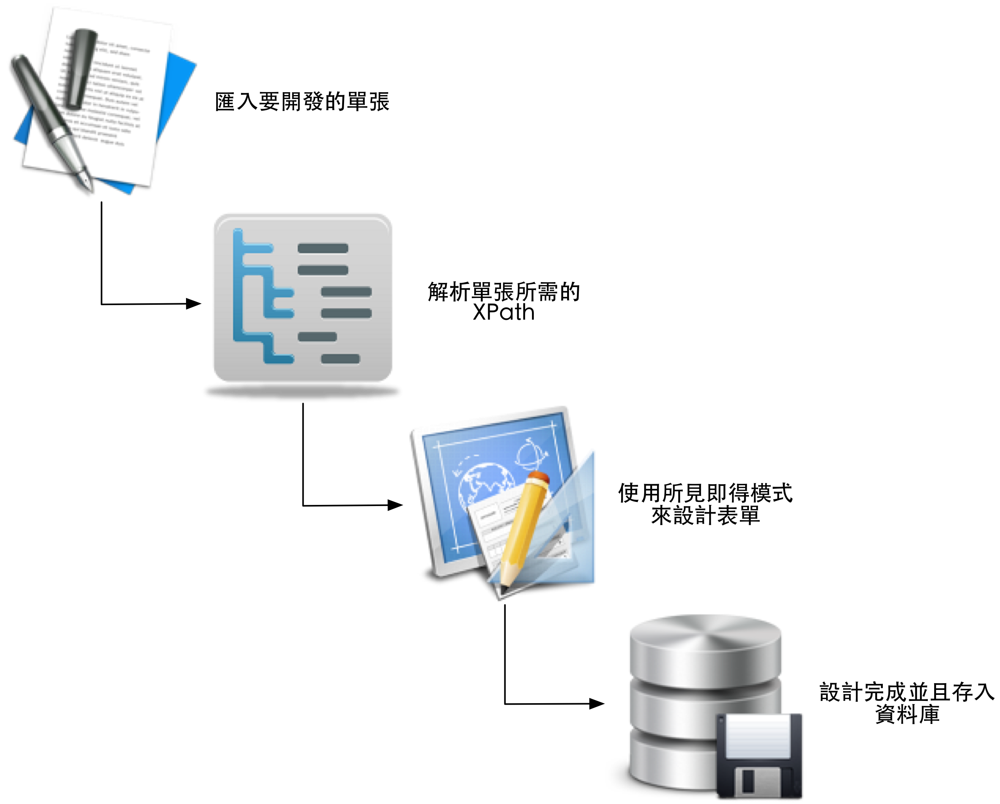
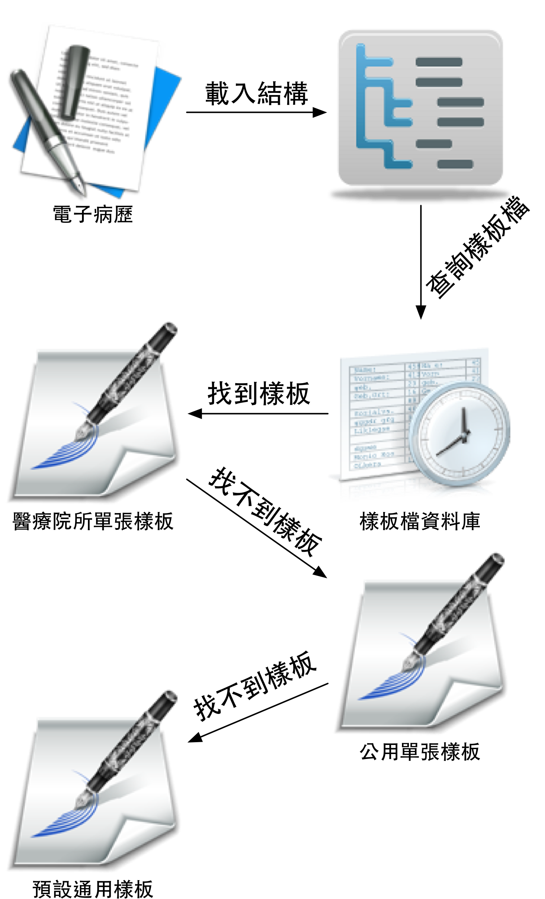
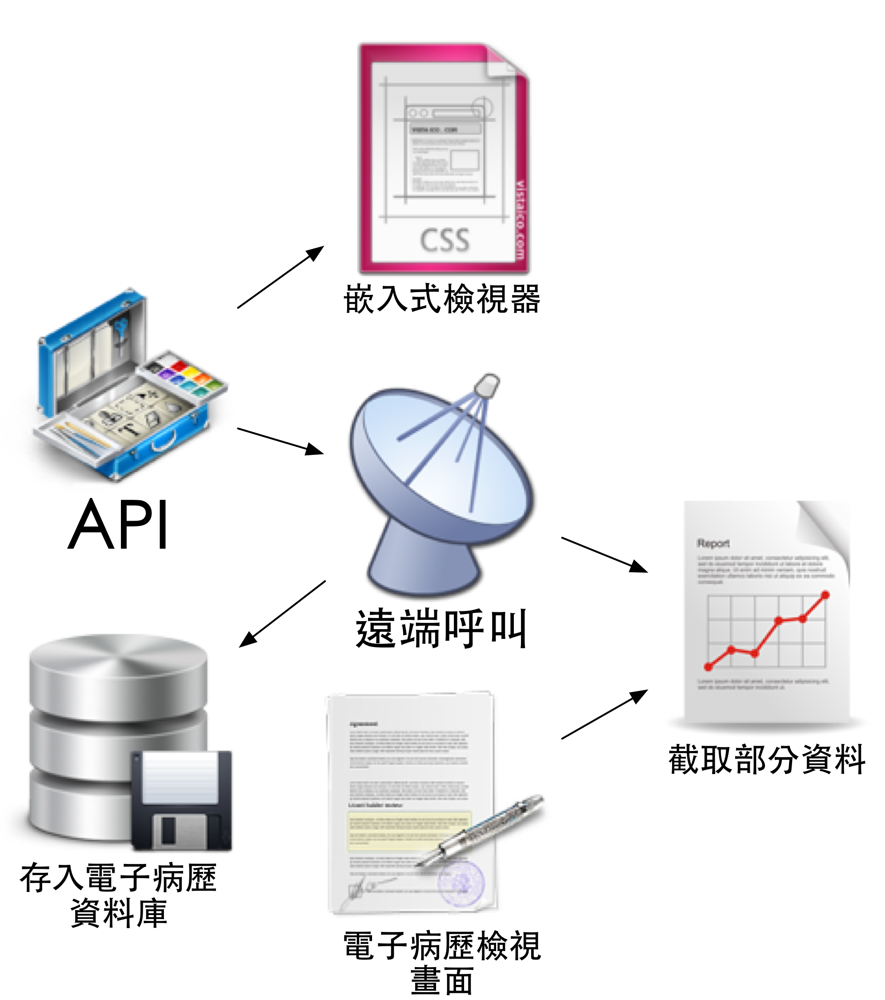
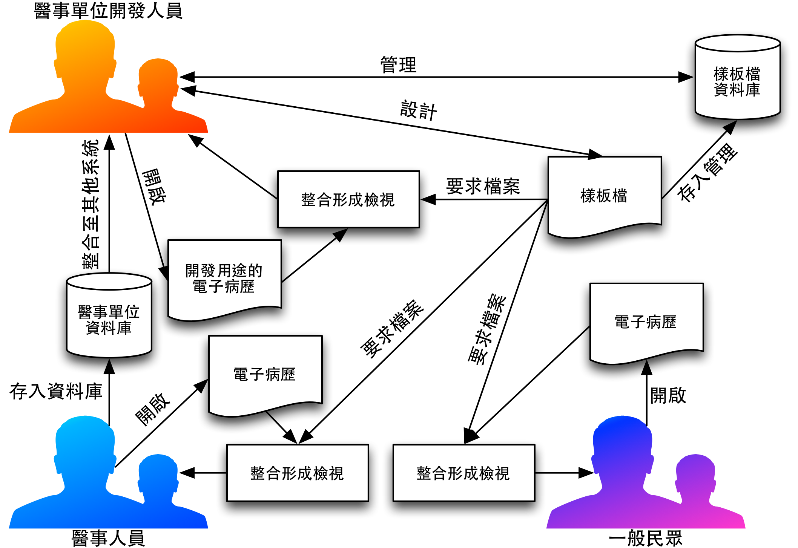
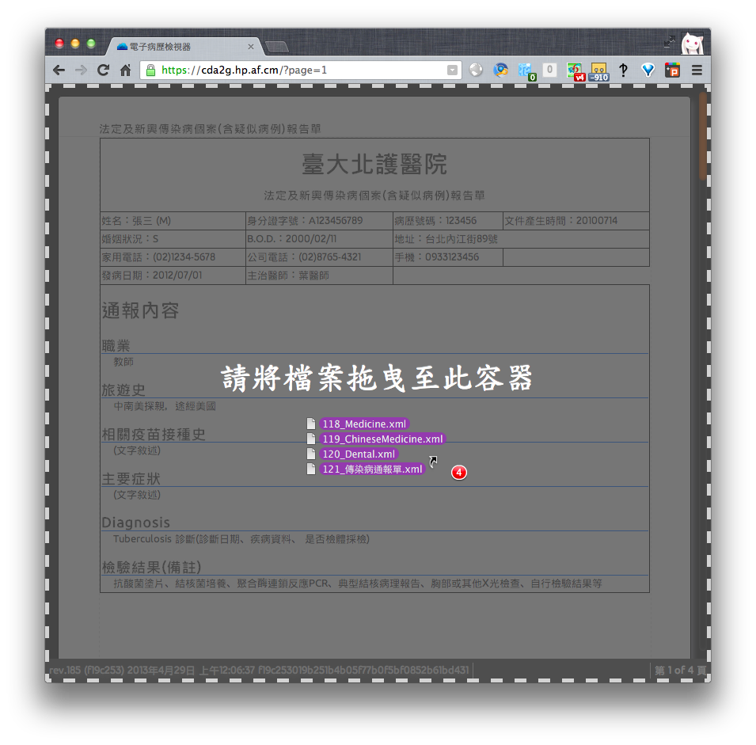
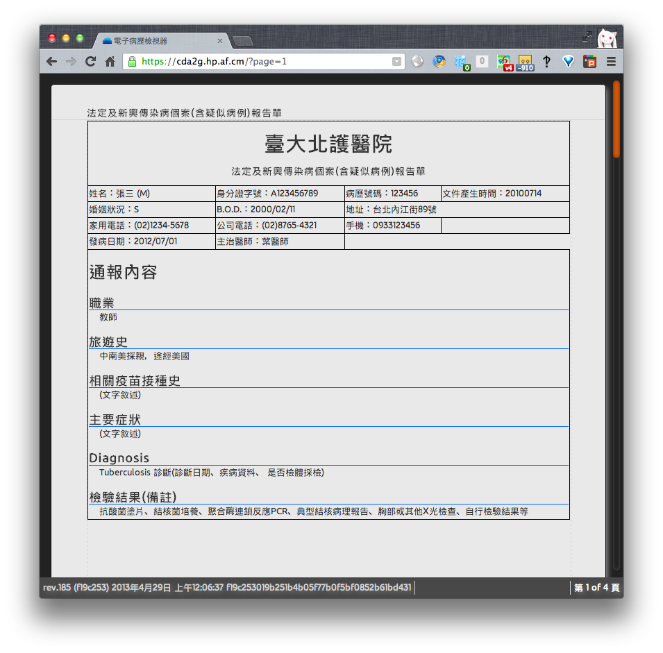
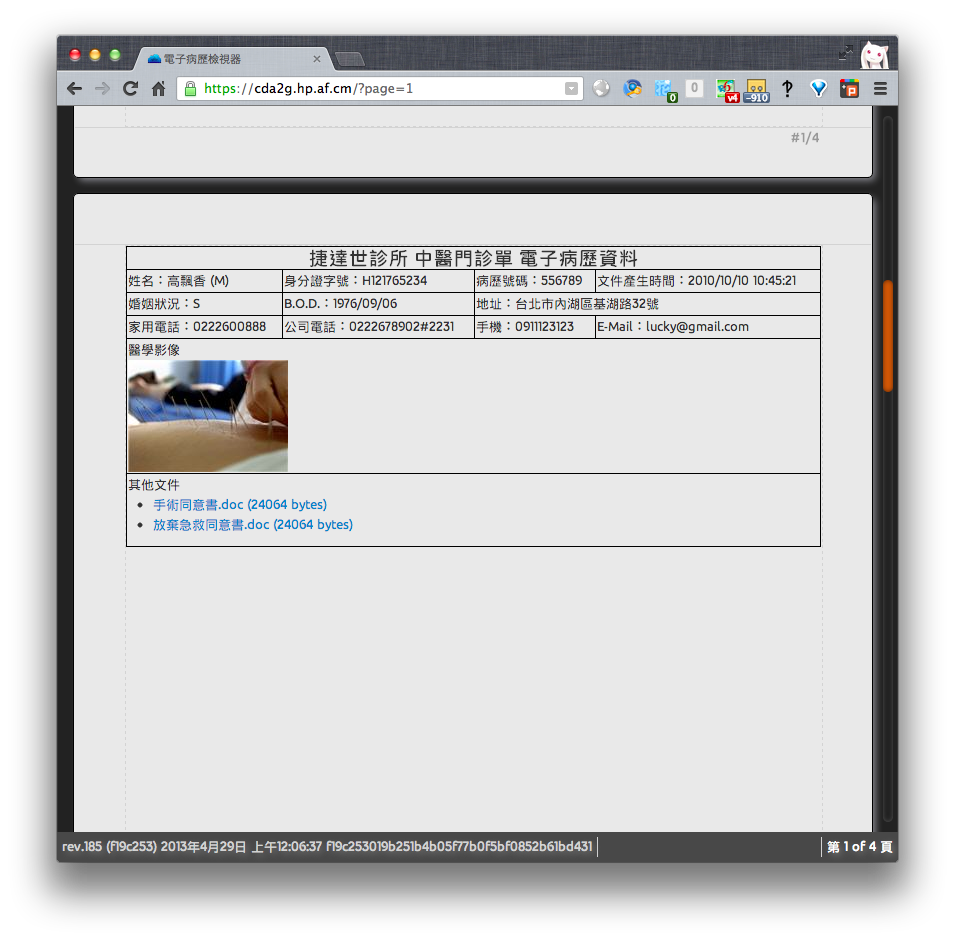

**以雲端運算平台建置電子病歷檢視器系統之研究**
===============================================
### *The Study of Building Cloud Computing Platform for the System of electronic medical records*
- - - - - - - - - - - - - - - - - - - - - - - - - - - - - - - - - - - - - - - -
# 摘要

**關鍵字：_電子病歷、臨床文件架構、雲端運算、檢視器、資訊技術基礎構想、資訊技術服務管理、使用者經驗、使用者界面設計、多國語系、超文本標記語言第五版_**
- - - - - - - - - - - - - - - - - - - - - - - - - - - - - - - - - - - - - - - -
# 第一章 緒論

## 第一節 研究背景
現行國內的電子病歷，皆需要透過電子病歷交換平台(EEC, E.M.R. Exchange Center, Electornic Medical Record Exchange Center)交換電子病歷資料，而醫院需要先經過8個申請流程才能夠正式上線使用該平台。若是醫院要完成該申請，並且上線使用，則要先建置EEC Gateway及解讀電子病歷的系統。這個交換機制使用健保局VPN作為連線媒介，以完成與EEC之間的互通交換。資料交換期間，醫師若要看電子病歷，則必須在有病患的健保卡與自己的醫事憑證卡，至EEC申請資料調閱，隨後即可在HIS中直接瀏覽資料。

### 壹 國內電子病歷推行狀況
自民國九十八年開始，衛生署根據經驗上優先選取了常用的108分表單，並使用HL7 CDA格式制定了相關的資料欄位成為國內電子病歷資料交換的標準。並在隔年的『醫院實施電子病歷及互通補助計畫』中公告並開始使用四張醫院的病歷單張與三張診所病歷單張交換使用，其餘百餘張表單在這幾年內皆尚未開始正式使用。

### 貳 雲端服務的普及度
從目前國內衛生署正在積極推行「全民健康雲」，同時政府也在積極推行政府雲端應用加值服務中看出，不只政府推行雲端服務，甚至連國內外廠商也都陸續開始競爭。根據2012年11月，VMware委託Forrester Consulting進行的市場調查[[27]]中，台灣是首次納入調查範圍內，其中共有473位來自跨國企業、地區或區域企業、以及公部門等組織的資深IT工作者作為受訪者。調查內發現台灣的企業雲端的普及率為44%，略高於亞太地區的平均值2%，且受訪者中有27%表示尚未使用雲端解決方案，但未來有打算使用雲端方案，而在計畫採用雲端方案的受訪者中，有56%表示會在未來的18個月內落實。

該調查內顯示，絕大多數的受訪者都能瞭解雲端方案對企業的益處，有76%受訪者表示雲端技術能有助於提升營運效能，79%認為能降低成本；另外有28%表示這對企業轉型帶來重要影響。

另外，該調查也歸納出企業評估投入雲端前的重要因素，前三項包括：

1. 資料隱私、所在地，或「無法掌握」 (loss of control) (71%)
2. 成本 (69%)
3. 規範/管理/法規遵循議題 (67%)
 
## 第二節 研究動機

## 第三節 研究目的

- - - - - - - - - - - - - - - - - - - - - - - - - - - - - - - - - - - - - - - -
# 第二章 文獻探討

## 第一節 電子病歷

表1 電子病歷推動計劃補助款項及申請醫院家次統計(參考於衛生署網站[[5]])

|     項目/年度     |  99年度  | 100年度 | 101年度 |
|------------------|---------|--------|---------|
|      補助預算     | 3.89億元 | 2.2億元 | 5.8千萬元|
|  已申請之醫院家次  |  164家   |    -   |    -    |
|已申請檢查之醫院家次 |    -    |  120家  |    -    |
|已申請查驗之醫院家次 |    -    |   57家  |  >170家 |
|  已申請之補助金額  | 3.27億元 | 2.2億元 | 5.8千萬元|
|    補助款餘額     |6.17千萬元|   0元   |   0元   |

## 第三節 XML

## 第四節 HTML5

## 第五節 雲端運算

- - - - - - - - - - - - - - - - - - - - - - - - - - - - - - - - - - - - - - - -
# 第三章 研究方法
本章節依序說明研究步驟、系統需求分析與設計、相關技術應用及開發環境與工具。

## 第一節 研究步驟
本研究會設計一個電子病歷的檢視平台，並且提供各醫療院所及民眾使用，主要提供醫療院所做為一個資料交換後的檢視平台，以便還尚未建置部屬完成電子病歷匯入程式的單位使用，並且可以在線上開發其他單張所需的檢視模板，並提供給民眾使用。最後將探討電子病歷之架構及相關電子病歷之雲端應用研究，並且以實作的方式建立此系統平台完成本研究之計畫。其詳細的研究流程從研究背景、動機及目的、文獻探討、研究方法如圖1所示。

### 壹 研究流程
  
圖1 研究流程圖

### 貳 系統建置流程
1. 研究CDA文件架構  
	研究CDA文件內的架構與模型、參考方式、資料屬性及詞彙等，研究文件的階層及儲存位置還有形態等內容。
	
2. 分析電子病歷文件單張  
	為了區分出每個單張的不同，以及辨識不同單張所需的樣板檔，必須先瞭解電子病歷文件中所記錄的代碼為何種意義，以便瞭解哪個代碼的特性為何，並且針對該代碼來作為區分用途。
	
3. 研究XPath使用特性  
	在電子病歷文件中接使用XML來儲存內容，若要萃取出資料則必須要有選擇，而在XML文件中要萃取出需要的資料則是要先瞭解XPath內的特性以及使用方式。
	
4. 訂定系統需求與系統設計  
	針對本研究之系統訂定系統需求與系統設計，依照使用對象的不同區分為兩大部份，並在完成這兩大部份後完成本系統平台之設計。
	
	1. 醫事單位表單開發設計人員  
		由於醫事單位有開發上的需求以及會有內部人員的需要，故在此部分會要有一個特別設計的編輯模式可供這些醫事單位可以用所見即得的方式在線上編輯樣板檔，並且可以隨時發佈變更給所有的使用者使用。
		
	2. 醫事人員與一般民眾  
		依照使用者的喜好與習慣為原則，因此這部分會用一個類似於文件檢視器的形式來呈現最後解析處理後的電子病歷結果。
		
5. 系統開發  
	本研究主要分為四個開發部分，並且在一連串的建置與測試後，經由電子病歷文件的引入來確認是否能夠符合不失去原始內容的呈現。
	
	1. 建置系統框架  
		建置系統框架，提供使用者直覺的檢視資料。其中必須提供檢視工具，包含上一頁、下一頁、直接換頁，若在個人資料法的允許下則會提供列印的功能。在檢視器的畫面中呈現出如同真實紙本資料的畫面，並且可以直接顯示圖表，或者可程式化的互動介面，使電子病歷不再只是作為資料交換的用途。而在畫面上會提供使用者可以使用拖拉的方式將檔案置入檔案解析介面中開始解析檔案。
		
	2. 檔案解析介面  
		讓使用者可以將檔案匯入至頁面中解析資料，並且可以結合模板互相搭配呈現畫面。其中會依據電子病歷檔案內的屬性來判斷該檔案是為哪一單張的資料結構，隨之自動的配合相對應的單張樣板檔來呈現該單張的顯示介面以及互動介面。
		
	3. 模板編輯框架  
		模板編輯器的界面可以提供醫療院所設計每個不同的單張所專用的顯示結果，甚至可以設計模組套件，在設計完成後即可發佈給其他設計者引用協做。
		
	4. 模板管理  
		管理已經設計好的模板，並且可以編輯或者引用其他設計者所設計好的介面，另外提供版本歷程的記錄，以避免版本變更後的不預期問題發生。
	
6. 雲端部署  
	本研究為雲端運算平台，為提供軟體服務，且沒有隱私資料的保存，故選擇使用Cloud Foundry平台，並使用公用雲部署模式，由於其基礎架構與平台架構的最低應體需求極高[[26]]，因此皆改採用其他廠商提供的Cloud Foundry架構的PaaS平台來部署本系統，所以本階段只需要利用廠商提供的部署工具將系統部署至平台上即可使用(如下圖所示)，因此下一節中將不再探討雲端運算之內容。  
  
圖2 雲端部署架構示意圖
	
7. 研究成果撰寫  
	撰寫系統建置與實作結果的文件，並討論發表過程中的問題與困難點，以提供後續研究或者導入本系統之單位的後續發展與參考。

## 第二節 系統需求分析與設計
本部份分為兩個部份，第一個部份會根據需求來分析與系統架構，在第二部份會根據第一部份的結果來做系統分析與系統架構的設計。

### 壹 需求分析
為了使電子病歷最終可以顯示成為圖表化的病歷資料，如同實際在紙本作業程序中的感受一致，故依照系統使用的相關人員而區分為三大類，以下分別說明：

* 醫事單位表單開發設計人員：負責文件樣板的設計以及開發，讓醫事人員以及一般民眾可以很容易的使用本系統瀏覽由醫院所輸出的電子病歷資料，以及和其他系統的整合應用
* 醫事人員：可以使用本系統作為一個電子病歷的檢視，讓醫事人員可以不用等待資訊系統的匯入等待時間即可立即瀏覽內容，也可以經由本系統導入資料至醫事單位所開發整合的系統中作為存儲
* 一般民眾：僅只有電子病歷的檢視功能，最終顯示的方式使用HTML5的方式呈現

### 貳 系統分析與設計
系統中主要有四個部分組成運作，分別為(1)醫事單位開發界面;(2)樣板檔資料庫;(3)樣板檔組合電子病歷形成檢視;(4)外部使用的API介面，其中以開發界面最為重要，因為包含了形成檢視的檢視畫面以外，還必須有設計的功能，並且還要結合樣板檔資料庫，以便開發中引用其他樣板做進一步開發。以下將對這幾部分加以探討：

1. 醫事單位開發界面  
	在眾多使用者與醫療單位的使用之下，為了電子病歷呈現的問題，這需要有設計好的樣板檔當作顯示的底層才有辦法呈現出資料及格式，故系統中需要一個可以提供給醫事單位使用的開發及設計界面，為了方便使用這個界面的醫事單位可以快速的將客製化後的表單直接使用，這個開發界面會結合模板編輯器以及檔案解析介面的系統功能，並且可以存入樣板檔資料庫中，以供再次編輯或者引用至其它樣板檔中作為物件來再次開發。而作為物件開發時，即可重複利用該樣板檔中的資料，節省重複開發所造成的耗時問題。在醫事單位開發的流程上就會有如圖3所示：  
  
圖3 醫事單位開發界面流程圖  
因此，醫事單位僅需要將要開發的單張匯入至系統開發界面中即會把可用的內容或欄位資料解析條列出來，若系統中已經有病歷內容所需的顯示組件，則會在所見即得編輯器(WYSIWYG)中顯示該可用的組件，以供開發者可以將其引用進入樣板檔中，最後編輯完成後即可存檔供日後使用。
	
2. 樣板檔資料庫  
	樣板檔資料庫內，會以各單張來區分，在區分之後會再以醫療機構代碼來細分各醫療機構專用的樣板檔。當使用者使用了某醫療機構的單張，則系統會以以下規則來查詢樣板檔：
	1. 以單張代碼為主，醫療機構代碼為輔來查詢樣板
	2. 若上述規則無樣板檔，則以單張代碼為主，找尋該單張代碼使用的公用樣板檔
	3. 若上述規則無樣板檔，則直接使用通用樣板檔  
	
	其詳細的描述結構有如圖4所示：  
  
圖4 樣板檔資料庫示意圖
	
3. 樣板檔組合電子病歷形成檢視  
	在單張讀取的時候，本系統會根據單張的資料及屬性，使用前項所述之規則找尋樣板檔，並在樣板檔找到的時候，使用Web Components技術呈現電子病歷資料。在Web Components元件內，可供開發者自行加入更多元化的設計，甚至可以自動的載入形成各區塊的病歷資料或圖表，以及內容的排版位置。形成檢視的過程中，系統會有如圖5所示的流程：  
  
圖5 樣板檔組合電子病歷形成檢視流程圖
	
4. 外部使用的API介面  
	當系統是在醫事單位內使用時，可以利用API的介面進行遠端呼叫或者引用系統檢視的功能，在使用API的時候可以當作嵌入式檢視器，甚至可以將本系統整合進入至該醫事單位的HIS系統畫面中，也可以當作匯入電子病歷檔案至HIS資料庫的媒介，如此可以節省開發電子病歷資料的匯入與轉換及呈現的時間。詳細API會提供的呼叫方式及功能結構如圖6所示：  
  
圖6 外部使用的API介面示意圖

## 第三節 系統架構
依照前面兩節所描述的需求分析與設計，可歸類出系統與其相關使用者的關係架構如圖7所示。  
  
圖7 使用者與系統關聯圖  
若依照系統架構區分，則本系統分為兩種使用者架構及四個子系統，在使用者架構中區分為登入使用者與一般使用者。在登入使用者中，則是醫事單位的開發人員或者醫事人員，在四個子系統中，所有的使用者皆能檢視電子病歷的畫面，醫事人員可以使用API介面決定是否要將電子病歷匯入至該單位的資料庫中，而開發人員可以使用全部功能。其餘詳細的架構如圖8所示。  
  
圖8 系統架構圖

## 第四節 相關技術及開發工具
本研究準備使用的開發環境、開發工具、開發程式語言如下：

- 開發環境：Macintosh OS X Mountain Lion 10.8.3、Microsoft Window 8 Pro
- 開發工具：Sublime Text 2、SourceTree、Google Chrome、Mou
- 開發語言：HTML 5、JavaScript、jQuery、jQuery UI、CSS、php、mySQL、Markdown

- - - - - - - - - - - - - - - - - - - - - - - - - - - - - - - - - - - - - - - -
# 第四章 研究結果
## 第一節 電子病歷檢視器
本研究完成一套電子病歷檢視器的雲端應用平台，資料僅需要透過拖拉的方式即可匯入資料到瀏覽器中讀取(不需要上傳至伺服器)(如圖9及圖10畫面所示)，並且已經能夠直接顯示現行各種單張的解碼及提供將資料視覺化至自動分頁的畫面中的功能(如圖11畫面所示)，最終可以呈現不同單張與不同醫療機構的版本。  
為了在檢視電子病歷資料的同時，要如同是觀看真實文件一般的直覺化操作，界面上呈現的樣式和列印出來的格式及樣貌必須皆完全一致。而一般使用者不論是否在有網路環境時，皆能使用此一平台瀏覽電子病歷資料。醫療院所也可以自行設計對應到每個單張的樣板檔及該單位專用的樣式至本系統或者插入到電子病歷檔中，讓使用者可以直接瀏覽使用而不影響檔案在各單位之間的資料交換，除資料交換以外也能讓醫療資訊系統呼叫引用本系統的檢視功能，本系統將能使電子病歷檢視之應用更具多元化。  
  
圖9 系統匯入資料到瀏覽器中的畫面  
  
圖10 匯入CDA資料到瀏覽器後的畫面  
  
圖11 系統自動分頁畫面  

## 第二節 文件讀取及解析模組
由於本系統讀取電子病歷文件時不需要將檔案上傳即可瀏覽，因此本系統會將檔案使用Drag & Drop的方式讓使用者輸入檔案，並且在接收到OnDrag Event的時候會處理資料的解析與讀取。
在資料讀取的時候，為了要確定使用者輸入的檔案確實為符合臨床文件架構的電子病歷資料，故本系統會有以下規則來檢查是否為正確的文件格式：

1. 確認是否有XML的文件宣告
2. 檢查是否有ClinicalDocument的Root Element，並且有Element結尾
3. 檢查是否有xmlns宣告為urn:hl7-org:v3的schema
4. 其使用的RegExp檢查式為：`/<\?xml[^?>]+\?>\s*(<\?xml-stylesheet[^\?]+\?>)?\s*(<\?[^xml-][^\?]+\?>\s*){0,}<([\w]*:)?ClinicalDocument[^>]+>([\s\w\W]*)<\/([\w]*:)?ClinicalDocument>([\s\w\W]*)/`
5. 但本系統不會根據宣告的schema去驗證XML是否符合schema的宣告

在判斷為正確的檔案格式之後，即開始將檔案區分為兩個部分：CDA Header與CDA Body。其區分的方式為下列XPath表示：

* 取得CDA Header：`*:ClinicalDocument/(* except self::*/*:component)`
* 取得CDA Body：`*:ClinicalDocument/*:component`

在區分之後，將會分別以`cdaHeader`與`cdaBody`的tag包裝起來，放入`cda2g`這個tag內使用Web Components的API處理在這個tag內的資料讀取。在資料處理的時候，會根據樣板檔的描述，去決定選擇header的資料或者是body的資料，並且使用XPath的方式提供資料的選取。在選取的過程中，可以指定輸出的方式為具有格式化的資料或者純資料選取的方式輸出，若選取的資料不存在，則選取的時候不會有任何的資料輸出。  
資料選取與輸出的處理完成之後，就會把Web Components元件內的資料讀取出來並且銷毀，以便分頁處理顯示畫面。而畫面的輸出處理，則主要會以一個單張資料為一頁，若該單張的資料過多，則會在分頁處截斷至下一頁處理，並且將截斷前的頁面屬性延伸到截斷後的新頁面上。

若使用者一次輸入多個檔案的時候，本系統也會按照輸入順序依序讀取及檢查格式是否為電子病歷文件，並且依照上述流程產生文件與解讀結果於畫面中。

## 第三節 資料內嵌處理模組
由於電子病歷資料可以內嵌其他附件資料(例如：圖片、文件)，所以這些資料都會儲存於電子病歷內的`observationMedia`段，並且會以base64的方式儲存資料的內容。而本系統使用HTML5的File API來產生檔案的轉換及下載輸出，在檔案轉換輸出的時候會有以下流程(如圖12所示)：

1. Base64使用瀏覽器`atob` function轉換為binary string資料
2. 將binary string資料轉換回正確的binary資料
3. 使用`Blob` class將binary資料轉換成瀏覽器的blob資料
4. 建立blob URL
5. 輸出為圖片帶超連結或者文件資訊帶超連結

圖12 檔案轉換輸出流程  

在檔案轉換輸出後，會根據檔案的形態來決定是否要內嵌於畫面當中。如果是圖片的格式，則會限制最大不超過頁面大小，並且內嵌於畫面上，也可以直接將圖形儲存於電腦上，檔名則是根據電子病歷文件內設定的檔案名稱來自動存檔。若不是圖片格式，則本系統會於畫面中顯示其檔名，以及檔案的大小於畫面中，並且具有超聯結可供使用者從系統內部快取中下載該檔案並儲存於使用者電腦上的任意位置。

## 第四節 樣板處理與頁面構成模組
在電子病歷文件輸入的時候，系統會讀取其樣板中的單張代碼，以及醫療機構代碼，並且依照這兩個代碼所組成的資料形成唯一值，根據這個唯一值對本系統要求電子病歷樣板檔回傳至前端系統，並且使用Web Components結合這些樣板檔使用於文件呈現、資料處理的模組處理。在要求樣板檔的時候，會使用md5 hash演算法作為資料識別ID，並且使用以下規則傳回適當的樣板檔以供系統使用：

1. 以單張代碼及醫療機構代碼查詢樣板檔
2. 若上述規則無樣板檔，則以單張代碼返回其使用的公用樣板檔
3. 若上述規則無樣板檔，則直接返回通用樣板檔  

而在樣板檔中必須定義各樣版的名稱於根元素內，定義的時候必須以固定的格式定義識別名稱，其規則為下：

1. 若為醫療機構客制的單張，則以此種方式命名：`cda___單張代碼___醫療機構代碼`
2. 若為單張公用樣板檔，則以此種方式命名：`cda___單張代碼`
3. 若為通用樣板檔，則以此種方式命名：`cdaDemo`

## 第五節 樣板管理模組

- - - - - - - - - - - - - - - - - - - - - - - - - - - - - - - - - - - - - - - -
# 第五章 討論
## 第一節 系統功能與限制
* 雲端平台建置：由於要實際建置一個雲端平台的硬體需求過高[[26]]，因此目前採用該平台的協力廠商來做為目前的替代方案，所以現行架構上是使用Cloud Foundry方案來作為本研究的基礎環境。
* 電子病歷交換標準單張：由於目前上線使用的交換單張有「111\_醫療影像報告」、「113\_血液檢驗報告」、「114\_門診用藥」與、「115\_出院病歷摘要」等四張病歷單張，以及「118\_西醫門診單」、「119\_中醫門診單」和「120\_牙醫門診單」等三張門診病歷單張。雖然系統有對應單張代碼的機制，但實際上線使用的並無更多單張，故無法實際公開實驗測試開發者會遇到的問題。
- - - - - - - - - - - - - - - - - - - - - - - - - - - - - - - - - - - - - - - -
# 第六章 結論與建議
## 結論

## 未來努力方向
針對本研究系統之建議如下，可提供未來研究者參考：

1. 本系統僅只有實作單張樣板之對應，並無結合代碼轉換之功能。
2. 未來可與多家醫院結合使用，使之可以不用建置電子病歷解碼程式。

- - - - - - - - - - - - - - - - - - - - - - - - - - - - - - - - - - - - - - - -
# 參考文獻
1. [全民健康雲啟動 整合個人健康履歷][1]
2. [DIGITIMES - 全民健康雲][2]
3. [電子病歷 - Wikipedia][3]
4. [行政院衛生署電子病歷推動專區 - 簡介][4]
5. [行政院衛生署電子病歷推動專區 - 歷年補助案][5]
6. [K. W. Boone, "The CDA Book": Springer-Verlag London, 2011.][6]
7. [Robert H, Liora A, Sandy B, Calvin B, Fred M, Paul V, Amnon S, “HL7 Clinical Document Architecture, Release 2.0,” ANSI, 2005.][7]
8. [T. Benson, "Clinical Document Architecture", Principles of Health Interoperability HL7 and SNOMED, pp. 145-160, 2010.][8]
9. [XML - Wikipedia][9]
10. [Tim Bray, Jean Paoli, C. M. Sperberg-McQueen, Extensible Markup Language (XML) 1.0, W3C Recommendation 10-February-1998][10]
11. [Tim Bray, Jean Paoli, C. M. Sperberg-McQueen, Eve Maler, François Yergeau, Extensible Markup Language (XML) 1.0 (Fifth Edition), W3C Recommendation 26 November 2008][11]
12. [HTML5 - Wikipedia][12]
13. [Steve Jobs, Thoughts on Flash, Apple Inc., 2010][13]
14. [Anne van Kesteren, Simon Pieters, HTML5 differences from HTML4, W3C Working Draft 25 October 2012][14]
15. [Sergey Mavrody, Sergey's HTML5 & CSS3: Quick Reference. HTML5, CSS3 and APIs. Full Color (2nd Edition), 2012, ISBN: 0983386722][15]
16. [Ian Hickson, Web Storage, W3C Candidate Recommendation][16]
17. [Ian Hickson, HTML5 Web Messaging, W3C Candidate Recommendation][17]
18. [Ian Hickson, HTML Living Standard, WHATWG][18]
19. [Nikunj Mehta, Jonas Sicking, Eliot Graff, Andrei Popescu, Jeremy Orlow, Indexed Database API, W3C Working Draft][19]
20. [Arun Ranganathan, Jonas Sicking, File API, W3C Working Draft][20]
21. [Eric Uhrhane, File API: Directories and System, W3C Working Draft][21]
22. [Eric Uhrhane, File API: Writer, W3C Working Draft][22]
23. [Peter Mell, Timothy Grance, The NIST Definition of Cloud Computing, National Institute of Standards and Technology Special Publication 800-145, 2011][23]
24. [雲端運算 - Wikipedia][24]
25. [Cloud Computing - Wikipedia][25]
26. [Cloud Foundry Documentation - Deploying Cloud Foundry on vSphere - Hardware Requirement][26]

[1]: http://video.udn.com/video/Item/ItemPage.do?sno=324-233-2B3-2F3-2B3d4-233-2B3d3d3b34324-2334 "全民健康雲啟動 整合個人健康履歷"
[2]: http://www.digitimes.com.tw/tw/dt/n/shwnws.asp?CnlID=10&Cat=35&id=303217 "DIGITIMES - 全民健康雲"
<!--以上全民健康雲參考-->

[3]: http://zh.wikipedia.org/zh-tw/%E7%94%B5%E5%AD%90%E7%97%85%E5%8E%86 "電子病歷 - Wikipedia"
[4]: http://emr.doh.gov.tw/introduction.aspx "行政院衛生署電子病歷推動專區 - 簡介"
[5]: http://emr.doh.gov.tw/allowance.aspx "行政院衛生署電子病歷推動專區 - 歷年補助案"
<!--以上電子病歷參考-->

[6]: http://www.medlib.am/Fulltexts/The%20CDA%20TM%20BOOK%202011.pdf "K. W. Boone, "The CDA Book": Springer-Verlag London, 2011., ISBN: 978-0-85729-335-0, e-ISBN: 978-0-85729-336-7, DOI: 10.1007/978-0-85729-336-7"
[7]: http://www.ncbi.nlm.nih.gov/pmc/articles/PMC1380194/pdf/30.pdf "Robert H, Liora A, Sandy B, Calvin B, Fred M, Paul V, Amnon S, “HL7 Clinical Document Architecture, Release 2.0,” ANSI, 2005."
[8]: http://link.springer.com/content/pdf/10.1007%2F978-1-84882-803-2_9 "T. Benson, "Clinical Document Architecture", Principles of Health Interoperability HL7 and SNOMED, pp. 145-160, 2010."
<!--以上HL7 CDA參考-->

[9]: http://zh.wikipedia.org/wiki/XML "XML - Wikipedia"
[10]: http://www.w3.org/TR/1998/REC-xml-19980210 "Tim Bray, Jean Paoli, C. M. Sperberg-McQueen, Extensible Markup Language (XML) 1.0, W3C Recommendation 10-February-1998"
[11]: http://www.w3.org/TR/2008/REC-xml-20081126/ "Tim Bray, Jean Paoli, C. M. Sperberg-McQueen, Eve Maler, François Yergeau, Extensible Markup Language (XML) 1.0 (Fifth Edition), W3C Recommendation 26 November 2008"
<!--以上XML參考-->

[12]: http://zh.wikipedia.org/wiki/HTML5 "HTML5 - Wikipedia"
[13]: http://www.apple.com/hotnews/thoughts-on-flash/ "Steve Jobs, Thoughts on Flash, Apple Inc., 2010"
[14]: http://www.w3.org/TR/2012/WD-html5-diff-20121025/ "Anne van Kesteren, Simon Pieters, HTML5 differences from HTML4, W3C Working Draft 25 October 2012"
[15]: http://www.amazon.com/Sergeys-HTML5-CSS3-Quick-Reference/dp/0983386722 "Sergey Mavrody, Sergey's HTML5 & CSS3: Quick Reference. HTML5, CSS3 and APIs. Full Color (2nd Edition), 2012, ISBN: 0983386722"
[16]: http://www.w3.org/TR/2011/CR-webstorage-20111208/ "Ian Hickson, Web Storage, W3C Candidate Recommendation"
[17]: http://www.w3.org/TR/2012/CR-webmessaging-20120501/ "Ian Hickson, HTML5 Web Messaging, W3C Candidate Recommendation"
[18]: http://www.whatwg.org/specs/web-apps/current-work/multipage/ "Ian Hickson, HTML Living Standard, WHATWG"
[19]: http://www.w3.org/TR/2012/WD-IndexedDB-20120524/ "Nikunj Mehta, Jonas Sicking, Eliot Graff, Andrei Popescu, Jeremy Orlow, Indexed Database API, W3C Working Draft"
[20]: http://www.w3.org/TR/2012/WD-FileAPI-20121025/ "Arun Ranganathan, Jonas Sicking, File API, W3C Working Draft"
[21]: http://www.w3.org/TR/2012/WD-file-system-api-20120417/ "Eric Uhrhane, File API: Directories and System, W3C Working Draft"
[22]: http://www.w3.org/TR/2012/WD-file-writer-api-20120417/ "Eric Uhrhane, File API: Writer, W3C Working Draft"
<!--以上HTML5參考-->

[23]: http://csrc.nist.gov/publications/nistpubs/800-145/SP800-145.pdf "Peter Mell, Timothy Grance, The NIST Definition of Cloud Computing, National Institute of Standards and Technology Special Publication 800-145, 2011"
[24]: http://zh.wikipedia.org/wiki/%E9%9B%B2%E7%AB%AF%E9%81%8B%E7%AE%97 "雲端運算 - Wikipedia"
[25]: http://en.wikipedia.org/wiki/Cloud_computing "Cloud Computing - Wikipedia"
[26]: http://cloudfoundry.github.com/docs/running/deploying-cf/vsphere/hardware_spec.html "Cloud Foundry Documentation - Deploying Cloud Foundry on vSphere - Hardware Requirement"
<!--以上雲端運算參考-->

- - - - - - - - - - - - - - - - - - - - - - - - - - - - - - - - - - - - - - - -
# 檔案結尾
	此行以下已經沒有任何內容