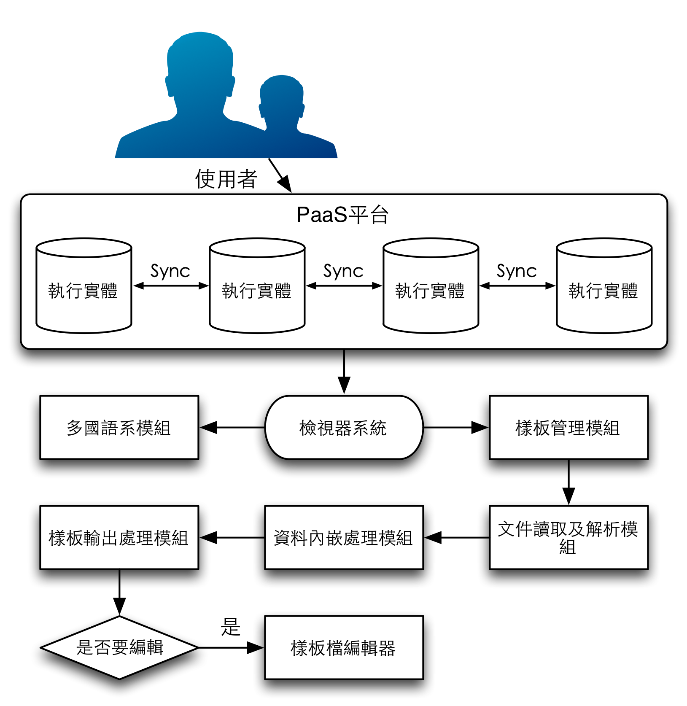

**以雲端運算平台建置電子病歷檢視器系統之研究**
=======================================
### *The Study of Building Cloud Computing Platform for the System of electronic medical records*
- - - - - - - - - - - - - - - - - - - - - - - - - - - - - - - - - -
# 摘要

**關鍵字：_電子病歷、臨床文件架構、雲端運算、檢視器、資訊技術基礎構想、資訊技術服務管理、使用者經驗、自適應網頁設計、使用者界面設計、多國語系、超文本標記語言第五版_**
- - - - - - - - - - - - - - - - - - - - - - - - - - - - - - - - - -
# 第壹章 緒論

## 第一節 研究背景
國內衛生署推行的電子病歷是由HL7所制定的臨床文件架構所制定的一種XML文件，這文件格式現在在國內已經有數百家醫院使用，各個醫院必須透過各自的EEC Gateway，經過健保局提供的VPN網路，與衛生署電子病歷交換平台(EEC, E.M.R. Exchange Center, Electornic Medical Record Exchange Center)交換電子病歷資料。各醫院的醫師看診時，若要看其他醫院所產出的電子病歷，則必須在有病患的健保卡與醫師的醫事憑證卡，連線至EEC平台申請相關的電子病歷資料調閱，隨後等待資料回傳後，即可直接在HIS中直接瀏覽資料。但目前交換電子病歷資料的對等醫院皆必須要有HIS系統能夠編、解碼，否則交換後的資料無法解讀給醫生瀏覽。至目前為止，國內所有的電子病歷都必須要各家醫療院所自行開發電子病歷相關的編、解碼程式，然後經過衛生署認證後，才能上線至EEC平台開始做電子病歷交換的流程。

### 壹 國內電子病歷推行狀況
自民國九十八年開始，衛生署根據經驗上優先選取了常用的108份表單，並使用HL7 CDA格式制定了相關的資料欄位成為國內電子病歷資料交換的標準。並在隔年的『醫院實施電子病歷及互通補助計畫』中公告並開始使用四張醫院的病歷單張與三張診所病歷單張交換使用，其餘百餘張表單在這幾年內皆尚未開始正式使用。而目前電子病歷推動計劃相關的補助以及申請醫院家次統計如表1所示。

表1 電子病歷推動計劃補助款項及申請醫院家次統計(參考於衛生署網站[[5]])

|     項目/年度     |  99年度  | 100年度 | 101年度 |
|------------------|---------|--------|---------|
|      補助預算     | 3.89億元 | 2.2億元 | 5.8千萬元|
|  已申請之醫院家次  |  164家   |    -   |    -    |
|已申請檢查之醫院家次 |    -    |  120家  |    -    |
|已申請查驗之醫院家次 |    -    |   57家  |  >170家 |
|  已申請之補助金額  | 3.27億元 | 2.2億元 | 5.8千萬元|
|    補助款餘額     |6.17千萬元|   0元   |   0元   |

### 貳 雲端服務的普及度
從目前國內衛生署正在積極推行「全民健康雲」，同時政府也在積極推行政府雲端應用加值服務中看出，不只政府推行雲端服務，甚至連國內外廠商也都陸續開始競爭。根據2012年11月，VMware委託Forrester Consulting進行的市場調查[[27]]中，台灣是首次納入調查範圍內，其中共有473位來自跨國企業、地區或區域企業、以及公部門等組織的資深IT工作者作為受訪者。調查內發現台灣的企業雲端的普及率為44%，略高於亞太地區的平均值2%，且受訪者中有27%表示尚未使用雲端解決方案，但未來有打算使用雲端方案，而在計畫採用雲端方案的受訪者中，有56%表示會在未來的18個月內落實。

該調查內顯示，絕大多數的受訪者都能瞭解雲端方案對企業的益處，有76%受訪者表示雲端技術能有助於提升營運效能，79%認為能降低成本；另外有28%表示這對企業轉型帶來重要影響。

另外，該調查也歸納出企業評估投入雲端前的重要因素，前三項包括：

1. 資料隱私、所在地，或「無法掌握」 (loss of control) (71%)
2. 成本 (69%)
3. 規範/管理/法規遵循議題 (67%)
 
## 第二節 研究動機
在國際上，雲端服務與雲端醫療的爭相競爭之下，病歷資料的交換互通與即時處理顯示已經成為了未來的趨勢。尤其是國內的電子病歷交換之後，面臨到的是系統是否能夠即時顯示而不需要經過HIS的轉換就能夠呈現，或者能夠即時的轉換成不同的樣貌來顯示資料或者圖表。

在目前國內政府力推雲端醫療，以及國際上電子病歷的盛行之下，電子病歷的交換與使用是不可或缺的，而衛生署在為了推行電子病歷，還提出了推動補助款，加速國內電子病歷的普及率。

### 行動裝置與平板電腦的崛起，Web 3.0的時代來臨
在過去，Web 2.0所使用的元件、概念，現在完全顛覆。自適應網頁設計(RWD, Responsive Web Design)的理念已經逐漸成為目前的主流，讓網頁可以自行適應於各種不同的裝置與設備上可以自動調整顯示的方式；若再以傳統概念設計系統，則無法完全發揮原先預期設計理念的成果。在過去，開發系統時僅需要一般電腦使用者能夠正常使用即可，但由於行動裝置與平板電腦的輕便，已經逐漸的讓使用者轉型。現在的使用者不再需要固定的電腦主機即可使用各式各樣的系統來完成工作，行動應用程式的崛起也創造不少商機，更多的醫療機構也逐漸陸續的投資使用平板電腦作為日常工作所需之設備。現在，大多數的網站設計都已經導入了RWD理念，這理念不僅能節省開發成本，也能讓開發者更能專注在於增加應用程式更多的應用方面。

## 第三節 研究目的
為了可以增加政府推行電子病歷的成效，以現有技術考量，建立一套得以使各家醫療院所產出的電子病歷互通檢視的雲端平台，以及能夠透過各家醫療院所客製化的表單至其他單位供檢視使用。若有使用遠距照護等系統，若能產出電子病歷的話，則也可使用此一平台來協助病患自行檢視，迅速瞭解自己的遠距照護資料。

本系統提供給醫療院所、醫事人員及病患使用使用，並具有下列所述之目的：

1. 此一平台提供各家醫院能夠使用自行設計之客制化的樣板檔來顯示各種電子病歷單張
2. 提供上述各醫院設計的電子病歷單張樣板檔上傳至雲端平台的功能
3. 依據雲端平台的樣板檔，可在檢視病歷時自動套用原始單位所設計的樣板檔
4. 不需要經由HIS系統的轉換即可使用電子病歷內的資料呈現成報表或者表單
5. 本系統可以依據使用者要求而產生Green CDA規範下的XML文件以增加可用性
6. 符合資訊系統共享及永續經營理念，本系統所有功能皆可以客制化定義及設計不同的顯示方式

## 第四節 研究流程與步驟
本研究會設計一個電子病歷的檢視平台，並且提供各醫療院所及民眾使用。依據研究動機來決定並確認其研究目的之範圍，並進行國內、外的文獻、規範、書籍做探討，並且彙整後先瞭解技術的可行性，以及能否符合預期設計和目標，最後實作系統，該系統主要提供醫療院所做為一個電子病歷資料交換後的檢視平台，並且可以在線上開發各種單張所需的檢視模板。最後檢查實際是否能夠達到預期目標。如圖1所示本研究的研究流程與步驟：

圖1 研究流程圖

  
圖 研究流程與步驟圖

## 第五節 研究範圍與研究限制
本研究的範圍，將會限制在系統的可行性研究上，會以主流的網頁應用程式設計的方式導入到電子病歷交換的層面，觀察能否應用於醫療領域；但下列各項將不列入本研究範圍：

* 電子病歷呈現用的樣板檔編輯器
* 樣板擋存回電子病歷中增加可攜性之研究
* 電子病歷的制作與交換
* 電子病歷的格式與數位簽章之驗證及檢查
* 資料安全與防止漏洞隱碼之研究
* 雲端平台相關建制之研究
* 國內其他非正式交換用的電子病歷規範之研究

- - - - - - - - - - - - - - - - - - - - - - - - - - - - - - - - - -
# 第貳章 文獻探討
本章節依照研究目的，首先探討電子病歷的歷史與規格及國內交換的方式及相關驗證部分，並且依序探討資訊技術與服務為什麼會在本研究中使用，以及探討其他在本研究所開發之系統中所使用到的技術。

## 第一節 電子病歷
電子病歷(Electronic Medical Record, `EMR`)是一種由電子化方式擷取、傳送、儲存、取回、連結與處理的多媒體資料，電子病歷主要的用途為協助醫療或其相關服務。其資料內容包括病患的個人資料、問題、SOAP(Subjective, 主觀陳訴, Objective, 客觀陳訴, Assessment, 評估, Plan, 計畫)、病程紀錄、護理計畫、護理記錄、生命徵象記錄、藥物使用記錄、過去病史、家族病史、預防接種記錄，與其相關的醫療實驗室的檢驗資料與報告，和相關的檢查資料與報告，凡是相關病情必要之資訊，如相對於疫情的旅遊史，則亦可成為電子病歷的一環而成為電子病歷的資料內容[[3]]。

目前在國內的電子病歷則是使用HL7 CDA v3的規格所制定的，在資料交換時，必須經由健保局提供的VPN網路，透過電子病歷交換中心閘道器(EEC Gateway, Electronic Medical Record Exchange Center Gateway)交換資料。EEC Gateway是一個必須在各個醫院設立的閘道器主機，目的在於EEC平台可以透過此一閘道器作為一個中繼點，使用健保局提供的VPN當作管道，平時醫院可以將需要上傳的資料先儲存於該主機內，等待EEC平台至該主機內定期的抓取上傳的資料。若是作為資料調閱時，可以透過EEC平台查詢資料索引，並且通知存有資料的EEC Gateway將完整資料回傳至EEC提供調閱，並隨後轉送至需要該調閱資料的單位的EEC Gateway內，HIS取得該資料後才能將資料轉換並呈現給醫事人員瀏覽。

## 第二節 資訊技術與服務
ITIL針對的是使用者的感受，強調終端與終端的服務，與本研究開發之系統的關聯在於本研究強調於使用者可以自行設計樣本檔並且提供給其他使用者使用，並且。
描述一下ITIL和ITSM使用在整個研究上的哪些地方，為什麼要用？影響為何？

### 壹 基礎構想
資訊科技基礎構想(ITIL, Information Technology Infrastructure Library)源起於1980年代的英國政府商務部(OGC, Office of Government Commerce)的前身組織 -- 「顧客信用貿易協會」(CCTA, Consumer Credit Trade Association)所主導進行的「如何提升政府資訊科技與管理」研究專案。又被稱為資訊服務管理的最佳實務(Best Practice)。資訊服務管理的ISO標準(ISO/IEC 20000)主要參考架構所發展制定。

ITIL之發展有三個階段：

1. 針對IT技術提供者(功能基礎)
2. 針對服務提供者(處理流程為導向)
3. 針對策略夥伴(生命週期管理)

ITIL並不是個正式的標準，而是目前普遍執行於「事實」上的準則。而整個ITIL的核心重點在於人與處理流程的爭議必須第一個被提到，其次就是要有「質」感的客戶服務，也就是必須無時無刻的去迎合客戶的需求和期望。

ITIL第二階段以前，主要分成兩個部份：服務支援 (Service Support) 與服務遞送 (Service Delivery)。ITIL 最新版本(Version 3)則將安全管理(Security Management)納入考量，所以ITIL包含七個模組：

* 服務管理(Service Management)
* 服務支援(Service Support)
* 服務遞送(Service Delivery)
* ICT基礎架構管理(ICT Infrastructure Management)
* 規劃到建置服務管理(Planning to Implement Service Management)
* 應用管理(Application Management)
* 企業遠景(The Business Perspective)
* 安全管理(Security Management)

因為雲端醫療的電子病歷的專業領域與一般IT有所不同，其服務的項目是各個醫療院所所使用的醫師，而不是一般使用者；所以服務內容是透過各個不同的醫療單位所提供的資訊，並不是固定內容的資訊系統。因此本研究僅針對ITIL的服務管理做探討，其他模組則不在本研究的範圍。

### 貳 服務管理
本研究僅使用到前面所述之ITIL的第一個模組服務管理(ITSM, IT Service Management)內細分的服務支援(Service Support)及服務遞送(Service Delivery)的服務傳遞部分，其詳細說明如下。

服務遞送有以下五種管理：容量管理(Capacity Management)、服務水準管理(Service Level Management)、可用性管理(Availability Management)、服務永續性管理(Service Continuity Management)、服務的財務管理(Financial Management for Service)。本研究中使用到可用性管理與服務永續性管理兩部分。

可用性管理(Availability Management)有兩個處理流程階段：

* 透過適當資源、方法和技術的部署，從而確保與顧客約定之服務應用(SA)可用性目標得以實現的流程。
* 主要涉及維護活動的最佳化規劃，以及設計相關措施，將事件發生的次數降至最低。

階段一：規劃(Planning)：由於此部分服務應用軟體(內製、委外、夥伴)及IT的規劃，所以服務經理必須參加三種不同特性的規劃，不僅反映客服需求，同時也要求各單位(包含內部、委外、夥伴)設計「可用性」及「復原」的監督績效評核準則，才有辦法制定客服管理方法。

* 決定可用性需求
* 可用性的設計
* 復原的設計

階段二：監督(Monitoring)

* 監督和趨勢分析
* 檢閱服務(服務應用/IT)及設備的可用性

服務永續管理(Service Continuity Management)：

* 找出所需要的和協議的商業營運最低層級，以及系統、設備和服務需求所涵蓋的需求定義
* 檢查對這些需求的風險及威脅
* 開發新系統的風險降低或是減輕計劃

持續性管理之目標：

* 持續性管理之主題在於管理"風險"
	* 確保組織的服務應用軟體基礎架構，在發生不可能發生的事件或非預期的事件時可以繼續提供服務
	* 即確保當發生正常可用性解決方案失敗的事件時，仍能夠提供價值給客戶
* 透過商業處理程序的分析，對於服務應用軟體基礎架構弱點進行風險控管
* 持續性管理應結合於企業整體永續經營計畫中

## 第三節 XML
可延伸標記式語言(eXtensible Markup Language, `XML`)是一種標記式語言。標記指電腦所能理解的訊息符號，使用此種標記，電腦與電腦之間可以互相處理包含各種訊息的資料。XML是從標準通用標記式語言(Standard Generalized Markup Language, `SGML`)中簡化修改出來的。它主要用到的有可延伸標記式語言、可延伸樣式語言(eXtensible Stylesheet Language, `XSL`)、可擴展商業報告語言(eXtensible Business Reporting Language, `XBRL`)和XML路徑語言(XML Path Language, `XPath`)等[[9]]。

XML是設計用來傳輸及儲存資料資訊，不是用來顯示或呈現資料，相對的HTML則是用來呈現資料，所以XML的主要用途如下[[9]]：

1. 豐富文件(Rich Documents)自定義檔案的描述並使其具有更豐富的內容
	* 屬於以檔案為主的應用
	* 標記是用來定義資料應該如何呈現
2. 中繼資料(Metadata)描述其它檔案或網路資訊
	* 屬於以資料為主的應用
	* 標記是用來說明資料的意義
3. 配置檔(Configuration Files)描述軟體設定的參數
	* 屬於以屬性為主的應用
	* 標記是用來配置資料或應用程式的設定

## 第四節 Web 3.0
Web 3.0是一個概念，他的定義在2006年11月的Technet峰會上首次被提出。Netflix創始人Reed Hastings闡述了定義Web術語的簡單公式：

	Web 1.0是撥號上網，50K平均頻寬，Web 2.0是1M平均頻寬，那Web 3.0就該是10M頻寬，全視頻的網路，這才感覺像Web 3.0。

而隔年的8月7日，Google首席執行官埃里克•施密特出席首爾數字論壇

	「Web 2.0只是一個行銷術語，而你剛才正好發明了Web 3.0這個行銷術語。」

隨後他談及了自己的具體看法

	創建應用程序的方法將不同。到目前為止Web 2.0一詞的出現主要是回應某種叫做「AJAX」的概念……而對Web 3.0，我的預測將是拼湊在一起的應用程序，帶有一些主要特徵

	* 應用程式相對較小
	* 資料處於Cloud中
	* 應用程式可以在任何設備上運行（電腦或者行動裝置）
	* 應用程式的速度非常快並能進行客製化
	* 此外應用程式像病毒一樣地擴散（社交網路，電子郵件等）

而要如何達到Web 3.0的概念呢？其實我們只要替使用者提供更加豐富的相關使用者經驗，並且讓每個使用者可以有獨特的網路使用模式，如此一來，這就達到了Web 3.0的概念。

### 壹 HTML5
超文本標記語言第五版(Hyper-Text Markup Language 5, HTML5)草案的前身名為Web Applications 1.0，是在2004年由WHATWG提出，再於2007年獲W3C接納，並成立了新的HTML工作團隊。它是HTML下一個主要的版本，現在仍處於發展階段。目標是要取代1999年所制定的HTML 4.01和XHTML 1.0標準，以期望能在網際網路應用迅速發展的時候，使網路標準符合現代的網路需求。廣義的說HTML5，實際指的就是包括HTML、CSS和JavaScript在內的一套技術集合。它希望能夠減少瀏覽器需要外掛程式的豐富性網路應用服務(plug-in-based Rich Internet Application, `RIA`)，如Adobe Flash、Microsoft Silverlight，與Oracle JavaFX的需求，並且能夠提供更多有效增強網路應用的標準[[12]]。以下是本研究中所使用到的HTML5的功能。

* 離線儲存資料庫(離線網路應用程式)[[16]]：可以讓網頁不需要網路的狀態下儲存資料或存取資料，等有網路的時候再依照設計的模型決定是否要與伺服器同步資料
* 編輯：讓網頁直接編輯，不再需要透過編輯器或所見即得編輯器
* 拖放：使檔案的選擇不需要經由系統的對話視窗選擇即可使用拖放的方式將檔案放置在網頁中讓應用程式讀取資料
* 瀏覽歷史管理
* MIME和協議處理程式時表頭登記

### 貳 自適應網頁設計
自適應網頁設計(RWD, Responsive Web Design)是一種網頁設計的概念，這種設計的方式可以使網站可以適應到多種瀏覽的裝置上(從電腦到行動電話或者行動裝置)閱讀，同時可以減少縮放和捲動。

採用RWD設計的網站會使用到CSS3的媒體查詢，即是對CSS的 `@media` 規則的擴充，以適應不同大小的裝置。但是這在比較就版本的瀏覽器就無法使用。

## 第五節 雲端運算
雲端運算是一種基於網際網路的運算方式，這種方式是繼1980年代的大型電腦到主從式架構的大轉變之後的再次巨變。雲端運算通常可以認為包括以下三個層次的服務：基礎設施即服務(Infrastructure as a service, `IaaS`)，即是使用「基礎運算資源」，如處理能力、儲存空間、網路元件或中介軟體，使用者能掌握作業系統、儲存空間及已部署的應用程式和網路元件(如防火牆、負載平衡器等)，但並不掌握雲端基礎架構。例如: Amazon AWS；平台即服務(Platform as a service, `PaaS`)，即是使用主機操作應用程式，使用者有掌控運作應用程式的環境(也擁有主機部分掌控權)，但並不掌控作業系統、硬體或運作的網路基礎架構。使用的平台通常是應用程式基礎架構。例如: Google App Engine；軟體即服務(Software as a service, `SaaS`)，即是使用應用程式，但並不擁有作業系統、硬體或運作的網路基礎架構，是一種服務的觀念基礎，軟體服務的供應商以租賃的方式提供客戶服務，而非購買，比較常見的模式是提供帳號密碼來操作使用。例如: Microsoft CRM。這些雲端運算服務通常透過瀏覽器存取，讓軟體和資料可在資料中心儲存和使用。

根據美國國家標準和技術研究院的定義[[23]]，雲端運算服務應該具備以下幾條特徵：

* 需要時即可使用的自助服務：不需要人的操作即可以自動化的將需要的資源啟用
* 寬頻網路存取：使用任何的網路或裝置存取
* 資源池：可以將資源集合在一起，並且可以提供多人共享使用
* 可快速重新部署：當有需求的時候可以自動化的重製來擴展服務寬度
* 可被監控與量測的服務：讓系統可以很清楚的知道使用的狀況，並且可以控制和優化使用的資源

本研究中，主要為資源池的使用方式來提供使用者服務，而且可以快速地重新部署系統至各地方醫療機構使用。

## 第六節 多國語系應用程式
在國際上，很多的東西與物件的名稱都有不同的稱呼方式，而為了讓使用者可以更容易瞭解物品的名稱，因此必須要標註不同語言的名稱在物品上，而多國語系的應用程式也是如此。在一個應用程式的介面上，以不同的文字來呈現相同的功能，由於是針對不同語系的人所設計的文字，所以即使使用者是來自不同語系的國家也能正常的使用這個應用程式。若應用程式要國際化發展的話，則勢必要有不同的文字翻譯，如此這個應用程式將能國際化發展。

## 第七節 其他相關研究
目前與電子病歷相關的系統有Microsoft HealthVault與Google Health，但是目前Google已經於2012年的1月1日將Google Health終止服務了，因此這裡只探討Microsoft HealthVault的功能。

HealthVault是一個個人健康履歷的網站，目前僅提供美國與英國地區的服務，其中包含個人健康歷、生理徵象、檢驗檢查、醫學影像等資料，皆能在此一服務上存取，並且可以匯出成電子病歷資料提供醫師檢視使用。

- - - - - - - - - - - - - - - - - - - - - - - - - - - - - - - - - -
# 第参章 研究方法
本研究為實驗設計，但並不是一般商業軟體開發，故本系統建置流程不適合於一般商業軟體系統開發建置流程，所以較為簡化。

## 第一節 系統建置流程
在整個系統建置的過程裡，首先做文件分析對CDA等相關的文件分析，然後做系統的規劃與設計，最後開始系統開發與部署至雲端平台上進行系統測試。

1. 文件分析

	首先，先研究CDA文件架構，研究CDA文件內的架構與模型、參考方式、資料屬性及詞彙等，研究文件的階層及儲存位置還有形態等內容。第二，分析電子病歷文件單張，為了區分出每個單張的不同，以及辨識不同單張所需的樣板檔，必須先瞭解電子病歷文件中所記錄的代碼為何種意義，以便瞭解哪個代碼的特性為何，並且針對該代碼來作為區分用途。第三，研究XPath使用特性，在電子病歷文件中接使用XML來儲存內容，若要萃取出資料則必須要有選擇，而在XML文件中要萃取出需要的資料則是要先瞭解XPath內的特性以及使用方式。
		
2. 系統設計

	首先的第一步驟為系統規劃。系統規劃是根據整個CDA的使用目的來設計本系統的相關功能，而原本電子病歷的使用目的是希望CDA能在各家醫院的HIS系統編、解碼使用，但是因為現有的醫院有很多不是沒有開發解碼電子病歷的功能，那更不用說編碼了。所以說，系統的需求與設計，首先注重於各醫院，不論是否已經或尚未開發電子病歷的編、解碼程式，本系統將協助醫事單位表單開發設計人員完成電子病歷的編、解碼作業。同時，也提供一般醫事人員與民眾解讀電子病歷文件的內容。
	
	根據系統規劃使用者的需求，首先完成系統架構圖，然後開始系統開發，而開發過程中將會依序分別為：建置系統框架、檔案解析介面、樣板檔管理等三個系統模組。

	1. 建置系統框架  
		
		建置系統框架，提供使用者直覺的檢視資料。其中必須提供檢視工具，並且能在檢視器的畫面中呈現出如同真實紙本資料的畫面，可以直接顯示圖表，或者可程式化的互動介面。使用者可以在畫面使用拖拉的方式將檔案置入檔案解析介面中開始解析檔案。
	
	2. 檔案解析介面  

		讓使用者可以將檔案匯入至頁面中解析資料，並且可以結合樣板檔互相搭配呈現畫面。其中會依據電子病歷檔案內的屬性來判斷該檔案是為哪一單張的資料結構，隨之自動的配合相對應的單張樣板檔來呈現該單張的顯示介面以及互動介面。
	
	3. 樣板檔管理  

		管理已經設計好的樣板檔，並且可以編輯或者引用其他設計者所設計好的介面，另外提供版本歷程的記錄，以避免版本變更後的不預期問題發生。

3. 雲端部署  

	因為國內將要推行雲端醫療平台，故本研究將會以雲端平台的方式，將系統部署到雲端上，且採用開放原始碼的Cloud Foundry平台架構進行部署。但由於此種架構下的雲端平台的硬體需求必須達到最少128GB的記憶體[[26]]，因此本研究直接採用其他使用Cloud Foundry架構的PaaS平台來部署本系統，所以本階段需要利用部署工具將本系統部署至平台上即可使用(如下圖所示)。

	  
	圖2 雲端部署架構示意圖

## 第二節 系統需求分析與設計
根據系統建置流程中所提及的系統設計規劃中，將三個系統模組需要的功能及流程依序分析及設計。

### 壹 需求分析
根據系統模組分析每個模組中需要的功能以及處理的流程為下：

1. 系統框架

	系統的功能必須要有以下功能：
	
	* 必須可以將畫面分割顯示於不同的分頁之中
	* 能夠顯示頁碼，以及頁首與頁尾
	* 必須能夠提供檔案的讀取及寫出的能力

2. 檔案解析介面

	檔案解析介面的功能必須要有以下功能：
	
	* 必須檢查檔案是否為CDA文件
	* 將CDA Header與Body讀取出來，並加以區分
	* 能夠將樣板檔選取的XPath資料以元件的方式呈現
	* 能夠列舉XPath所選取的資料
	* 能夠有資料對應表來制作代碼區域對應的呈現

3. 樣板檔管理

	樣板檔管理的功能必須要有以下功能：
	
	* 必須自動的在找不到對應樣板檔的時候退回至該單張的預設樣板檔
	* 必須自動的在找不到對應的預設樣板檔時，使用系統範例樣板檔
	* 提供樣板檔上傳介面，讓設計者可以提供樣板檔給對應的電子病歷單張

若依照使用者分析其代表的角色將會有如下列所示：

* 醫事單位表單開發設計人員：負責文件樣板的設計以及開發，讓醫事人員以及一般民眾可以很容易的使用本系統瀏覽由醫院所輸出的電子病歷資料，以及和其他系統的整合應用
* 醫事人員：使用本系統檢視電子病歷資料的時候可以經由本系統導入資料至醫事單位所開發整合的系統中使用
* 一般民眾：僅只有電子病歷的檢視功能，並無其他功能可以使用

### 貳 系統分析與設計
系統中主要有四個部分組成運作，分別為(1)醫事單位開發界面;(2)樣板檔資料庫;(3)樣板檔組合電子病歷形成檢視;(4)外部使用的API介面，其中以開發界面最為重要，因為包含了形成檢視的檢視畫面以外，還必須有設計的功能，並且還要結合樣板檔資料庫，以便開發中引用其他樣板做進一步開發。以下將對這幾部分加以探討：

1. 醫事單位開發界面  
	在眾多使用者與醫療單位的使用之下，為了電子病歷呈現的問題，這需要有設計好的樣板檔當作顯示的底層才有辦法呈現出資料及格式，故系統中需要一個可以提供給醫事單位使用的開發及設計界面，為了方便使用這個界面的醫事單位可以快速的將客製化後的表單直接使用，這個開發界面會結合模板編輯器以及檔案解析介面的系統功能，並且可以存入樣板檔資料庫中，以供再次編輯或者引用至其它樣板檔中作為物件來再次開發。而作為物件開發時，即可重複利用該樣板檔中的資料，節省重複開發所造成的耗時問題。在醫事單位開發的流程上就會有如圖3所示：  
  
圖3 醫事單位開發界面流程圖  
因此，醫事單位僅需要將要開發的單張匯入至系統開發界面中即會把可用的內容或欄位資料解析條列出來，若系統中已經有病歷內容所需的顯示組件，則會在所見即得編輯器(WYSIWYG)中顯示該可用的組件，以供開發者可以將其引用進入樣板檔中，最後編輯完成後即可存檔供日後使用。
	
2. 樣板檔資料庫  
	樣板檔資料庫內，會以各單張來區分，在區分之後會再以醫療機構代碼來細分各醫療機構專用的樣板檔。當使用者使用了某醫療機構的單張，則系統會以以下規則來查詢樣板檔：
	1. 以單張代碼為主，醫療機構代碼為輔來查詢樣板
	2. 若上述規則無樣板檔，則以單張代碼為主，找尋該單張代碼使用的公用樣板檔
	3. 若上述規則無樣板檔，則直接使用通用樣板檔  
	
	其詳細的描述結構有如圖4所示：  
  
圖4 樣板檔資料庫示意圖
	
3. 樣板檔組合電子病歷形成檢視  
	在單張讀取的時候，本系統會根據單張的資料及屬性，使用前項所述之規則找尋樣板檔，並在樣板檔找到的時候，使用Web Components技術呈現電子病歷資料。在Web Components元件內，可供開發者自行加入更多元化的設計，甚至可以自動的載入形成各區塊的病歷資料或圖表，以及內容的排版位置。形成檢視的過程中，系統會有如圖5所示的流程：  
  
圖5 樣板檔組合電子病歷形成檢視流程圖
	
4. 外部使用的API介面  
	當系統是在醫事單位內使用時，可以利用API的介面進行遠端呼叫或者引用系統檢視的功能，在使用API的時候可以當作嵌入式檢視器，甚至可以將本系統整合進入至該醫事單位的HIS系統畫面中，也可以當作匯入電子病歷檔案至HIS資料庫的媒介，如此可以節省開發電子病歷資料的匯入與轉換及呈現的時間。詳細API會提供的呼叫方式及功能結構如圖6所示：  
  
圖6 外部使用的API介面示意圖

## 第三節 系統架構
依照前面兩節所描述的需求分析與設計，可歸類出系統與其相關使用者的關係架構如圖7所示。  
  
圖7 使用者與系統關聯圖  
若依照系統架構區分，則本系統分為兩種使用者架構及四個子系統，在使用者架構中區分為登入使用者與一般使用者。在登入使用者中，則是醫事單位的開發人員或者醫事人員，在四個子系統中，所有的使用者皆能檢視電子病歷的畫面，醫事人員可以使用API介面決定是否要將電子病歷匯入至該單位的資料庫中，而開發人員可以使用全部功能。其餘詳細的架構如圖8所示。  
  
圖8 系統架構圖

## 第四節 相關技術及開發工具
本研究準備使用的開發環境、開發工具、開發程式語言如下：

- 開發環境：Macintosh OS X Mountain Lion 10.8.3、Microsoft Window 8 Pro
- 開發工具：Sublime Text 2、SourceTree、Google Chrome、Mou
- 開發語言：HTML 5、JavaScript、jQuery、jQuery UI、CSS、php、mySQL、Markdown

- - - - - - - - - - - - - - - - - - - - - - - - - - - - - - - - - -
# 第肆章 研究結果
## 第一節 電子病歷檢視器
本研究完成一套電子病歷檢視器的雲端應用平台，資料僅需要透過拖拉的方式即可匯入資料到瀏覽器中讀取(不需要上傳至伺服器)(如圖9及圖10畫面所示)，並且已經能夠直接顯示現行各種單張的解碼及提供將資料視覺化至自動分頁的畫面中的功能(如圖11畫面所示)，最終可以呈現不同單張與不同醫療機構的版本。  
為了在檢視電子病歷資料的同時，要如同是觀看真實文件一般的直覺化操作，界面上呈現的樣式和列印出來的格式及樣貌必須皆完全一致。而一般使用者不論是否在有網路環境時，皆能使用此一平台瀏覽電子病歷資料。醫療院所也可以自行設計對應到每個單張的樣板檔及該單位專用的樣式至本系統或者插入到電子病歷檔中，讓使用者可以直接瀏覽使用而不影響檔案在各單位之間的資料交換，除資料交換以外也能讓醫療資訊系統呼叫引用本系統的檢視功能，本系統將能使電子病歷檢視之應用更具多元化。  
  
圖9 系統匯入資料到瀏覽器中的畫面  
  
圖10 匯入CDA資料到瀏覽器後的畫面  
  
圖11 系統自動分頁畫面  

## 第二節 文件讀取及解析模組
由於本系統讀取電子病歷文件時不需要將檔案上傳即可瀏覽，因此本系統會將檔案使用Drag & Drop的方式讓使用者輸入檔案，並且在接收到OnDrag Event的時候會處理資料的解析與讀取。
在資料讀取的時候，為了要確定使用者輸入的檔案確實為符合臨床文件架構的電子病歷資料，故本系統會有以下規則來檢查是否為正確的文件格式：

1. 確認是否有XML的文件宣告
2. 檢查是否有ClinicalDocument的Root Element，並且有Element結尾
3. 檢查是否有xmlns宣告為urn:hl7-org:v3的schema
4. 其使用的RegExp檢查式為：`/<\?xml[^?>]+\?>\s*(<\?xml-stylesheet[^\?]+\?>)?\s*(<\?[^xml-][^\?]+\?>\s*){0,}<([\w]*:)?ClinicalDocument[^>]+>([\s\w\W]*)<\/([\w]*:)?ClinicalDocument>([\s\w\W]*)/`
5. 但本系統不會根據宣告的schema去驗證XML是否符合schema的宣告

在判斷為正確的檔案格式之後，即開始將檔案區分為兩個部分：CDA Header與CDA Body。其區分的方式為下列XPath表示：

* 取得CDA Header：`*:ClinicalDocument/(* except self::*/*:component)`
* 取得CDA Body：`*:ClinicalDocument/*:component`

在區分之後，將會分別以`cdaHeader`與`cdaBody`的tag包裝起來，放入`cda2g`這個tag內使用Web Components的API處理在這個tag內的資料讀取。在資料處理的時候，會根據樣板檔的描述，去決定選擇header的資料或者是body的資料，並且使用XPath的方式提供資料的選取。在選取的過程中，可以指定輸出的方式為具有格式化的資料或者純資料選取的方式輸出，若選取的資料不存在，則選取的時候不會有任何的資料輸出。  
資料選取與輸出的處理完成之後，就會把Web Components元件內的資料讀取出來並且銷毀，以便分頁處理顯示畫面。而畫面的輸出處理，則主要會以一個單張資料為一頁，若該單張的資料過多，則會在分頁處截斷至下一頁處理，並且將截斷前的頁面屬性延伸到截斷後的新頁面上。

若使用者一次輸入多個檔案的時候，本系統也會按照輸入順序依序讀取及檢查格式是否為電子病歷文件，並且依照上述流程產生文件與解讀結果於畫面中。

## 第三節 資料內嵌處理模組
由於電子病歷資料可以內嵌其他附件資料(例如：圖片、文件)，所以這些資料都會儲存於電子病歷內的`observationMedia`段，並且會以base64的方式儲存資料的內容。而本系統使用HTML5的File API來產生檔案的轉換及下載輸出，在檔案轉換輸出的時候會有以下流程(如圖12所示)：

1. Base64使用瀏覽器`atob` function轉換為binary string資料
2. 將binary string資料轉換回正確的binary資料
3. 使用`Blob` class將binary資料轉換成瀏覽器的blob資料
4. 建立blob URL
5. 輸出為圖片帶超連結或者文件資訊帶超連結

圖12 檔案轉換輸出流程  

在檔案轉換輸出後，會根據檔案的形態來決定是否要內嵌於畫面當中。如果是圖片的格式，則會限制最大不超過頁面大小，並且內嵌於畫面上，也可以直接將圖形儲存於電腦上，檔名則是根據電子病歷文件內設定的檔案名稱來自動存檔。若不是圖片格式，則本系統會於畫面中顯示其檔名，以及檔案的大小於畫面中，並且具有超聯結可供使用者從系統內部快取中下載該檔案並儲存於使用者電腦上的任意位置。

## 第四節 樣板處理與頁面構成模組
在電子病歷文件輸入的時候，系統會讀取其樣板中的單張代碼，以及醫療機構代碼，並且依照這兩個代碼所組成的資料形成唯一值，根據這個唯一值對本系統要求電子病歷樣板檔回傳至前端系統，並且使用Web Components結合這些樣板檔使用於文件呈現、資料處理的模組處理。在要求樣板檔的時候，會使用md5 hash演算法作為資料識別ID，並且使用以下規則傳回適當的樣板檔以供系統使用：

1. 以單張代碼及醫療機構代碼查詢樣板檔
2. 若上述規則無樣板檔，則以單張代碼返回其使用的公用樣板檔
3. 若上述規則無樣板檔，則直接返回通用樣板檔  

而在樣板檔中必須定義各樣版的名稱於根元素內，定義的時候必須以固定的格式定義識別名稱，其規則為下：

1. 若為醫療機構客制的單張，則以此種方式命名：`cda___單張代碼___醫療機構代碼`
2. 若為單張公用樣板檔，則以此種方式命名：`cda___單張代碼`
3. 若為通用樣板檔，則以此種方式命名：`cdaDemo`

## 第五節 樣板管理模組
樣板檔設計人員將樣板檔設計完成之後，透過系統的管理介面可以將樣板檔上傳發佈至本系統平台中，提供其他使用者使用。

在上傳樣板檔的時候，系統將會依據樣板檔內宣告的命名來進行存檔作業，並且開始進入版本控管階段，若原始檔案已經有相同的檔名存在的時候，將會在檔名之後加上版本編號以利區分，以便日後可以取得各種版本的樣板檔。

## 第六節 多國語系介面
在系統中，會將所有的介面標示為多國語系使用，並且依據使用者的瀏覽器決定最終要使用哪種語言呈現介面，讓使用者可以直接進到系統就是使用者所熟悉的語言環境與介面。

- - - - - - - - - - - - - - - - - - - - - - - - - - - - - - - - - -
# 第伍章 結論與建議
## 結論
本系統目前已經可以呈現現行已經公告出來進行交換用的四個門診單張，以及疾病通報單張。同時，本系統操作簡單，使用者僅需要將檔案拉入瀏覽器的畫面中即可開始解析電子病歷的內容，並且可以匯出成Green CDA的XML文件，或者普通的XML文件。本研究之系統目前同時也能夠達到永續經營之目的，隨時可以提供資料維護的作業，並且利用雲端平台的服務能力，提供不間斷的服務。

## 未來努力方向
針對本研究系統之建議如下，可提供未來研究者參考：

1. 本系統僅只有實作單張樣板之對應，並無結合代碼轉換之功能。
2. 未來可與多家醫院結合使用，使之可以不用建置電子病歷解碼程式。

- - - - - - - - - - - - - - - - - - - - - - - - - - - - - - - - - -
# 參考文獻
1. [全民健康雲啟動 整合個人健康履歷][1]
2. [DIGITIMES - 全民健康雲][2]
3. [電子病歷 - Wikipedia][3]
4. [行政院衛生署電子病歷推動專區 - 簡介][4]
5. [行政院衛生署電子病歷推動專區 - 歷年補助案][5]
6. [K. W. Boone, "The CDA Book": Springer-Verlag London, 2011.][6]
7. [Robert H, Liora A, Sandy B, Calvin B, Fred M, Paul V, Amnon S, “HL7 Clinical Document Architecture, Release 2.0,” ANSI, 2005.][7]
8. [T. Benson, "Clinical Document Architecture", Principles of Health Interoperability HL7 and SNOMED, pp. 145-160, 2010.][8]
9. [XML - Wikipedia][9]
10. [Tim Bray, Jean Paoli, C. M. Sperberg-McQueen, Extensible Markup Language (XML) 1.0, W3C Recommendation 10-February-1998][10]
11. [Tim Bray, Jean Paoli, C. M. Sperberg-McQueen, Eve Maler, François Yergeau, Extensible Markup Language (XML) 1.0 (Fifth Edition), W3C Recommendation 26 November 2008][11]
12. [HTML5 - Wikipedia][12]
13. [Steve Jobs, Thoughts on Flash, Apple Inc., 2010][13]
14. [Anne van Kesteren, Simon Pieters, HTML5 differences from HTML4, W3C Working Draft 25 October 2012][14]
15. [Sergey Mavrody, Sergey's HTML5 & CSS3: Quick Reference. HTML5, CSS3 and APIs. Full Color (2nd Edition), 2012, ISBN: 0983386722][15]
16. [Ian Hickson, Web Storage, W3C Candidate Recommendation][16]
17. [Ian Hickson, HTML5 Web Messaging, W3C Candidate Recommendation][17]
18. [Ian Hickson, HTML Living Standard, WHATWG][18]
19. [Nikunj Mehta, Jonas Sicking, Eliot Graff, Andrei Popescu, Jeremy Orlow, Indexed Database API, W3C Working Draft][19]
20. [Arun Ranganathan, Jonas Sicking, File API, W3C Working Draft][20]
21. [Eric Uhrhane, File API: Directories and System, W3C Working Draft][21]
22. [Eric Uhrhane, File API: Writer, W3C Working Draft][22]
23. [Peter Mell, Timothy Grance, The NIST Definition of Cloud Computing, National Institute of Standards and Technology Special Publication 800-145, 2011][23]
24. [雲端運算 - Wikipedia][24]
25. [Cloud Computing - Wikipedia][25]
26. [Cloud Foundry Documentation - Deploying Cloud Foundry on vSphere - Hardware Requirement][26]
27. [VMware 雲端成熟度指標：台灣雲端運算普及率 44%][27]

[1]: http://video.udn.com/video/Item/ItemPage.do?sno=324-233-2B3-2F3-2B3d4-233-2B3d3d3b34324-2334 "全民健康雲啟動 整合個人健康履歷"
[2]: http://www.digitimes.com.tw/tw/dt/n/shwnws.asp?CnlID=10&Cat=35&id=303217 "DIGITIMES - 全民健康雲"
<!--以上全民健康雲參考-->

[3]: http://zh.wikipedia.org/zh-tw/%E7%94%B5%E5%AD%90%E7%97%85%E5%8E%86 "電子病歷 - Wikipedia"
[4]: http://emr.doh.gov.tw/introduction.aspx "行政院衛生署電子病歷推動專區 - 簡介"
[5]: http://emr.doh.gov.tw/allowance.aspx "行政院衛生署電子病歷推動專區 - 歷年補助案"
<!--以上電子病歷參考-->

[6]: http://www.medlib.am/Fulltexts/The%20CDA%20TM%20BOOK%202011.pdf "K. W. Boone, "The CDA Book": Springer-Verlag London, 2011., ISBN: 978-0-85729-335-0, e-ISBN: 978-0-85729-336-7, DOI: 10.1007/978-0-85729-336-7"
[7]: http://www.ncbi.nlm.nih.gov/pmc/articles/PMC1380194/pdf/30.pdf "Robert H, Liora A, Sandy B, Calvin B, Fred M, Paul V, Amnon S, “HL7 Clinical Document Architecture, Release 2.0,” ANSI, 2005."
[8]: http://link.springer.com/content/pdf/10.1007%2F978-1-84882-803-2_9 "T. Benson, "Clinical Document Architecture", Principles of Health Interoperability HL7 and SNOMED, pp. 145-160, 2010."
<!--以上HL7 CDA參考-->

[9]: http://zh.wikipedia.org/wiki/XML "XML - Wikipedia"
[10]: http://www.w3.org/TR/1998/REC-xml-19980210 "Tim Bray, Jean Paoli, C. M. Sperberg-McQueen, Extensible Markup Language (XML) 1.0, W3C Recommendation 10-February-1998"
[11]: http://www.w3.org/TR/2008/REC-xml-20081126/ "Tim Bray, Jean Paoli, C. M. Sperberg-McQueen, Eve Maler, François Yergeau, Extensible Markup Language (XML) 1.0 (Fifth Edition), W3C Recommendation 26 November 2008"
<!--以上XML參考-->

[12]: http://zh.wikipedia.org/wiki/HTML5 "HTML5 - Wikipedia"
[13]: http://www.apple.com/hotnews/thoughts-on-flash/ "Steve Jobs, Thoughts on Flash, Apple Inc., 2010"
[14]: http://www.w3.org/TR/2012/WD-html5-diff-20121025/ "Anne van Kesteren, Simon Pieters, HTML5 differences from HTML4, W3C Working Draft 25 October 2012"
[15]: http://www.amazon.com/Sergeys-HTML5-CSS3-Quick-Reference/dp/0983386722 "Sergey Mavrody, Sergey's HTML5 & CSS3: Quick Reference. HTML5, CSS3 and APIs. Full Color (2nd Edition), 2012, ISBN: 0983386722"
[16]: http://www.w3.org/TR/2011/CR-webstorage-20111208/ "Ian Hickson, Web Storage, W3C Candidate Recommendation"
[17]: http://www.w3.org/TR/2012/CR-webmessaging-20120501/ "Ian Hickson, HTML5 Web Messaging, W3C Candidate Recommendation"
[18]: http://www.whatwg.org/specs/web-apps/current-work/multipage/ "Ian Hickson, HTML Living Standard, WHATWG"
[19]: http://www.w3.org/TR/2012/WD-IndexedDB-20120524/ "Nikunj Mehta, Jonas Sicking, Eliot Graff, Andrei Popescu, Jeremy Orlow, Indexed Database API, W3C Working Draft"
[20]: http://www.w3.org/TR/2012/WD-FileAPI-20121025/ "Arun Ranganathan, Jonas Sicking, File API, W3C Working Draft"
[21]: http://www.w3.org/TR/2012/WD-file-system-api-20120417/ "Eric Uhrhane, File API: Directories and System, W3C Working Draft"
[22]: http://www.w3.org/TR/2012/WD-file-writer-api-20120417/ "Eric Uhrhane, File API: Writer, W3C Working Draft"
<!--以上HTML5參考-->

[23]: http://csrc.nist.gov/publications/nistpubs/800-145/SP800-145.pdf "Peter Mell, Timothy Grance, The NIST Definition of Cloud Computing, National Institute of Standards and Technology Special Publication 800-145, 2011"
[24]: http://zh.wikipedia.org/wiki/%E9%9B%B2%E7%AB%AF%E9%81%8B%E7%AE%97 "雲端運算 - Wikipedia"
[25]: http://en.wikipedia.org/wiki/Cloud_computing "Cloud Computing - Wikipedia"
[26]: http://cloudfoundry.github.com/docs/running/deploying-cf/vsphere/hardware_spec.html "Cloud Foundry Documentation - Deploying Cloud Foundry on vSphere - Hardware Requirement"
[27]: https://www.vmware.com/tw/company/news/releases/VMware-cloudindex2012tw-112012.html "VMware 雲端成熟度指標：台灣雲端運算普及率 44%"
<!--以上雲端運算參考-->

- - - - - - - - - - - - - - - - - - - - - - - - - - - - - - - - - -
# 檔案結尾
	此行以下已經沒有任何內容