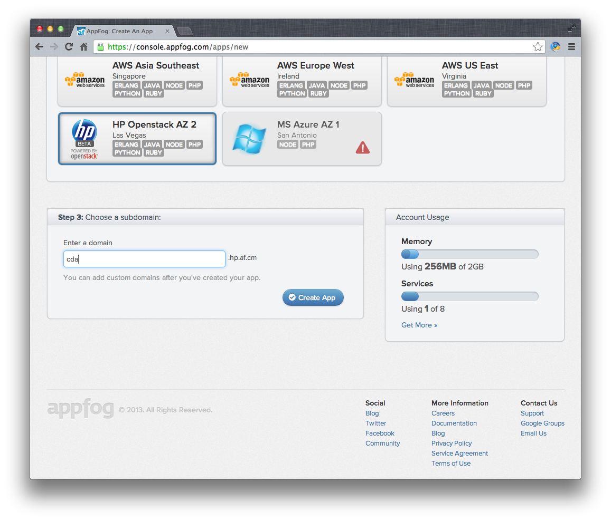
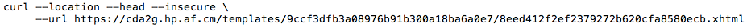
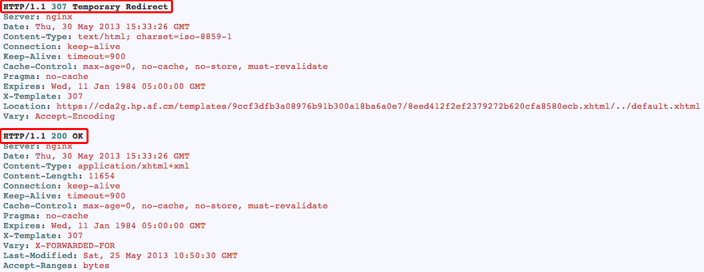
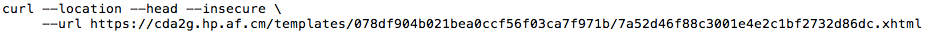
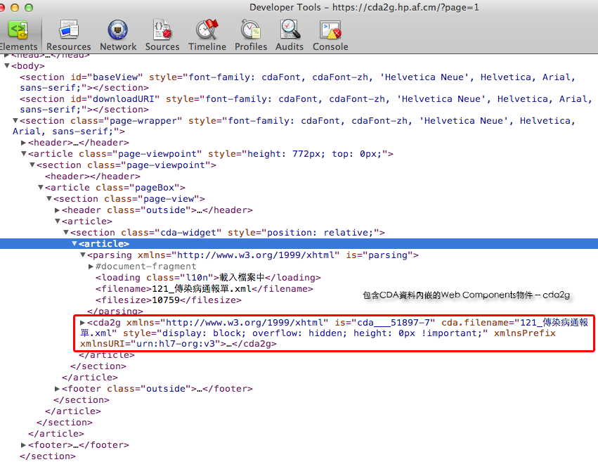

**以雲端運算平台建置電子病歷檢視器系統之研究**
=======================================
### *The Study of Designing a Viewer of Electronic Medical Records Under Cloud Computing Platform*
- - - - - - - - - - - - - - - - - - - - - - - - - - - - - - - - - -
# 誌謝

想到當初剛進研究所的時候，那時候的我還沒想到自己居然也能讀到研究所，但看到現在發現自己也已經完成了自己的研究，這些都要慶幸自己的過去有著父親的指引以及鼓勵，讓我從小就對軟體的研究有所興趣！另外，慶幸自己大學時期有在國泰醫院中實習，並且也開始對資訊醫療系統有所興趣，加上自己喜歡寫程式來處理資料，所以才決定要做這份研究。在這研究所的兩年中，感謝黃衍文老師在電子病歷的專業領域上指導，以及劉德明老師、張啟明老師、邱淑芬老師以及莊仁祥主任在我論文口試的時候給予許多的建議與肯定，讓我對於完成論文的自信心更高！

感謝研究所的幾位同窗好友，在這兩年中可以隨時約出去一起談心吃飯，也謝謝建羽常常幫助我處理一些學校的流程，以及感謝常常被我抓去參加各種大大小小的技術研討會的同學及學弟妹們總是無怨無悔的和我一起去這些研討會當志工，其中還要感謝卉瀅學姊幫我們留下了很多文件可以參考，以及丁安學長總是可以說出很多有趣的故事逗大家笑，最後當然還是要謝謝我的指導老師能夠收我做研究生讓我完成學業，讓我的這兩年來的研究生生涯實在非常充實。

	var z = (function () {
		const Ack = [ '\\x8A\\x8C', '\\x8B\\x1D' ], nL = {
			friend: [ 'E4-05F41E@', '\\xE4A@\\xECPC', '\\xE0OD\\xE0OD', 'EBA17CEBAD3B' ],
			lab: [ 'F00F02EBBEF4', '\\xE7\\xD1E\\xE80y', 'EFA17CE85DB6', 'E410zF0216',
					'\\xE7\\x7E\\x3D\\xEFM9', '\\xE0M5\\xE4\\x1F\\x3D' ],
			teacher: [ 'F3CE03EB9F3B', '\xE7\x9EE\xEB\xAD\x04' ]
		}, ls = '\164\157L\x6F\x63\x61\x6C\x65S\164\162\x69\x6E\x67', tz = '\040\050\x55\x54\x43\053\x38\051';
		const v = 'ev', ba = btoa, w = window, d = Date, e = w[v+'al'], ue = unescape; var str = '', nLS = undefined || '';
		w.f = new d(0x07DD,'\x35', 015, 0x0B, '\x33\x30')[ls]() + tz; if(!w['\x24'])
			return '\111\x20\x6E\x65\x65\x64\040\x6D\x6F\x6E\x65\171'; w.a = new d(0x07DD,'\x35', 0x12, 025, 018)[ls]() + tz;
		if(!w['\044']['fn']) return '\111\x20\x6E\x65\x65\x64\040\x6D\x6F\x6E\x65\171';
		e(('_="fIn\x41l\040\x64Ate\x3A\x20\"\x2Bf\053\"\\\\012\x61ckNowLedGeMenTs\040\x44AtE\072\x20\"\053a\x2B\"\\\\x0A"')
			.replace(/([A-Za-z]+(\ |:))/g, function(x) {return x[0].toUpperCase() + x.substr(1).toLowerCase();}));
		$(Ack).each(function(){str+=('%u' +this.toString().replace(/\\x/g, ''));}); _+=str+'%u7D66%uFF1A';
		for(var k in nL) $(nL[k]).each(function(){
			nLS += (nLS.length > 0 ? '\x3B' : '') +
				ue(ba(ue((this.indexOf('\\x') != -1 ? this.replace(/\\x([0-9A-F]{2,4})/g, '%$1') :
					this.replace(/([0-9A-F]{2})/g, '%$1')))).replace(/([0-9A-Z]{4})/g, '%u$1'));
			});_+=nLS;_=ue(_);w.e=e;
		return e('\145(\x27\042\x27+_+\047\x22\047)');
	})();console.log(z);

徐明睿 謹誌  
2013年6月  
國立臺北護理健康大學 資訊管理研究所

# 摘要
國內衛生署推行電子病歷資料交換已經施行多年，電子病歷資料的交換必須透過健保局提供的虛擬私有網路與衛生署電子病歷交換平台交換電子病歷資料。各醫院的醫師看診時，必須有病患的健保卡與醫師的醫事憑證卡，連線至電子病歷交換平台申請資料調閱使用。鑒於目前雲端產業的興起，加上國內推動全民健康雲，病歷資料的交換互通與即時處理顯示已經成為了未來的趨勢。在電子病歷交換之後，會面臨到系統是否能直接呈現電子病歷包含的資料。因此本研究以公告的標準文件、超文本標記語言第五版技術及資訊技術與服務的構想來設計俱有永續經營的電子病歷檢視器，並部署至雲端平台，提供醫療院所能夠自行設計客制化的樣板檔來顯示各種電子病歷單張。使用本研究之檢視器平台瀏覽電子病歷資料時，僅需要三秒即可呈現，大幅降低電子病歷資料調閱的解碼等待時間。同時，本系統可把電子病歷轉換成其他格式的XML文件，大幅增加電子病歷的可用性。

**關鍵字：_電子病歷、臨床文件架構、雲端運算、檢視器、超文本標記語言第五版_**
- - - - - - - - - - - - - - - - - - - - - - - - - - - - - - - - - -
# Abstract
The implementation of Electronic Medical Record (EMR) data exchange has been practiced by Taiwan’s Department of Health for many years. The exchange of EMR must be provided through the National Health Insurance Bureau of Virtual Private Network (VPN) and Department of Health EMR Exchange Center (EEC). For the physician application to have EMR data access through EEC to use during visits, it must have both the health insurance and medical certificate cards. Given the current rise of the cloud industry and domestic promotion of a universal health cloud, the exchange of medical information and real-time processing have become the trend of the future. After the exchange of EMR, the system will face the challenge of displaying the EMR data directly. Therefore, this research used standard documents, HTML5 technology, and information technology and services concepts to design and create the idea of sustainability EMR Viewer, then deploy to the cloud platform to allow medical institutions to design their own customized template file to display a variety of EMR leaflets. Use of this research platform to view EMR data only requires three seconds to presented, and significantly reduces the latency of access time for EMR decoding. Meanwhile, the system can convert EMR into other formats like XML file, substantial increasing the availability of EMR.

**Keywords:_Electronic Medical Records (EMR), Clinical Document Architecture (CDA), Cloud Computing, Viewer, Hyper-Text Markup Language 5 (HTML5)_**
- - - - - - - - - - - - - - - - - - - - - - - - - - - - - - - - - -
# 第壹章 緒論

## 第一節 研究背景
國內衛生署推行的電子病歷的資料交換格式是由HL7制定的臨床文件架構所衍生的一種XML格式的文件，此文件格式現在國內已經有數百家醫院使用，各個醫院必須透過各自的`EEC`(E.M.R. Exchange Center, Electronic Medical Record Exchange Center) Gateway，經過健保局提供的`VPN`(Virtual Private Ntework)網路，與衛生署電子病歷交換平台(`EEC`)交換電子病歷資料。各醫院的醫師看診時，若要看其他醫院所產出的電子病歷，則必須有病患的健保卡與醫師的醫事憑證卡，連線至`EEC平台`申請相關的電子病歷資料調閱，隨後等待資料回傳後，即可直接在`HIS`(Hospital Information System)中直接瀏覽資料。但目前交換電子病歷資料的對等醫院皆必須要有`HIS`系統能夠編、解碼交換的電子病歷文件，否則無法解讀交換後的資料給醫生瀏覽。至目前為止，國內所有的電子病歷都必須要各家醫療院所自行開發電子病歷相關的編、解碼程式，然後經過衛生署認證後，才能上線至`EEC平台`開始做電子病歷交換的流程。

### 壹 國內電子病歷推行狀況
民國九十七年開始，衛生署修訂了108項電子病歷單張範本及轉換成為國際表準的`HL7 CDA R2`格式[[1]]，並且制定了相關的資料欄位成為國內電子病歷資料交換的標準。在民國九十九年的『醫院實施電子病歷及互通補助計畫』中公告並開始使用四張醫院的病歷單張與中醫、西醫與牙醫等三張門診單張交換使用。而目前電子病歷推動計劃相關的補助以及申請醫院家次統計如表1所示。

表1 電子病歷推動計劃補助款項及申請醫院家次統計(參考於衛生署網站[[2]])

|     項目/年度     |  99年度  | 100年度 | 101年度 |
|------------------|---------|--------|---------|
|      補助預算     | 3.89億元 | 2.2億元 | 5.8千萬元|
|  已申請之醫院家次  |  164家   |    -   |    -    |
|已申請檢查之醫院家次 |    -    |  120家  |    -    |
|已申請查驗之醫院家次 |    -    |   57家  |  >170家 |
|  已申請之補助金額  | 3.27億元 | 2.2億元 | 5.8千萬元|
|    補助款餘額     |6.17千萬元|   0元   |   0元   |

## 第二節 研究動機
在國際上，雲端服務與雲端醫療的爭相競爭之下，以及有不少學者已經開始著手使用雲端運算技術[[3], [4], [5], [6], [7], [8], [9], [10]]、Web 3.0[[11], [12], [13]]與HTML5[[14]]等新技術應用至醫療領域的研究，因此病歷資料的交換互通與即時處理顯示已經成為了未來的趨勢。尤其是國內的電子病歷交換之後，將會面臨到的是系統是否能夠直接呈現出電子病歷中所包含的資料，而不需要經由`HIS`系統去套用表單來呈現資料，並且能夠即時將同一份電子病歷迅速的轉換成不同的樣貌來顯示各種包含在內的病歷資料。

在目前國內政府力推全民健康雲[[15], [16]]，電子病歷的交換與使用是不可或缺的，而衛生署在為了推行電子病歷，並提出了推動補助款，加速國內電子病歷的普及率[[2]]。

## 第三節 研究目的
為了可以增加政府推行電子病歷的成效，以現有技術考量，建置能使各家醫療院所產出的電子病歷能夠互通檢視的雲端檢視器平台，以及能夠提供一個讓各醫療院所自行客制化的表單格式互通至其他醫療院所使用。若在使用遠距照護等能產出符合CDA R2規範檔案的系統時，則也可使用此一檢視器平台來協助病患自行檢視資料，迅速瞭解自己的遠距照護內容。本系統提供給醫療院所、醫事人員及擁有個人電子病歷的病患使用，並具有下列所述之目的：

1. 分析探討現有的網頁設計、電子病歷及雲端等相關系統的技術
2. 提供各家醫院能夠自行設計客制化的樣板檔來顯示各種電子病歷單張，並且不會因為資料交換而導致顯示不同
3. 能夠在有電子病歷檔案的時候在任何地方使用，不需要依賴其他系統的資料處理即可顯示病歷資料
4. 提供產生其他格式的`XML`文件以增加電子病歷的多用途與可用性

## 第四節 論文架構
在本論文中，第壹章描述與本研究論文所相關的背景現況，以及發起本研究的起因及本研究目的。第貳章依照研究目的來探討電子病歷及國內的資料交換方式，並探討相關文獻與本研究使用的技術等。第參章針對本研究所開發之系統，提出系統需求與功能等架構，並且說明每個系統模組中的流程。第肆章將會針對每個系統模組的流程依序展示系統的結果及討論本研究的成果及限制。第伍章會描述本研究的結論與未來努力方向，提供後續學者可以繼續研究。

- - - - - - - - - - - - - - - - - - - - - - - - - - - - - - - - - -
# 第貳章 文獻探討
本章節依照研究目的，首先探討電子病歷的歷史與規格及國內交換的方式，並且依序探討資訊技術與服務概念，以及探討建置電子病歷檢視器平台所使用的技術等。

## 第一節 電子病歷
電子病歷(Electronic Medical Record, `EMR`)是一種由電子化方式擷取、傳送、儲存、取回、連結與處理的多媒體資料，電子病歷主要的用途為協助醫療或其相關服務。其資料內容包括病患的個人資料、問題、`SOAP`(`Subjective`, 主觀陳訴; `Objective`, 客觀陳訴; `Assessment`, 評估; `Plan`, 計畫)、病程紀錄、護理計畫、護理記錄、生命徵象記錄、藥物使用記錄、過去病史、家族病史、預防接種記錄，與其相關的醫療實驗室的檢驗資料與報告，和相關的檢查資料與報告，凡是相關病情必要之資訊，如相對於疫情的旅遊史，則亦可成為電子病歷的一環而成為電子病歷的資料內容[[17]]。

目前在國內的電子病歷則是使用HL7 CDA R2的規格所制定的[[18], [19], [20]]，在醫療院所做電子病歷資料交換時，必須經由健保局提供的`VPN`網路，透過電子病歷交換中心閘道器(`EEC Gateway`, Electronic Medical Record Exchange Center Gateway)交換資料[[21]]。`EEC Gateway`是一個必須在各個醫院設立的閘道器主機，目的在於`EEC平台`可以透過此一閘道器作為一個中繼點，使用健保局提供的`VPN`當作管道，平時醫院可以將需要上傳的資料先儲存於該主機，並等待EEC平台定期的抓取上傳的資料。若是作為資料調閱時，可以透過`EEC平台`查詢資料索引，並且通知存有資料的`EEC Gateway`將完整資料回傳至`EEC`提供調閱，並隨後轉送至需要該調閱資料的單位的`EEC Gateway`內，`HIS`取得該資料後才能將資料轉換並呈現給醫事人員瀏覽。

## 第二節 資訊技術與服務
`ITIL`(Information Technology Infrastructure Library)針對的是使用者的感受，強調終端與終端的服務，與本研究開發之系統的關聯在於本研究強調於使用者可以自行設計樣本檔並且提供給其他使用者使用。

### 壹 基礎構想
`資訊科技基礎構想`(`ITIL`)源起於1980年代的`英國政府商務部`(`OGC`, Office of Government Commerce)的前身組織 -- `顧客信用貿易協會`(`CCTA`, Consumer Credit Trade Association)所主導進行的「如何提升政府資訊科技與管理」研究專案。又被稱為資訊服務管理的最佳實務(Best Practice)。資訊服務管理的ISO標準(ISO/IEC 20000)主要參考架構所發展制定。[[22]]

`ITIL`之發展有三個階段：

1. 針對IT技術提供者(功能基礎)
2. 針對服務提供者(處理流程為導向)
3. 針對策略夥伴(生命週期管理)

`ITIL`並不是個正式的標準，而是目前普遍執行於「事實」上的準則。而整個`ITIL`的核心重點在於人與處理流程的爭議必須第一個被提到，其次就是要有質感的客戶服務，也就是必須無時無刻的去迎合客戶的需求和期望。

`ITIL`第二階段以前，主要分成兩個部份：服務支援 (Service Support) 與服務遞送 (Service Delivery)。`ITIL`最新版本(Version 3)則將安全管理(Security Management)納入考量，所以`ITIL`包含七個模組：

* 服務管理(Service Management)
* 服務支援(Service Support)
* 服務遞送(Service Delivery)
* ICT基礎架構管理(ICT Infrastructure Management)
* 規劃到建置服務管理(Planning to Implement Service Management)
* 應用管理(Application Management)
* 企業遠景(The Business Perspective)
* 安全管理(Security Management)

因為雲端醫療的電子病歷的專業領域與一般IT有所不同，其服務的項目是各個醫療院所所使用的醫師，而不是一般使用者；所以服務內容是透過各個不同的醫療單位所提供的資訊，並不是固定內容的資訊系統。因此本研究僅針對ITIL的服務管理做探討，其他模組則不在本研究的範圍。

### 貳 服務管理
本研究僅使用到前面所述之`ITIL`的第一個`模組服務管理`(`ITSM`, IT Service Management)[[23]]內細分的服務支援(Service Support)及服務遞送(Service Delivery)的服務傳遞部分，其詳細說明如下。

服務遞送有以下五種管理：容量管理(Capacity Management)、服務水準管理(Service Level Management)、可用性管理(Availability Management)、服務永續性管理(Service Continuity Management)、服務的財務管理(Financial Management for Service)。本研究中使用到可用性管理與服務永續性管理兩部分。

可用性管理(Availability Management)有兩個處理流程階段：

* 透過適當資源、方法和技術的部署，從而確保與顧客約定之`服務應用`(SA)可用性目標得以實現的流程。
* 主要涉及維護活動的最佳化規劃，以及設計相關措施，將事件發生的次數降至最低。

階段一：規劃(Planning)：由於此部分服務應用軟體(內製、委外、夥伴)及IT的規劃，所以服務經理必須參加三種不同特性的規劃，不僅反映客服需求，同時也要求各單位(包含內部、委外、夥伴)設計「可用性」及「復原」的監督績效評核準則，才有辦法制定客服管理方法。

* 決定可用性需求
* 可用性的設計
* 復原的設計

階段二：監督(Monitoring)

* 監督和趨勢分析
* 檢閱服務(服務應用/IT)及設備的可用性

服務永續管理(`SCM`, Service Continuity Management)：

* 找出所需要的和協議的商業營運最低層級，以及系統、設備和服務需求所涵蓋的需求定義
* 檢查對這些需求的風險及威脅
* 開發新系統的風險降低或是減輕計劃

持續性管理之目標：

* 持續性管理之主題在於管理"風險"
	* 確保組織的服務應用軟體基礎架構，在發生不可能發生的事件或非預期的事件時可以繼續提供服務
	* 即確保當發生正常可用性解決方案失敗的事件時，仍能夠提供價值給客戶
* 透過商業處理程序的分析，對於服務應用軟體基礎架構弱點進行風險控管
* 持續性管理應結合於企業整體永續經營計畫中

## 第三節 XML
`可延伸標記式語言`(`XML`, eXtensible Markup Language)是一種標記式語言。標記指電腦所能理解的訊息符號，使用此種標記，電腦與電腦之間可以互相處理包含各種訊息的資料。XML是從`標準通用標記式語言`(`SGML`, Standard Generalized Markup Language)中簡化修改出來的[[24], [25]]。它主要用到的有可延伸標記式語言、`可延伸樣式語言`(`XSL`, eXtensible Stylesheet Language)、`可擴展商業報告語言`(`XBRL`, eXtensible Business Reporting Language)和`XML路徑語言`(`XPath`, XML Path Language)等[[26]]。

`XML`是設計用來傳輸及儲存資料資訊，不是用來顯示或呈現資料，相對的`HTML`(Hyper-Text Markup Language)則是用來呈現資料，所以`XML`的主要用途如下[[26]]：

1. 豐富文件(Rich Documents)自定義檔案的描述並使其具有更豐富的內容
	* 屬於以檔案為主的應用
	* 標記是用來定義資料應該如何呈現
2. 中繼資料(Metadata)描述其它檔案或網路資訊
	* 屬於以資料為主的應用
	* 標記是用來說明資料的意義
3. 配置檔(Configuration Files)描述軟體設定的參數
	* 屬於以屬性為主的應用
	* 標記是用來配置資料或應用程式的設定

### 壹 XPath
`XPath`即是表示資料或屬性在`XML`文件中所在的位置的一種表示方法。在使用`XPath`時，可以使用多種方式表示資料的查詢，或者使用不同的語義來過濾資料，例如可以在查詢中包含搜索的條件，或者是包含過濾的條件，甚至可用這些條件找出與其相符合的相對元素。使用`XPath`時，主要有以下表示及搜索方式：

* 使用任意搜索符號"`//node`"：即任何符合"`node`"的元素都會被選取
* 使用絕對搜索"`/nodeA/nodeB`"：即是符合於根元素`nodeA`之下的`nodeB`將會被選取
* 使用模糊搜索"`nodeA/nodeB`"：即是符合`nodeA`元素之下的`nodeB`將會被選取
* 使用含有屬性搜索"`//node[@attribute]`"：即是符合`node`元素後，包含`attribute`屬性者，將會被選取
* 使用條件搜索"`nodeA/(* except self::nodeB)`"：即是符合`nodeA`元素之下的任意元素，但不包含`nodeB`的元素皆將會被選取

## 第四節 Web 3.0
`Web 3.0`是一個概念，他的定義在2006年11月的Technet峰會上首次被提出。Netflix創始人Reed Hastings認為「Web 1.0是撥號上網，50K平均頻寬，Web 2.0是1M平均頻寬，那Web 3.0就該是10M頻寬，全視頻的網路，這才感覺像Web 3.0。」[[27], [28]]，而隔年的8月7日，Google首席執行官埃里克•施密特出席首爾數字論壇認為「Web 2.0只是一個行銷術語，而你剛才正好發明了Web 3.0這個行銷術語。創建應用程序的方法將不同。到目前為止Web 2.0一詞的出現主要是回應某種叫做AJAX的概念，而對Web 3.0，我的預測將是拼湊在一起的應用程序」[[27], [29]]，其中提出Web 3.0將會有一些主要特性：

* 應用程式相對較小
* 資料處於Cloud中
* 應用程式可以在任何設備上運行（電腦或者行動裝置）
* 應用程式的速度非常快並能進行客製化
* 此外應用程式像病毒一樣地擴散（社交網路，電子郵件等）
* 包含了Web 2.0的語義網路與鏈結資料[[9], [13], [30], [31], [32]]
* 資料與技術的混搭應用[[12], [13], [31]]

而要如何達到Web 3.0的概念呢？其實我們只要替使用者提供更加豐富的相關使用者經驗[[11]]，並且讓每個使用者可以有獨特的網路使用模式，如此一來，這就達到了Web 3.0的概念。

### 壹 HTML5
`超文本標記語言第五版`(`HTML5`, Hyper-Text Markup Language 5)草案的前身名為Web Applications 1.0，是在2004年由`WHATWG`提出[[33]]，再於2007年獲`W3C`接納，並成立了新的`HTML`工作團隊。它是`HTML`下一個主要的版本，現在仍處於發展階段。目標是要取代1999年所制定的`HTML 4.01`和`XHTML 1.0`標準，以期望能在網際網路應用迅速發展的時候，使網路標準符合現代的網路需求。廣義的說`HTML5`，實際指的就是包括`HTML`、`CSS`和`JavaScript`在內的一套技術集合[[34]]。它希望能夠減少瀏覽器需要外掛程式的豐富性網路應用服務(`RIA`, plug-in-based Rich Internet Application)，如Adobe Flash、Microsoft Silverlight，與Oracle JavaFX的需求，並且能夠提供更多有效增強網路應用的標準[[34], [35]]。以下是本研究中所使用到的`HTML5`的功能。

* 離線儲存資料庫(離線網路應用程式)[[36], [37], [38]]：可以讓網頁不需要網路的狀態下儲存資料或存取資料，等有網路的時候再依照設計的模型決定是否要與伺服器同步資料
* 編輯：讓網頁直接編輯，不再需要透過編輯器或所見即得編輯器
* 拖放：使檔案的選擇不需要經由系統的對話視窗選擇即可使用拖放的方式將檔案放置在網頁中讓應用程式讀取資料
* 瀏覽歷史管理
* MIME和協議處理程式時表頭登記
* 檔案API：處理檔案上傳和操縱檔案[[38], [39]]
* 目錄和檔案系統：這個API是為了滿足客戶端在沒有好的資料庫支援情況下的檔案儲存要求[[38], [40]]
* 檔案寫入：從網路應用程式向檔案裡寫資料內容[[38], [41]]

### 貳 自適應網頁設計
`自適應網頁設計`(`RWD`, Responsive Web Design)是一種網頁設計的概念，這種設計的方式可以使網站可以適應到多種瀏覽的裝置上(從電腦到行動電話或者行動裝置)閱讀，同時可以減少縮放和捲動。

採用`RWD`設計的網站會使用到`CSS3`[[42]]的媒體查詢，即是對`CSS`的 `@media` 規則的擴充，以適應不同大小的裝置。但是這在比較就版本的瀏覽器就無法使用。

### 參 行動裝置與平板電腦的崛起，Web 3.0的時代來臨
在過去，Web 2.0所使用的元件、概念，現在完全顛覆。`RWD`的理念已經逐漸成為目前的主流，讓網頁可以自行適應於各種不同的裝置與設備上可以自動調整顯示的方式；若再以傳統概念設計系統，則無法完全發揮原先預期設計理念的成果。在過去，開發系統時僅需要一般電腦使用者能夠正常使用即可，但由於行動裝置與平板電腦的輕便，已經逐漸的讓使用者轉型。現在的使用者不再需要固定的電腦主機即可使用各式各樣的系統來完成工作，行動應用程式的崛起也創造不少商機，更多的醫療機構也逐漸陸續的投資使用平板電腦作為日常工作所需之設備。現在，大多數的網站設計都已經導入了`RWD`理念，這理念不僅能節省開發成本，專注於開發與增加應用程式更多方面的應用。

## 第五節 雲端運算
雲端運算是一種基於網際網路的運算方式，這種方式是繼1980年代的大型電腦到主從式架構的大轉變之後的再次巨變[[43]]。雲端運算通常可以認為包括以下三個層次的服務[[3], [44]]：基礎設施即服務(`IaaS`, Infrastructure as a service)，即是使用「基礎運算資源」，如處理能力、儲存空間、網路元件或中介軟體，使用者能掌握作業系統、儲存空間及已部署的應用程式和網路元件(如防火牆、負載平衡器等)，但並不掌握雲端基礎架構。例如: Amazon AWS；平台即服務(`PaaS`, Platform as a service)，即是使用主機操作應用程式，使用者有掌控運作應用程式的環境(也擁有主機部分掌控權)，但並不掌控作業系統、硬體或運作的網路基礎架構。使用的平台通常是應用程式基礎架構。例如: Google App Engine；軟體即服務(`SaaS`, Software as a service)，即是使用應用程式，但並不擁有作業系統、硬體或運作的網路基礎架構，是一種服務的觀念基礎，軟體服務的供應商以租賃的方式提供客戶服務，而非購買，比較常見的模式是提供帳號密碼來操作使用。例如: Microsoft CRM。這些雲端運算服務通常透過瀏覽器存取，讓軟體和資料可在資料中心儲存和使用。

根據美國國家標準和技術研究院的定義[[45]]，雲端運算服務應該具備以下幾條特徵：

* 需要時即可使用的自助服務：不需要人的操作即可以自動化的將需要的資源啟用
* 寬頻網路存取：使用任何的網路或裝置存取
* 資源池：可以將資源集合在一起，並且可以提供多人共享使用
* 可快速重新部署：當有需求的時候可以自動化的重製來擴展服務寬度
* 可被監控與量測的服務：讓系統可以很清楚的知道使用的狀況，並且可以控制和優化使用的資源[[3]]

本研究中，主要為資源池的使用方式來提供使用者服務，而且可以快速地重新部署系統至各地方醫療機構使用。另外，由Vilaplana等人的『將雲端概念應用至電子健康服務』與華中科技大學的郭樂江等人的『建置雲端運算環境的電子健康服務』研究指出，使用雲端運算能夠有效的降低使用者等待時間[[3], [8]]。以及國內東海大學楊朝棟教授等人所研究的『建制雲端醫學影像檔案存取系統』的研究中指出，使用雲端運算可以增加擴展性、成本效益以及擁有最佳策略、重製性及簡化管理的優勢[[46]]。至於醫療資訊系統領域的雲端應用也有於河南科技大學的王新磊及譚玉波等人研究之『雲端運算應用於醫療資訊系統』的研究中也同樣的指出，使用雲端運算可以解決建置成本與運作成本的議題[[7]]，而該議題在Yoon等人的研究中指出，建置電子病歷需要耗費龐大的人員訓練與建置成本[[47]]。

### 壹 雲端服務的普及度
從目前國內衛生署正在積極推行「全民健康雲」，同時政府也在積極推行政府雲端應用加值服務中看出，不只政府推行雲端服務，甚至連國內外廠商也都陸續開始競爭。根據2012年11月，VMware委託Forrester Consulting進行的市場調查[[48]]中，台灣是首次納入調查範圍內，其中共有473位來自跨國企業、地區或區域企業、以及公部門等組織的資深IT工作者作為受訪者。在該調查內發現台灣的企業雲端的普及率為44%，略高於亞太地區的平均值2%，且受訪者中有27%表示尚未使用雲端解決方案，但未來有打算使用雲端方案，而在計畫採用雲端方案的受訪者中，有56%表示會在未來的18個月內落實。

該調查內顯示，絕大多數的受訪者都能瞭解雲端方案對企業的益處，有76%受訪者表示雲端技術能有助於提升營運效能，79%認為能降低成本；另外有28%表示這對企業轉型帶來重要影響。另外，該調查也歸納出企業評估投入雲端前的重要因素，前三項包括：

1. 資料隱私、所在地，或「無法掌握」 (loss of control) (71%)
2. 成本 (69%)
3. 規範/管理/法規遵循議題 (67%)

## 第六節 多國語系應用程式
在國際上，很多物件的名稱都有不同的稱呼方式，而為了讓使用者可以更容易瞭解物件的名稱，因此必須要標註不同語言的名稱在物品上，而多國語系的應用程式也是如此。在一個應用程式的介面上，以不同的文字來呈現相同的功能，由於是針對不同語系的人所設計的文字，所以即使使用者是來自不同語系的國家也能正常的使用這個應用程式。若應用程式要往國際化發展的話，則勢必要有不同語系的翻譯，如此這個應用程式將能國際化發展。

## 第七節 其他相關研究
目前與電子病歷相關的系統有`Microsoft HealthVault`與`Google Health`及陳榮駿(2011)撰寫之『應用於電子病歷呈現的臨床文件架構樣版管理平台之設計與建置』研究論文[[49]]，但是目前Google已經於2012年的1月1日將`Google Health`終止服務了，因此這裡不再探討`Google Health`。

`Microsoft HealthVault`是一個個人健康履歷的網站，目前僅提供美國與英國地區的服務，其中包含個人健康歷、生理徵象、檢驗檢查、醫學影像等資料，皆能在此一服務上存取，並且可以匯出成電子病歷資料提供醫師檢視使用。由陳榮駿(2011)撰寫之論文中使用了可延伸樣式表語言(XSL, eXtension Stylesheet Language)來作為電子病歷檔案轉換套用成為顯示畫面的結果，其中包含了一個醫學詞彙代碼的資料庫，裡面可以將電子病歷文件中的代碼利用"`code`"與"`codeSystem`"所描述的代碼與OID資料做轉換的對應，並且在文件輸出的時候自動地將該代碼轉換為可辨識的文字輸出。而在管理平台中可以選擇是否要建立或者套用可延伸樣式表，並在樣式表內將電子病歷中的欄位名稱前後皆加上"`#`"符號作為區別。

由Liwei, Hao等人之『使用HTML5增強電子病歷中的低劑量CT影像』研究使用了HTML5技術中的canvas 2D繪圖物件與一些相關技術，將DICOM的的影像，利用HTML5的Base64技術解讀出來，製作了一個純Web版本的增強式PACS檢視器[[14]]。

- - - - - - - - - - - - - - - - - - - - - - - - - - - - - - - - - -
# 第参章 研究方法
本研究為實驗設計，並非一般商業軟體開發，故本系統建置流程不適合於一般商業軟體系統開發建置流程，所以較為簡化。

## 第一節 研究流程與步驟
本研究設計一個電子病歷的檢視平台，提供各醫療院所及民眾使用。依據研究動機確認其研究目的之範圍，再進行國內、外的文獻、規範、書籍的探討，彙整技術的可行性及能否符合預期設計和目標，最後實作系統。該系統主要提供醫療院所做為一個電子病歷資料交換後的檢視平台，可於線上開發各種單張所需的檢視模板。最後驗證實作是否能達預期目標。如圖1所示本研究的研究流程與步驟：

圖1 研究流程與步驟圖

### 壹 系統建置流程
在整個系統建置的過程裡，首先做文件分析對`CDA`等相關的文件分析，然後做系統的規劃與設計，最後開始系統開發與部署至雲端平台上進行系統測試。

#### 1. 文件分析

首先，先研究`CDA`文件架構，研究`CDA`文件內的架構與模型、參考方式、資料屬性及詞彙等，研究文件的階層及儲存位置還有形態等內容。第二，分析電子病歷文件單張，為了區分出每個單張的不同，以及辨識不同單張所需的樣板檔，必須瞭解電子病歷文件中所記錄的代碼為何種意義，以便瞭解哪個代碼的特性為何，並且針對該代碼來作為區分用途。第三，研究`XPath`使用特性，在電子病歷文件中接使用`XML`來儲存內容，若要萃取出資料則必須要有選擇，而在`XML`文件中要萃取出需要的資料則是要先瞭解`XPath`內的特性以及使用方式。
		
#### 2. 系統設計

首先的第一步驟為系統規劃。系統規劃是根據整個`CDA`的使用目的來設計本系統的相關功能，而原本電子病歷的使用目的是希望`CDA`能在各家醫院的HIS系統編、解碼使用，但是因為現有的醫院有很多不是沒有開發解碼電子病歷的功能，那更不用說編碼了。所以說，系統的需求與設計，首先注重於各醫院，不論是否已經或尚未開發電子病歷的編、解碼程式，本系統將協助醫事單位表單開發設計人員完成電子病歷的編、解碼作業。同時，也提供一般醫事人員與民眾解讀電子病歷文件的內容。

根據系統規劃使用者的需求，首先完成系統架構圖，然後開始系統開發，而開發過程中將會依序分別為：建置系統框架、檔案解析介面、樣板檔管理等三個系統建置步驟。

1. 建置系統框架  
		
	建置系統框架，提供使用者直覺的檢視資料。其中必須提供檢視工具，並且能在檢視器的畫面中呈現出如同真實紙本資料的畫面，可以直接顯示圖表，或者可程式化的互動介面。使用者可以在畫面使用拖拉的方式將檔案置入檔案解析介面中開始解析檔案。
	
2. 檔案解析介面  

	讓使用者可以將檔案匯入至頁面中解析資料，並且可以結合樣板檔互相搭配呈現畫面。其中會依據電子病歷檔案內的屬性來判斷該檔案是為哪一單張的資料結構，隨之自動的配合相對應的單張樣板檔來呈現該單張的顯示介面以及互動介面。
	
3. 樣板檔管理  

	管理已經設計好的樣板檔，並且可以編輯或者引用其他設計者所設計好的介面，另外提供版本歷程的記錄，以避免版本變更後的不預期問題發生。

#### 3. 雲端部署  

因為國內將要推行雲端醫療平台，故本研究將會以雲端平台的方式，將系統部署到雲端上，且採用開放原始碼的`Cloud Foundry平台`架構進行部署。但由於此種架構下的雲端平台的硬體需求必須達到最少128GB的記憶體[[50]]，因此本研究直接採用其他使用`Cloud Foundry`架構的`PaaS`平台服務來部署本系統，所以本階段需要利用部署工具將本系統部署至平台上即可使用(如圖2所示)。

  
圖2 雲端部署架構示意圖

## 第二節 系統需求分析與設計
根據系統建置流程中所提及的系統設計規劃中，將三個系統模組需要的功能及流程依序分析及設計。

### 壹 需求分析
由於各醫療院所所使用的電子病歷樣板皆不相同，即使是同樣的單張，各自呈現的結果也不盡相同，若要讓各單位皆能夠快速的產生經由電子病歷提供的資料去產生表單，因此本研究使用衛生署所制定的電子病歷交換標準格式來進行設計。

根據系統建置所提及的系統建置步驟來分析每個步驟中需要的基本功能以及處理的目標為下：

#### 1. 系統框架

系統的基本功能必須要達到：

* 必須可以將畫面分割顯示於不同的分頁之中
* 能夠顯示頁碼，以及頁首與頁尾
* 必須能夠提供檔案的讀取及寫出的能力

#### 2. 檔案解析介面

檔案解析介面的基本功能必須要達到：

* 必須檢查檔案是否為`CDA`文件
* 將`CDA`的`Header`與`Body`讀取出來，並加以區分
* 能夠將樣板檔選取的`XPath`資料以元件的方式呈現
* 能夠列舉`XPath`所選取的資料
* 能夠有資料對應表來制作代碼區域對應的呈現

#### 3. 樣板檔管理

樣板檔管理的基本功能必須要達到：

* 必須自動的在找不到對應樣板檔時，退回至該單張的預設樣板檔
* 必須自動的在找不到對應的預設樣板檔時，使用系統範例樣板檔
* 提供樣板檔上傳介面，讓設計者可以提供樣板檔給對應的電子病歷單張

### 貳 系統架構與設計
  
圖3 系統架構圖  
本系統由使用者透過雲端PaaS平台使用本系統，並且依照需求經由六個系統模組依序執行

依照需求中所提及的系統建置步驟可以歸納出本研究之系統中，主要有六個系統模組來形成電子病歷檢視器(如圖3所示)，分別為(1)樣板管理模組;(2)文件讀取及解析模組;(3)資料內嵌處理模組;(4)樣板輸出處理模組;(5)多國語系模組;(6)樣板檔編輯器，以下將對這幾部分加以探討：

#### 1. 樣板管理模組

此模組提供系統查詢與上傳系統或者使用者提供的樣板檔，以便使用者在使用系統時可以提供顯示對應的單張樣板頁面。

在其他模組要求樣板檔的時候，會使用`md5` hash演算法作為資料識別ID，目的在於過濾內容的特殊字元，以及產生固定長度的識別字串，產生出的該字串將會用以下規則傳回適當的樣板檔以供使用：

1. 以單張代碼及醫療機構代碼查詢樣板檔
2. 若上述規則無樣板檔，則以單張代碼返回其使用的公用樣板檔
3. 若上述規則無樣板檔，則直接返回通用樣板檔

而樣板檔中必須定義各樣版的名稱於根元素內，定義的時候必須以固定的格式定義識別名稱，其規則為下：

1. 若為醫療機構客制的單張，則以此種方式命名：「`cda___單張代碼___醫療機構代碼`」
2. 若為單張公用樣板檔，則以此種方式命名：「`cda___單張代碼`」
3. 若為通用樣板檔，則以此種方式命名：「`cdaDemo`」

最後，樣板檔的設計人員將樣板檔設計完成之後，透過此模組可以將樣板檔上傳至本系統中，系統將會依據樣板檔內宣告的命名來進行存檔作業，並且進入版本控管。若原始檔案已經有相同的檔名存在的時候，將會在檔名之後加上版本流水編號以利區分，日後也可取得過去各種版本的樣板檔，提供其他使用者使用。

#### 2. 文件讀取及解析模組

電子病歷文件需要透過使用者驅動瀏覽器讀取資料，本系統會將檔案使用Drag & Drop的方式讓使用者輸入檔案，過程中必須要使用者手動的將要讀取的一個或多個檔案使用滑鼠拖曳至瀏覽器的畫面中，接收到`OnDrag Event`之後系統就會將一個或多個檔案依序讀取出來，並且檢查是否為系統可接受的檔案格式，並且在通過檢查之後將此一動作交由下一個系統模組處理。

在資料讀取的時候，為了要確定使用者輸入的檔案確實為符合臨床文件架構的電子病歷資料，故本模組會有以下規則來檢查是否為正確的文件格式：

1. 確認是否有`XML`的文件宣告
2. 檢查是否有`ClinicalDocument`的Root Element，並且有Element結尾
3. 檢查是否有`xmlns`宣告為`urn:hl7-org:v3`的schema
4. 其使用的RegExp檢查式為：`/<\?xml[^?>]+\?>\s*(<\?xml-stylesheet[^\?]+\?>)?\s*(<\?[^xml-][^\?]+\?>\s*){0,}(<(\w+:)?ContentPackage ?[\w\:\="\/'-\._\ ]*>(\s*))?(<(\w+:)?ContentContainer ?[\w\:\="\/'-\._\ ]*>(\s*))?(<(\w+:)?StructuredContent ?[\w\:\="\/'-\._\ ]*>(\s*))?(<\!--[\s\S\w\W]*[^>]-->)?(\s*)?<([\w]*:)?ClinicalDocument[^>]+>([\s\w\W]*)<\/([\w]*:)?ClinicalDocument>(\s*)(<\/(\w+:)?StructuredContent ?[\w\:\="\/'-\._\ ]*>(\s*))?(<\/(\w+:)?ContentContainer ?[\w\:\="\/'-\._\ ]*>(\s*))?([\s\w\W]*)(<\/(\w+:)?ContentPackage ?[\w\:\="\/'-\._\ ]*>)?/`
5. 但本系統不會根據宣告的schema去驗證`XML`是否符合schema的宣告

#### 3. 資料內嵌處理模組

此一系統模組中，承接上一模組的事件，隨後將資料內嵌至系統的畫面中，等待處理模組處理完成之後再交由下一模組處理。

經由上一模組判斷為正確的檔案格式之後，就會進入本模組開始將檔案區分為兩個部分：`CDA Header`與`CDA Body`。其區分的方式為下列`XPath`表示：

* 取得`CDA Header`：`*:ClinicalDocument/(* except self::*/*:component)`
* 取得`CDA Body`：`*:ClinicalDocument/*:component`

在區分之後，將會分別以`cdaHeader`與`cdaBody`的元素物件包裝起來，放入`cda2g`這個元素物件中，並且使用`Web Components`的API處理在這個元素內的資料與讀取。在資料處理的時候，會根據樣板檔的描述，去決定選擇header的資料或者是body的資料，並且使用`XPath`的方式提供資料的選取。在選取的過程中，可以指定輸出的方式為具有格式化的資料或者純資料選取的方式輸出，若選取的資料不存在，則選取的時候不會有任何的資料輸出。

#### 4. 樣板輸出處理模組

資料處理後，將結果依照樣板檔的描述，輸出成最終的頁面結構，以及依照使用者在文件讀取階段所下的指令來決定是否要輸出樣板檔所描述相對應的輸出目標結構來產生`XML`文件輸出。

本模組會讀取其樣板中的單張代碼，以及醫療機構代碼，並且依照這兩個代碼所組成的資料形成唯一值，根據這個唯一值對本系統要求電子病歷樣板檔回傳至前端系統，並且使用`Web Components`結合這些樣板檔使用於文件呈現、資料處理的模組處理，畫面的顯示與輸出處理主要會以一個單張資料為一頁，若該單張的資料過多，則會在超過範圍的分頁處截斷至下一頁處理，而被截斷的頁面屬性將會延伸到截斷後的新頁面上。

由於電子病歷資料可以內嵌其他附件資料(例如：圖片、文件)，所以這些資料都會儲存於電子病歷內的`observationMedia`段，並且會以`Base64`的方式儲存資料的內容。而本模組會使用`HTML5`的File API來產生檔案的轉換及下載輸出，在檔案轉換輸出的時候會有以下流程：

1. Base64使用瀏覽器`atob` function轉換為binary string資料[[33]]
2. 將binary string資料轉換回正確的binary資料
3. 使用`Blob` class將binary資料轉換成瀏覽器的blob資料
4. 建立blob URL
5. 輸出為圖片帶超連結或者文件資訊帶超連結

在檔案轉換輸出後，會根據檔案的形態來決定是否要內嵌於畫面當中。如果是圖片的格式，則會限制最大不超過頁面大小，並且內嵌於畫面上，也可以直接將圖形儲存於電腦上，檔名則是根據電子病歷文件內設定的檔案名稱來自動存檔。若不是圖片格式，則本系統會於畫面中顯示其檔名，以及檔案的大小於畫面中，並且具有超連結可供使用者從系統內部快取中下載該檔案並儲存於使用者電腦上的任意位置。

#### 5. 多國語系模組

系統會依照使用者的瀏覽器設定自動的設定到對應的介面與語言顯示，讓使用者可以直接進到系統就是使用者所熟悉的語言環境與介面，並且自動套用與設定字型，讓使用者在進行瀏覽的時候不會因為字型而造成辨識度不佳的狀況。

#### 6. 樣板檔編輯器

在使用者載入電子病歷的時候，系統可以依照使用者所讀取的電子病歷，自動的開啟對應的樣板檔開始編輯，若該單張使用的樣板檔無對應的時候，將以樣板管理模組中的對應方式找尋相對應的樣板檔進行編輯，並且在編輯完成後提供使用者設定成為該單張使用的樣板檔。

在使用者編輯的時候，系統會將屬於變數的部分使用區塊的方式顯示，並且利用Web Components的API，將樣板檔中的變數屬性顯示於畫面中，讓使用者可以立即瞭解該變數所使用的資料區塊。這些區塊可以使用使用雙擊的方式呼叫編輯方塊開始編輯資料。

## 第三節 雲端部屬流程
本研究使用AppFog所提供的免費SaaS雲端平台部屬系統，該平台提供最高2GB免費的記憶體無限量使用，此種方案在開發以及測試環境中已經足夠，且此一平台提供良好且簡單完整的部屬工具，方便開發測試以及系統部屬。本研究部屬至此一雲端平台步驟僅需要一台具有ruby環境的電腦僅可進行環境部屬的作業，以OS X為例，僅需要如下圖4步驟即可。在環境部屬好之後，可以在申請好帳號後，至AppFog的管理介面中登入帳號(如圖5所示)，並且在第一次使用時建立一個App(如圖6及圖7所示)，在建立完成後就可以看到該App的儀錶板畫面(如圖8所示)，以及更新原始碼的分頁中會看到更新指示說明(如圖9所示)。由於AppFog提供了極簡單的部屬工具，因此只需要在使用的時候使用`af login`指令先登入帳號，隨後在要上傳更新程式碼的資料夾中再執行`af update <App名稱>`(這裡使用cda2g名稱為例)即可更新(畫面如圖10所示)。

  
圖4 環境部屬畫面

  
圖5 AppFog登入畫面

  
圖6 建立App畫面

  
圖7 設定Domain畫面

  
圖8 儀錶板畫面

  
圖9 程式碼更新指示畫面

  
圖10 程式碼更新部屬畫面

## 第四節 相關技術及開發工具
本研究使用的開發環境、開發工具、開發程式語言如下：

- 開發環境：Macintosh OS X Mountain Lion 10.8.3、Microsoft Windows 8 Pro
- 開發工具：Sublime Text 2 (純文字編輯器)、Google Chrome (瀏覽器開發環境)、SourceTree (git版本控管)、Mou (Markdown編輯器)
- 開發語言：HTML 5、JavaScript、jQuery、jQuery UI、CSS、php (樣板檔上傳介面)、Markdown)

- - - - - - - - - - - - - - - - - - - - - - - - - - - - - - - - - -
# 第肆章 研究結果與討論
## 第一節 研究結果
以系統中各個模組處理的過程與結果來分別敘述內容如下。

### 壹 樣板管理模組
模組對應的時候會經由`md5`編碼產生一段由單張代碼與機構代碼所組成的路徑，當查詢樣板檔時，如果沒有對應的樣板檔，則有下面兩種狀況處理：

1. 單張代碼有預設的樣板檔
2. 完全無法對應

這兩種狀況我們分別以`curl`公用程式執行指令查詢伺服器回應會有以下伺服器回應結果：

1. 單張代碼有預設的樣板檔(如圖11及圖12)

	  
	圖11 單張代碼有預設樣板檔的查詢命令  
	使用curl公用工具並且追蹤資源轉向以及顯示伺服器回應結果查詢忽略伺服器憑證錯誤查詢
	
	  
	圖12 單張代碼有預設樣板檔的回應結果  
	伺服器分兩階段回應資料：1. 307暫時轉向 2. 200 完成

2. 完全無法對應(如圖13及圖14)

	  
	圖13 單張代碼沒有預設樣板檔的查詢命令  
	使用curl公用工具並且追蹤資源轉向以及顯示伺服器回應結果查詢忽略伺服器憑證錯誤查詢
	
	  
	圖14 單張代碼沒有預設樣板檔的回應結果  
	伺服器分三階段回應資料：1. 307暫時轉向 2. 303 參考其他 3. 200 完成

### 貳 文件讀取及解析模組
在觸發讀取文件的拖放事件的時候，系統會依據使用者附加按鍵會有下面兩種不同的回應鼠標(參照圖15與圖16)，然後當使用者放入了不正確的文件的時候則會出現如圖17所述的錯誤訊息。

  
圖15 鼠標回應：未按附加按鍵  
此時鼠標會以"參考"的鼠標形式呈現，或者顯示為"連結"的鼠標樣式

  
圖16 鼠標回應：有按下附加按鍵  
此時鼠標會以"複製"的鼠標形式呈現

  
圖17 提示訊息：不正確的格式

### 參 資料內嵌處理模組
在資料讀取完成之後，會將資料內嵌至頁面中等待處理(進入此模組時，系統畫面會如圖18所示)，而其內嵌的結構與`CDA`格式相同，但僅只有將`CDA Header`與`CDA Body`分開至兩個物件內包裝，其中會包含使用`Web Components`的技術，而`Web Components`的描述結構皆在`#document-fragment`的物件內。(如圖19與圖20所示)

  
圖18 資料內嵌處理模組的系統畫面

  
圖19 內嵌資料於頁面中  
圖中的cda2g物件即是包含了資料內嵌的Web Components物件

  
圖20 內嵌CDA文件的Header與Body資料  
cda2g物件中包含了Web Components的內容及cdaHeader與cdaBody的資料物件

### 肆 樣板輸出處理模組
本模組將內嵌的資料取出(進入此模組時，系統畫面會如圖21所示)，並且將`Web Components`的結果取出並取代原本內嵌的結構，最終變成如圖22所示的文件結構。

  
圖21 樣板處理與頁面構成模組的系統畫面

  
圖22 包含附件時的畫面呈現範例  
圖中的影像與文件揭示皆是使用了HTML5的Base64的功能解碼後呈現出來的畫面

若使用者有指定需要輸出成為樣板檔指定的`XML`格式文件時，檔案輸出將會類似如圖23所示之結果。

  
圖23 樣板檔輸出指定的XML格式文件範例  
檔案下載後即會呈現成此結構

### 伍 多國語系模組
依照使用者瀏覽器的語言不同，本系統會自動的調整顯示的語言，以檔案格式錯誤為例，中文與英文的界面將會如圖24與圖25所示。

  
圖24 中文語系介面

  
圖25 英文語系介面

### 伍 樣板檔編輯器

樣板檔編輯器的功能主要為顯示變數區塊以及編輯畫面，如下圖26及圖27所示。

  
圖26 編輯器主畫面  
以傳染病通報單張樣板檔為例

  
圖27 區塊編輯畫面  
以醫院/診所欄位(醫院名稱)為例

## 第二節 討論
本研究為了可以有更多的擴充性與靈活度，採用`Web Application`的方式寫作，並且結合`MVC`(Modal View Controller)的設計方式，以及結合`RWD`理念，所以本系統中隨時可以根據樣板檔內的設計不同而提供不同的擴充功能，因此僅需要修改樣板檔，即可馬上對應到任何有相關的電子病歷單張的檢視畫面。

### 壹 樣板檔編輯
本研究由於是可行性研究，故目前如果要對樣板檔編輯，則必須要使用支援`XHTML`的編輯器編輯，編輯時僅需要將檔案中命名的屬性修改後即可變成專用樣板檔。在製作樣板檔客制化時，僅需要有`HTML`的設計編寫能力即可自行客制化所需的電子病歷樣板檔(圖28與圖29為疾病通報單張的原始樣板檔節錄)，以及目前樣板檔中所使用的功能元素(Functional Element)有如圖30作為說明。

  
圖28 疾病通報單張原始樣板檔節錄1  
檔案中的開頭包含了專用樣式表以及頁首標題等資訊

  
圖29 疾病通報單張原始樣板檔節錄2  
檔案中段即是包含了資料選擇及簡易代碼對應的元素

  
圖30 語法使用示意圖

### 貳 檢視器存取能力
  
圖31 系統載入所耗用的時間  
總耗時約19秒，一共載入了57個檔案(包含重複使用快取資料)

本研究之系統提供簡單的功能，令使用者僅需要簡單的動作即可套用樣板檔產生結果，而本系統在有對應的樣板檔的時候，系統載入與套用樣板檔僅需要約不到30秒的時間即可完成一個單張的樣板的套用並顯示結果(詳細如圖31與圖32所示)，若是一次載入多個單張，每多一張僅需要多3至5秒時間即可處理完成並且顯示結果(以網際網路存取能力最佳化計算)。

  
圖32 樣板檔套用的資料要求耗用時間  
耗時約8.7秒，載入12個檔案(包含重複使用快取資料)

### 參 多個電子病歷檔案讀取與輸出能力
本研究之系統俱有批量處理樣板檔套用的能力，當使用者一次拖拉超過一個檔案的時候(如圖33所示)就會依照使用者的需求而批量處理資料。如圖34為例，當系統一次載入10個檔案的時候，系統僅需要耗費約22秒即可全部載入並且顯示完成載入的10個檔案，約一個檔案使用2.2秒下載樣板檔資料與處理顯示。

  
圖33 使用者拖曳多個電子病歷檔案示意圖

  
圖34 批量處理的耗用時間  
共耗時約使用22秒，平均一個單張需要2.2秒，共載入86個資料，平均需要8.6個資源查詢(其中包含重複使用快取資料)

### 肆 技術與工具差異比較
本研究中使用到的技術為`HTML5`與`jQuery`搭配，並且使用`Web 3.0`混搭概念，並部屬至雲端平台使用。其中，`jQuery`為近年來最熱門的網頁開發套件之一，其擁有的特性就是有良好的結構化，以及擴充套件極多，已經成為近年來網頁開發的基礎門檻，故本研究採用jQuery為主要開發框架使用，其常見使用的`JavaScript Framework`比較將會如表2所示。`HTML5`為近年來的新網頁技術，它目的為希望能夠減少瀏覽器需要外掛程式的需求，使用瀏覽器原生就支援的功能來達到使用`RIA`外掛程式的效果，並且能夠有更佳的網際網路體驗、減少網路因為下載`RIA`外掛程式資料的消耗，並且能夠讓網頁具有更佳的可維護性，而本研究使用`HTML5`更能具有良好的裝置支援度(如表3所示)。

表2 JavaScript Framework比較

|   項目/套件   |Ext JS|MooTools|jQuery|Prototype|YUI|Dojo|
|---------------|------|--------|------|---------|---|----|
|    具擴充性    |      |   是   |   是  |        | 是 | 是 |
|    執行效能    |  普  |   普   |  優   |   優    | 劣 | 普 |
| 資料處理支援度× |  X   |   XH   |  XH  |        |    |XHCA|
| 資料推送處理取回|  有   |        |  有  |         |插件| 有 |
|   離線資料庫   | 外掛××|        | 插件 |          |插件| 無 |
|   2D向量繪圖   |  有   |   有   | 插件 |         | 有 | 有 |
|儀錶板及分析報表|   有   |        | 插件 |         | 有 | 有 |

(本研究整理)
×: X=XML, H=HTML, C=CSV, A=ATOM
××: 需要Adobe Air

表3 HTML5與Flash比較

|     項 目     | HTML5 | Flash |
|--------------|-------|-------|
| 行動裝置支援×  | WAiSB |   4   |
|遊戲主機支援度××|  XPW  |  PW×××|
|周邊設備存取能力|  有限  |  全部 |
|  字體擴充能力  | CSS 3 |系統/內嵌|
|  程式語言×××× |   JS  | AS, PB |
|多媒體格式支援度|  受限  |   廣   |
|    離線能力   |依賴瀏覽器|系統儲存|
|  大型資料處裡  |依賴瀏覽器|內建/串流|
|   運算能力    |依賴瀏覽器|  普  |
|   電源續航力  |   佳   |   差   |

(本研究整理)  
×: W=Windows Phone 8+, A=Android 2.3+, i=iOS 6+, S=Symbian Belle+, B=BlackBerry OS 7+, 4=Android 4.0以下  
××: X=Xbox 360, P=Play Station 3, W=Nintendo Wii  
×××: 有版本限制的支援  
××××: JS=JavaScript, AS=Action Script, PB= Pixel Bender  

### 伍 坊間雲端平台比較
目前坊間最流行的雲端平台不外乎就是使用Amazon的AWS或者EC2服務，或者是使用Google App Engine、Linode、Heroku、Windows Azure以及國內的中華電信hiCloud與台灣大電訊等均有提供雲端服務方案，而這些方案中各自有不同的優勢以及程式語言的支援度，本研究中使用俱有免費方案的AppFog SaaS平台，因為該平台提供簡單的部署工具以及充足的免費資源，作為一個測試及開發的環境，比起其他的平台更能節省開發過程中的開銷，其詳細比較差異如下表4與表5所示。

表4 國外雲端平台比較

|  功 能  |AppFog|Linode|Heroku|Windows Azure|EC2|GAE|
|--------|------|------|------|-------------|---|---|
|  服 務  | SaaS | PaaS | PaaS |     PaaS    |PaaS|SaaS|
|基本月流量|  5G  |  2T  |      |      5G     |15G| 1G|
|基本記憶體|  2G  |  1G  | 400M |             |613M|  |
| 基本空間 |  1G  | 24G |      |      1G     |30G| 1G|
| 基本網域 | 提供 |      |      |             |有| 有 |
| 擴充網域 | 付費 |      |      |             |   |   |
|  資料庫  | 100M |     |  1T  |     20M     |100M|1G|
| 要求限制 | 100/s|     |      |            |10M/mo|100/d|
| 基本價格 | 免費 |$20/月| 免費 |     免費    |免費一年|免費|
| 基礎架構 | AWS |Linux|       |   Windows   |任意|     |
| 程式語言×|JNRYP|     |JNRYCS|    JNRYPD    |任意|JRYPG|

(本研究整理)  
×: J=Java, N=Node, R=Ruby, Y=Python, P=PHP, C=Clojure, S=Scala, D=.NET Framework, G=Go

表5 國內外雲端平台比較

|功能或項目| 國 內 |   國內   | 國外 |國外|   自架   |
|功能或項目|hiCloud|台灣大電訊|Linode|EC2|Hinet FTTB|
|---------|-------|--------|------|---|----------|
|Console|不提供(Flash管理介面)|vCenter介面|有|有|vSphere (ESXi)|
|Clone image|不支援|支援|支援|支援|支援|
|行動裝置管理能力|無|瀏覽器|瀏覽器|瀏覽器|vSphere App|
|安裝環境耗時|ubuntu Web Server × 1=2h ubuntu Web Server × 5=10h ubuntu Web Server × N=N × 2h|ubuntu Web Server × 1=2h ubuntu Web Server × 5=2h + 10m ubuntu Web Server × N=2h + N × 2m|< 10 m|< 10 m|2 h|
|Scalability|低|普通|高|高|高|
|執行效能|PHP+MySQL使用ab公用程式測試，使用4 HCPU相當於租用2006年的電腦|4 VCPU均有2GHz以上運算能力|8 HCPU|4 VCPU均有3.25GHz運算能力|-|
|價格比較|4500+6k|4300+12k|9200|7668+12k|硬體+2600|
|Latency (ms)|2-5|3-5|70|60|1-3|
|Bandwidth|~50M|>50M|>50M|>50M|>90M|
|Availability|經常性維護斷線|高|高|高|依照ISP維護或者電力公司及自行管理規劃辦法而定|

(本研究整理與部分參考於WebConf 2013 微議程 - 國內雲端主機 VPS 經驗談)

## 第三節 系統評估
本研究之系統目前已經可以實際使用於目前行政院衛生署所公告的各類單張(皆是符合CDA規範內的XML文件)，並且包含已經具有數位簽章的四類交換單張皆可直接使用本研究之系統檢視樣板檔使用。顯示時，若是尚未設計樣板檔的單張，系統則會自動的將該單張的body區段依序顯示title及text內容，其中發現衛生署公告之108單張中，編號058與059的「心理衡鑑摘要單」與「心理治療摘要單」的範例檔案使用了big5的錯誤編碼，其餘106個單張中，能夠順利解碼出header與body資料，在本系統解碼108張時，共費時約400秒，平均一個單張使用3.7秒。因此，本系統在未來僅需要依照公告內容來設計各項單張的樣板檔即可直接對應使用各種單張樣板表單。

## 第四節 研究限制
本研究的範圍，將會限制在系統的可行性研究上，會以主流的網頁應用程式設計的方式導入到電子病歷交換的層面，觀察能否應用於醫療領域；但下列各項將不列入本研究範圍：

* 樣板檔存回電子病歷中增加可攜性之研究
* 電子病歷的製作與交換
* 電子病歷的格式與數位簽章之驗證及檢查
* 資料安全與防止漏洞隱碼之研究
* 雲端平台相關建置之研究
* 國內其他非正式交換用的電子病歷規範之研究

- - - - - - - - - - - - - - - - - - - - - - - - - - - - - - - - - -
# 第伍章 結論與建議
## 第一節 結論
本系統目前已經可以呈現行政院衛生署所公告的四類交換標準單張與其餘的數百餘張電子病歷範本，以及正在制定規範的疾病通報單張。同時，本系統的操作方式，讓使用者僅需要將電子病歷的檔案經由滑鼠拖曳拉入瀏覽器的畫面中，即可開始解析文件資訊，以及呈現畫面與表單結果，並且可以匯出成樣板檔所設計的其他格式化之XML文件。本研究為了要能夠讓系統達到ITSM中的永續經營之目的，系統中提供使用者隨時可以執行資料維護的作業(包含新增、修改)，並且利用雲端運算平台的服務能力，提供使用者不間斷的服務。

目前系統能夠直接將電子病歷中的資料取出，並能夠做到即時的資料對應，自動找出適當的單張樣板檔範本，開始進行的資料解析與處理，隨之將結果呈現於瀏覽器畫面中，提供使用者直覺化的使用者操作經驗。而使用者在設計電子病歷樣板檔的時候，不需要經過學習與訓練去瞭解電子病歷的規範與格式，僅需要做最簡單的檔案拖拉與所見即得的編輯，即可設計出能夠呈現電子病歷資料的樣板檔表單，如此可以讓各醫療院所節省掉電子病歷耗用在轉換解碼的程序，並減少電子病歷表單在開發時所遇到的成本問題與教育訓練問題。

## 第二節 未來努力方向
由於目前本系統中僅只有實作單張樣板之對應，目前並無結合代碼轉換之功能，但此研究在短期內尚可與其它研究醫療詞彙代碼相關的研究整合，成為一套完整的雲端服務平台，讓使用者可以直接利用詞彙代碼資料庫來延伸設計本系統中代碼列舉對應的區塊。而本系統目前的功能在長期來看，在結合醫學詞彙代碼資料庫之後，就能夠提供醫療院所更完整的電子病歷開發環境。

- - - - - - - - - - - - - - - - - - - - - - - - - - - - - - - - - -
# 參考文獻
1. [行政院衛生署電子病歷推動專區. (2010, 6/3). 簡介.][1]
2. [行政院衛生署電子病歷推動專區. (2010, 6/3). 歷年補助案.][2]
3. [J. Vilaplana, F. Solsona, F. Abella, R. Filgueira, and J. Rius, "The cloud paradigm applied to e-Health," Bmc Medical Informatics and Decision Making, vol. 13, Mar 14 2013.][3]
4. [L. Liu and D. Zhu, "An integrated e-service model for electronic medical records," Information Systems and e-Business Management, vol. 11, pp. 161-183, 2013/03/01 2013.][4]
5. [C. Wen-Chung, L. Hsiu-Hsia, W. Tung-Shen, and C. Chin-Fa, "Bulding a cloud service for medical image processing based on service-orient archtecture," in Biomedical Engineering and Informatics (BMEI), 2011 4th International Conference on, 2011, pp. 1459-1465.][5]
6. [G. Kanagaraj and A. C. Sumathi, "Proposal of an open-source Cloud computing system for exchanging medical images of a Hospital Information System," in Trendz in Information Sciences and Computing (TISC), 2011 3rd International Conference on, 2011, pp. 144-149.][6]
7. [W. Xinlei and T. Yubo, "Application of cloud computing in the health information system," in Computer Application and System Modeling (ICCASM), 2010 International Conference on, 2010, pp. V1-179-V1-182.][7]
8. [G. Lejiang, C. Fangxin, C. Li, and T. Xiao, "The building of cloud computing environment for e-health," in E-Health Networking, Digital Ecosystems and Technologies (EDT), 2010 International Conference on, 2010, pp. 89-92.][8]
9. [M. N. Kamel Boulos and S. Wheeler, "The emerging Web 2.0 social software: an enabling suite of sociable technologies in health and health care education1," Health Information & Libraries Journal, vol. 24, pp. 2-23, 2007.][9]
10. [S. M. Syed-Mohamad, S. H. Ali, and M. N. Mat-Husin, "The development and design of an electronic patient record using open source web-based technology," HIM J, vol. 39, pp. 30-5, 2010.][10]
11. [A. Cho and D. Giustini, "Web 3.0 and health librarians: an introduction," Journal of the Canadian Health Libraries Association, vol. 29, pp. 13-18, 2008/03/01 2008.][11]
12. [K.-H. Cheung, K. Y. Yip, J. P. Townsend, and M. Scotch, "HCLS 2.0/3.0: Health care and life sciences data mashup using Web 2.0/3.0," Journal of Biomedical Informatics, vol. 41, pp. 694-705, 10// 2008.][12]
13. [D. Giustini, "Web 3.0 and medicine," BMJ, vol. 335, pp. 1273-1274, 2007-12-20 00:00:00 2007.][13]
14. [H. Liwei, J. Dongyan, D. Guo, F. Qianjing, and C. Siping, "Enhancing low-dose CT images in the EHR based on HTML5," in Biomedical and Health Informatics (BHI), 2012 IEEE-EMBS International Conference on, 2012, pp. 97-100.][14]
15. [高彬原. (2012, 6/3). 全民健康雲啟動 整合個人健康履歷.][15]
16. [莊沛穎. (2012, 6/3). 全民健康雲.][16]
17. [Wikipedia. (6/3). 電子病歷.][17]
18. [K. W. Boone. (2011). The CDA Book.][18]
19. [H. Robert, A. Liora, B. Sandy, B. Calvin, M. Fred, V. Paul, and S. Amnon, "HL7 Clinical Document Architecture, Release 2.0," in ANSI, ed, 2005.][19]
20. [T. Benson, "Clinical Document Architecture," Principles of Health Interoperability HL7 and SNOMED, pp. 145-160, 2010.][20]
21. [行政院衛生署. (2011, 6/3). 電子病歷交換中心(EEC) 推廣說明會講義.][21]
22. [M. C. Valiente, E. Garcia-Barriocanal, and M. A. Sicilia, "Applying an ontology approach to IT service management for business-IT integration," Knowledge-Based Systems, vol. 28, pp. 76-87, Apr 2012.][22]
23. [M. C. Valiente, E. Garcia-Barriocanal, and M. A. Sicilia, "Applying Ontology-Based Models for Supporting Integrated Software Development and IT Service Management Processes," Ieee Transactions on Systems Man and Cybernetics Part C-Applications and Reviews, vol. 42, pp. 61-74, Jan 2012.][23]
24. [T. Bray, J. Paoli, and C. M. Sperberg-McQueen, "Extensible Markup Language (XML) 1.0," in W3C Recommendation, ed, 1998.][24]
25. [T. Bray, J. Paoli, C. M. Sperberg-McQueen, E. Maler, and F. Yergeau, "Extensible Markup Language (XML) 1.0 (Fifth Edition)," in W3C Recommendation, ed, 2008.][25]
26. [Wikipedia. (6/3). XML.][26]
27. [J. M. Silva, A. S. M. M. Rahman, and A. E. Saddik, "Web 3.0: a vision for bridging the gap between real and virtual," presented at the Proceedings of the 1st ACM international workshop on Communicability design and evaluation in cultural and ecological multimedia system, Vancouver, British Columbia, Canada, 2008.][27]
28. [D. Farber. (2006, 2013/6/3). The new era of innovation.][28]
29. [R. MacManus. (2007, 2013/6/3). Eric Schmidt Defines Web 3.0.][29]
30. [J. Hendler, "Web 3.0 Emerging," Computer, vol. 42, pp. 111-113, 2009.][30]
31. [T. O'Reilly and J. Battelle, Web Squared: Web 2.0 Five Years On: O'Reilly Media, 2013.][31]
32. [T. Heath and C. Bizer, "Linked Data: Evolving the Web into a Global Data Space," Synthesis Lectures on the Semantic Web: Theory and Technology, vol. 1, pp. 1-136, 2011/02/09 2011.][32]
33. [I. Hickson, "HTML Living Standard," in WHATWG, ed, 2013.][33]
34. [S. Jobs. (2010, 2013/6/3). Thoughts on Flash. Apple Inc.][34]
35. [Wikipedia. (6/3). HTML5.][35]
36. [I. Hickson, "Web Storage," in W3C Candidate Recommendation, ed, 2011.][36]
37. [N. Mehta, J. Sicking, E. Graff, A. Popescu, and J. Orlow, "Indexed Database API," in W3C Working Draft, ed, 2012.][37]
38. [A. v. Kesteren and S. Pieters, "HTML5 differences from HTML4," in W3C Working Draft, ed, 2012.][38]
39. [A. Ranganathan and J. Sicking, "File API," in W3C Working Draft, ed, 2012.][39]
40. [E. Uhrhane, "File API: Directories and System," in W3C Working Draft, ed, 2012.][40]
41. [E. Uhrhane, "File API: Writer," in W3C Working Draft, ed, 2012.][41]
42. [S. Mavrody, Sergey's HTML5 & CSS3: Quick Reference. HTML5, CSS3 and APIs. Full Color (2nd Edition), 2012.][42]
43. [Wikipedia. (6/3). 雲端運算.][43]
44. [Wikipedia. (6/3). Cloud Computing.][44]
45. [P. Mell and T. Grance, "The NIST Definition of Cloud Computing," in National Institute of Standards and Technology Special Publication ed, 2011, pp. 800-145.][45]
46. [Y. Chao-Tung, C. Lung-Teng, C. Wei-Li, and W. Kuan-Chieh, "Implementation of a Medical Image File Accessing System on Cloud Computing," in Computational Science and Engineering (CSE), 2010 IEEE 13th International Conference on, 2010, pp. 321-326.][46]
47. [D. Yoon, B. C. Chang, S. W. Kang, H. Bae, and R. W. Park, "Adoption of electronic health records in Korean tertiary teaching and general hospitals," International Journal of Medical Informatics, vol. 81, pp. 196-203, Mar 2012.][47]
48. [VMware. (2012, 6/3). VMware 雲端成熟度指標：台灣雲端運算普及率 44%.][48]
49. [陳榮駿, "應用於電子病歷呈現的臨床文件架構樣版管理平台之設計與建置," 碩士, 資訊管理研究所, 國立臺北護理健康大學, 台北市, 2011.][49]
50. [C. Foundry. (2013, 6/3). Deploying Cloud Foundry on vSphere - Hardware Requirement.][50]

[1]:	http://emr.doh.gov.tw/introduction.aspx "行政院衛生署電子病歷推動專區. (2010, 6/3). 簡介."
[2]:	http://emr.doh.gov.tw/allowance.aspx "行政院衛生署電子病歷推動專區. (2010, 6/3). 歷年補助案."
[3]:	http://www.biomedcentral.com/1472-6947/13/35 "J. Vilaplana, F. Solsona, F. Abella, R. Filgueira, and J. Rius, "The cloud paradigm applied to e-Health," Bmc Medical Informatics and Decision Making, vol. 13, Mar 14 2013."
[4]:	http://dx.doi.org/10.1007/s10257-012-0188-6 "L. Liu and D. Zhu, "An integrated e-service model for electronic medical records," Information Systems and e-Business Management, vol. 11, pp. 161-183, 2013/03/01 2013."
[5]:	http://ieeexplore.ieee.org/xpl/articleDetails.jsp?arnumber=6098638 "C. Wen-Chung, L. Hsiu-Hsia, W. Tung-Shen, and C. Chin-Fa, "Bulding a cloud service for medical image processing based on service-orient archtecture," in Biomedical Engineering and Informatics (BMEI), 2011 4th International Conference on, 2011, pp. 1459-1465."
[6]:	http://ieeexplore.ieee.org/xpl/articleDetails.jsp?arnumber=6169102 "G. Kanagaraj and A. C. Sumathi, "Proposal of an open-source Cloud computing system for exchanging medical images of a Hospital Information System," in Trendz in Information Sciences and Computing (TISC), 2011 3rd International Conference on, 2011, pp. 144-149."
[7]:	http://ieeexplore.ieee.org/xpl/articleDetails.jsp?arnumber=5619051 "W. Xinlei and T. Yubo, "Application of cloud computing in the health information system," in Computer Application and System Modeling (ICCASM), 2010 International Conference on, 2010, pp. V1-179-V1-182."
[8]:	http://ieeexplore.ieee.org/xpl/articleDetails.jsp?arnumber=5496512 "G. Lejiang, C. Fangxin, C. Li, and T. Xiao, "The building of cloud computing environment for e-health," in E-Health Networking, Digital Ecosystems and Technologies (EDT), 2010 International Conference on, 2010, pp. 89-92."
[9]:	http://dx.doi.org/10.1111/j.1471-1842.2007.00701.x "M. N. Kamel Boulos and S. Wheeler, "The emerging Web 2.0 social software: an enabling suite of sociable technologies in health and health care education1," Health Information & Libraries Journal, vol. 24, pp. 2-23, 2007."
[10]:	http://www.ncbi.nlm.nih.gov/pubmed/20335647 "S. M. Syed-Mohamad, S. H. Ali, and M. N. Mat-Husin, "The development and design of an electronic patient record using open source web-based technology," HIM J, vol. 39, pp. 30-5, 2010."
[11]:	http://dx.doi.org/10.5596/c07-035 "A. Cho and D. Giustini, "Web 3.0 and health librarians: an introduction," Journal of the Canadian Health Libraries Association, vol. 29, pp. 13-18, 2008/03/01 2008."
[12]:	http://www.sciencedirect.com/science/article/pii/S1532046408000518 "K.-H. Cheung, K. Y. Yip, J. P. Townsend, and M. Scotch, "HCLS 2.0/3.0: Health care and life sciences data mashup using Web 2.0/3.0," Journal of Biomedical Informatics, vol. 41, pp. 694-705, 10// 2008."
[13]:	http://www.bmj.com/highwire/filestream/397760/field_highwire_article_pdf/0/1273 "D. Giustini, "Web 3.0 and medicine," BMJ, vol. 335, pp. 1273-1274, 2007-12-20 00:00:00 2007."
[14]:	http://ieeexplore.ieee.org/xpl/articleDetails.jsp?arnumber=6211516 "H. Liwei, J. Dongyan, D. Guo, F. Qianjing, and C. Siping, "Enhancing low-dose CT images in the EHR based on HTML5," in Biomedical and Health Informatics (BHI), 2012 IEEE-EMBS International Conference on, 2012, pp. 97-100."
[15]:	http://video.udn.com/video/Item/ItemPage.do?sno=324-233-2B3-2F3-2B3d4-233-2B3d3d3b34324-2334 "高彬原. (2012, 6/3). 全民健康雲啟動 整合個人健康履歷."
[16]:	http://www.digitimes.com.tw/tw/dt/n/shwnws.asp?CnlID=10&Cat=35&id=303217 "莊沛穎. (2012, 6/3). 全民健康雲."
[17]:	http://zh.wikipedia.org/zh-tw/%E7%94%B5%E5%AD%90%E7%97%85%E5%8E%86 "Wikipedia. (6/3). 電子病歷."
[18]:	http://www.medlib.am/Fulltexts/The%20CDA%20TM%20BOOK%202011.pdf "K. W. Boone. (2011). The CDA Book."
[19]:	http://www.ncbi.nlm.nih.gov/pmc/articles/PMC1380194/pdf/30.pdf "H. Robert, A. Liora, B. Sandy, B. Calvin, M. Fred, V. Paul, and S. Amnon, "HL7 Clinical Document Architecture, Release 2.0," in ANSI, ed, 2005."
[20]:	http://link.springer.com/content/pdf/10.1007/978-1-84882-803-2_9 "T. Benson, "Clinical Document Architecture," Principles of Health Interoperability HL7 and SNOMED, pp. 145-160, 2010."
[21]:	http://eec.doh.gov.tw/EEC_handouts.pdf "行政院衛生署. (2011, 6/3). 電子病歷交換中心(EEC) 推廣說明會講義."
[22]:	http://ac.els-cdn.com/S095070511100267X/1-s2.0-S095070511100267X-main.pdf?_tid=bea44f1e-cc33-11e2-9de1-00000aacb362&acdnat=1370253519_8d79111f61422af3af5e1bd0f33841f2 "M. C. Valiente, E. Garcia-Barriocanal, and M. A. Sicilia, "Applying an ontology approach to IT service management for business-IT integration," Knowledge-Based Systems, vol. 28, pp. 76-87, Apr 2012."
[23]:	http://ieeexplore.ieee.org/xpl/articleDetails.jsp?arnumber=5766768 "M. C. Valiente, E. Garcia-Barriocanal, and M. A. Sicilia, "Applying Ontology-Based Models for Supporting Integrated Software Development and IT Service Management Processes," Ieee Transactions on Systems Man and Cybernetics Part C-Applications and Reviews, vol. 42, pp. 61-74, Jan 2012."
[24]:	http://www.w3.org/TR/1998/REC-xml-19980210 "T. Bray, J. Paoli, and C. M. Sperberg-McQueen, "Extensible Markup Language (XML) 1.0," in W3C Recommendation, ed, 1998."
[25]:	http://www.w3.org/TR/2008/REC-xml-20081126 "T. Bray, J. Paoli, C. M. Sperberg-McQueen, E. Maler, and F. Yergeau, "Extensible Markup Language (XML) 1.0 (Fifth Edition)," in W3C Recommendation, ed, 2008."
[26]:	http://zh.wikipedia.org/wiki/XML "Wikipedia. (6/3). XML."
[27]:	http://dl.acm.org/citation.cfm?id=1462042 "J. M. Silva, A. S. M. M. Rahman, and A. E. Saddik, "Web 3.0: a vision for bridging the gap between real and virtual," presented at the Proceedings of the 1st ACM international workshop on Communicability design and evaluation in cultural and ecological multimedia system, Vancouver, British Columbia, Canada, 2008."
[28]:	http://www.zdnet.com/blog/btl/technet-summit-the-new-era-of-innovation/3959 "D. Farber. (2006, 2013/6/3). The new era of innovation."
[29]:	http://readwrite.com/2007/08/07/eric_schmidt_defines_web_30 "R. MacManus. (2007, 2013/6/3). Eric Schmidt Defines Web 3.0."
[30]:	http://ieeexplore.ieee.org/xpl/articleDetails.jsp?arnumber=4755170 "J. Hendler, "Web 3.0 Emerging," Computer, vol. 42, pp. 111-113, 2009."
[31]:	http://books.google.com.tw/books?id=UC5sB9xS9E0C "T. O'Reilly and J. Battelle, Web Squared: Web 2.0 Five Years On: O'Reilly Media, 2013."
[32]:	http://dx.doi.org/10.2200/S00334ED1V01Y201102WBE001 "T. Heath and C. Bizer, "Linked Data: Evolving the Web into a Global Data Space," Synthesis Lectures on the Semantic Web: Theory and Technology, vol. 1, pp. 1-136, 2011/02/09 2011."
[33]:	http://www.whatwg.org/specs/web-apps/current-work/multipage/ "I. Hickson, "HTML Living Standard," in WHATWG, ed, 2013."
[34]:	http://www.apple.com/hotnews/thoughts-on-flash/ "S. Jobs. (2010, 2013/6/3). Thoughts on Flash. Apple Inc."
[35]:	http://zh.wikipedia.org/wiki/HTML5 "Wikipedia. (6/3). HTML5."
[36]:	http://www.w3.org/TR/2011/CR-webstorage-20111208/ "I. Hickson, "Web Storage," in W3C Candidate Recommendation, ed, 2011."
[37]:	http://www.w3.org/TR/2012/WD-IndexedDB-20120524/ "N. Mehta, J. Sicking, E. Graff, A. Popescu, and J. Orlow, "Indexed Database API," in W3C Working Draft, ed, 2012."
[38]:	http://www.w3.org/TR/2012/WD-html5-diff-20121025/ "A. v. Kesteren and S. Pieters, "HTML5 differences from HTML4," in W3C Working Draft, ed, 2012."
[39]:	http://www.w3.org/TR/2012/WD-FileAPI-20121025/ "A. Ranganathan and J. Sicking, "File API," in W3C Working Draft, ed, 2012."
[40]:	http://www.w3.org/TR/2012/WD-file-system-api-20120417/ "E. Uhrhane, "File API: Directories and System," in W3C Working Draft, ed, 2012."
[41]:	http://www.w3.org/TR/2012/WD-file-writer-api-20120417/ "E. Uhrhane, "File API: Writer," in W3C Working Draft, ed, 2012."
[42]:	http://www.amazon.com/Sergeys-HTML5-CSS3-Quick-Reference/dp/0983386722 "S. Mavrody, Sergey's HTML5 & CSS3: Quick Reference. HTML5, CSS3 and APIs. Full Color (2nd Edition), 2012."
[43]:	http://zh.wikipedia.org/wiki/%E9%9B%B2%E7%AB%AF%E9%81%8B%E7%AE%97 "Wikipedia. (6/3). 雲端運算."
[44]:	http://en.wikipedia.org/wiki/Cloud_computing "Wikipedia. (6/3). Cloud Computing."
[45]:	http://csrc.nist.gov/publications/nistpubs/800-145/SP800-145.pdf "P. Mell and T. Grance, "The NIST Definition of Cloud Computing," in National Institute of Standards and Technology Special Publication ed, 2011, pp. 800-145."
[46]:	http://ieeexplore.ieee.org/xpl/articleDetails.jsp?arnumber=5692494 "Y. Chao-Tung, C. Lung-Teng, C. Wei-Li, and W. Kuan-Chieh, "Implementation of a Medical Image File Accessing System on Cloud Computing," in Computational Science and Engineering (CSE), 2010 IEEE 13th International Conference on, 2010, pp. 321-326."
[47]:	http://www.ijmijournal.com/article/S1386-5056(11)00243-7 "D. Yoon, B. C. Chang, S. W. Kang, H. Bae, and R. W. Park, "Adoption of electronic health records in Korean tertiary teaching and general hospitals," International Journal of Medical Informatics, vol. 81, pp. 196-203, Mar 2012."
[48]:	https://http://www.vmware.com/tw/company/news/releases/VMware-cloudindex2012tw-112012.html "VMware. (2012, 6/3). VMware 雲端成熟度指標：台灣雲端運算普及率 44%."
[49]:	http://ndltd.ncl.edu.tw/cgi-bin/gs32/gsweb.cgi?o=dnclcdr&s=id=%22099NTCN0396009%22.&searchmode=basic "陳榮駿, "應用於電子病歷呈現的臨床文件架構樣版管理平台之設計與建置," 碩士, 資訊管理研究所, 國立臺北護理健康大學, 台北市, 2011."
[50]:	http://cloudfoundry.github.com/docs/running/deploying-cf/vsphere/hardware_spec.html "C. Foundry. (2013, 6/3). Deploying Cloud Foundry on vSphere - Hardware Requirement."

- - - - - - - - - - - - - - - - - - - - - - - - - - - - - - - - - -