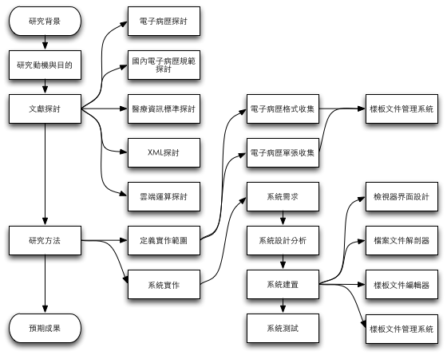
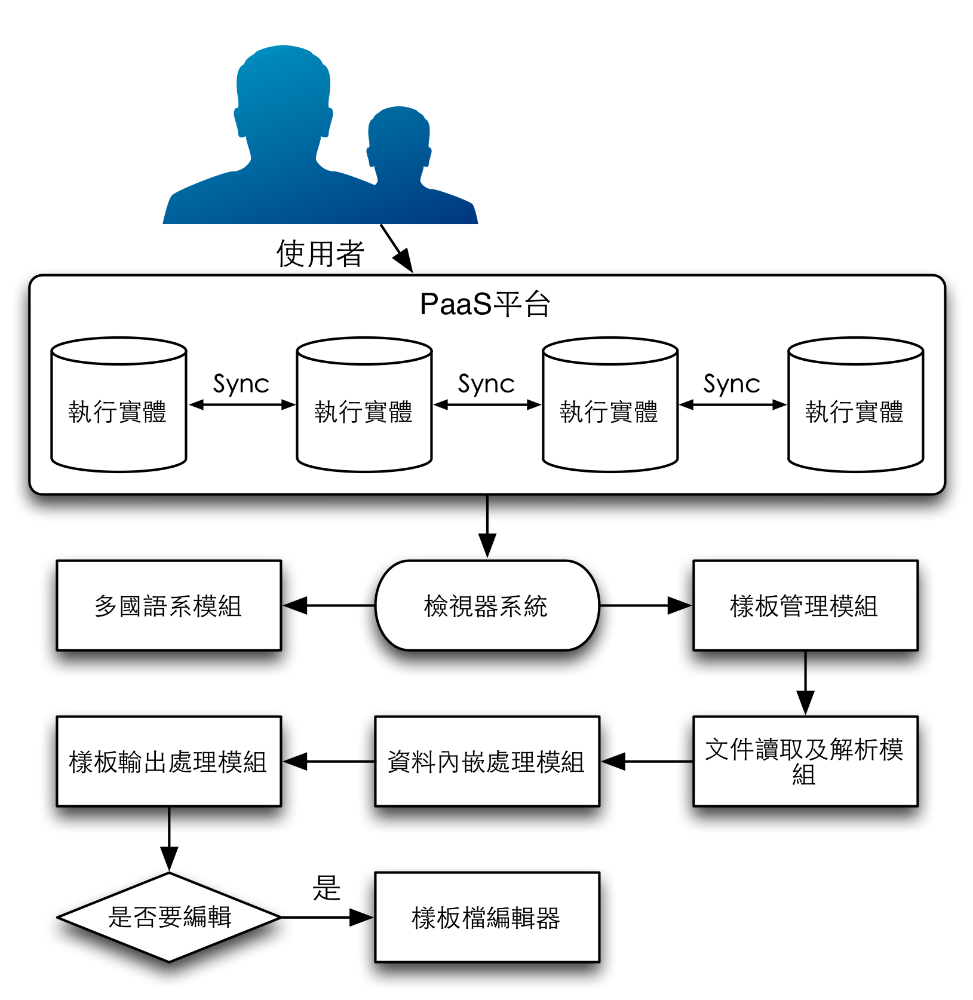

**以雲端運算平台建置電子病歷檢視器系統之整合設計與實作**
===============================================

### *Design and implementation of using a cloud computing platform to build the electronic medical record viewer integration system*
----
# 論文摘要

	暫時沒內容

**關鍵字：_電子病歷、XML、CDA、雲端、檢視器、HTML5_**

----
# 第一章 緒論

## 第一節 研究背景

鑒於國內電子病歷已施行多年，但這些資料仍存放在各家醫療單位所屬的資訊系統，無法全面互相交換，導致醫療資源無法有效的整合與利用，民眾更是無法使用散落在各醫療院所的病歷資料在每次的就醫過程中。在民國九十八年依據醫療院所在實際使用的經驗上優先選取了常用的108份表單，並且制定了電子病歷表單的欄位與資料格式標準，直至目前為止，在民國九十九年衛生署實施的『醫院實施電子病歷及互通補助計畫』中，公告了「醫療影像報告」、「出院病歷摘要」、「血液檢驗報告」與「門診用藥」等四張病歷單張交換的欄位與格式之標準，做為目前醫院與醫院或診所間電子病歷交換互通的單張規範。同時，為了快速達到預期之目的，『99年度加速診所實施電子病歷推廣案』中，制定了「西醫門診」、「中醫門診」和「牙醫門診」等三張門診病歷單張給診所交換使用。

而目前一〇一年衛生署即將推行打造「全民健康雲」，該計劃中率先使用了微軟的Windows Azure平台，整合健康、醫療、保險等相關機構所持有的個人健康履歷，包括施打疫苗、健康檢查、就醫診療、門診用藥記錄、醫療保險等資訊。現階段產生符合標準CDA文件對於醫療單位已經是必備的條件了，為了符合接下來的這些政策及趨勢，資料交換已經不是主要的重點，而是這些資料交換後要如何有效地被利用與如何有效的讓這些資料的擁有者更有效的使用，這些重點就是在於如何呈現這些資料的結果，電子病歷的呈現方式在目前仍有極大的發展空間！

## 第二節 研究動機

鑒於目前政府積極發展電子病歷，各醫療院所也皆致力於開發各種電子病歷交換的中介程式，但資料在交換之後若要到其他醫療院所使用則必須在該院所有建置該病歷單張的匯入中介程式，倘若沒有建置這部分的程式，則失去了資料交換的意義，也因此就無法瀏覽該資料的內容，若有一平台能夠統一的讓醫護人員可以直接瀏覽這些無法匯入至系統的交換資料則能夠大幅的增加資料交換的可用性！同時也能夠提供未來若民眾可以自行攜帶電子病歷出院，民眾也可以透過此一平台瀏覽自己的病歷資料，而此一平台只需要醫療院所有提供專用的顯示樣板檔即可讓民眾隨時檢視資料。

本研究將以行政院衛生署公告的電子病歷交換標準文件為例，並且將目前實際運作的四個正式單張與診間使用的三張門診單張來製作通用的樣板檔，並且提供給各醫療院所有個製作樣板的編輯器，藉此方便開發未來還尚未正式使用108張。

## 第三節 研究目的

本研究目的在於建立一套得以使各家醫療院所產出的電子病歷互通檢視的雲端平台，透過各家醫療院所客製化的表單至其他單位檢視使用，也可協助病患自行使用此平台，迅速檢視自己的病歷資料。本系統提供給醫療院所及病患使用兩種途徑，並在系統中區分出檢視器及編輯器兩大部分。本研究具體目的為下列所述：

1. 建置一套電子病歷檢視器的雲端平台可供任何使用者與單位在任何地方使用，作為國內醫療雲的附屬應用系統。
2. 參考HL7 CDA文件架構及行政院衛生署公告之電子病歷交換標準規範書來實作本研究之檢視器及編輯器，並可以將單張範本存回病歷檔增加可攜性。
3. 提供全國醫療院所可以將建立的電子病歷表單單張範本上傳，並且可供不同醫療院所檢視病歷時可快速套用自行設計的樣板。
4. 令使用本系統的使用者可節省電子病歷導入轉換的時間與成本及人力。
5. 可以使引進本系統功能的醫療資訊系統可以利用本系統的API產生電子報表。

----
# 第二章 文獻探討

本章節依照研究目的，首先探討電子病歷，再進一步的探討目的中所使用醫療資訊標準中的HL7 CDA架構及國內電子病歷規範，最後探討XML在電子病歷中的重要性，以及HTML5與雲端運算在本研究中的重要度。

## 第一節 電子病歷

電子病歷(Electronic Medical Record, EMR)是一種由電子化方式擷取、傳送、儲存、取回、連結與處理的多媒體資料，電子病歷主要的用途為協助醫療或其相關服務。其資料內容包括病患的個人資料、問題、SOAP(主觀陳訴、客觀陳訴、病況評估、處置計畫，含醫囑(醫令)記錄)、病程紀錄、護理計畫、護理記錄、生命徵象記錄、藥物使用記錄、過去病史、家族病史、預防接種記錄，與其相關的醫療實驗室的檢驗資料與報告，和相關的檢查資料與報告(含影像診斷學報告)等，凡是相關病情必要之資訊，如相對於疫情的旅遊史，則亦可成為電子病歷的一環而成為電子病歷的資料內容[[1]]。

在全球訂立電子病歷規範標準的機構如：在美國的非營利的組織ASTM、HL7與HIMSS；在歐洲是由CEN的TC/251所制定；國際標準化組織(ISO)的TC215也參考其他標準組織所建立的標準來制定其電子病歷標準。開放原始碼組織也建立並發表了電子病歷的規格與導入，被澳洲與部分歐洲國家所採用；加拿大的Canada Health Infoway在建置與應用電子醫療資訊系統；國內的衛生署，則以先訂立法規給予電子病歷可取代紙本病歷的法律地位來促進電子病歷上路使用，目前已有醫院據此開始實施電子病歷的儲存與資料交換[[1]]。

### 壹 國內電子病歷規範

在民國94年12月衛生署完成了「醫療院所病歷電子化現況調查」，在結果中顯示了國內醫院的病歷電子化發展已經相當普及，其中共計約有半數醫院的病歷資料已進行電腦化，大約三成醫院病歷電子化已進展至院內整合階段並逐漸邁向院際之分享與交換應用，顯示出在過去推動病歷電子化之發展已具有初步成效，應順勢大力推展[[2]]。

病歷電子化之願景希望讓病人可在任何一家醫院，透過健保IC卡及醫師之醫事憑證IC卡，且在病人同意及醫師授權之情形下，完整的取得病人過去病史資料，提供無縫隙的照護。如此可以提供兩點目標達成：

1. 加速推動醫療院所醫療作業資訊化及病歷電子化，提升醫療照護品質及病人安全。
2. 發展健康資訊技術，促進院際病歷互通整合，減少病患重複檢驗檢查及用藥，提升醫療資源運用效能。

其中，在衛生署的計畫中指出，至目前為止的推動工作年度目標與實際成果應該有如下表所示[[2]]

<table>
	<tr><th rowspan="2">推動工作</th><th colspan="3">工作目標</th></tr>
	<tr><th>99年度</th><th>100年度</th><th>101年度</th></tr>
	<tr>
		<td>一、建立電子病歷發展規範及基礎建設</td>
		<td>制定並公告：電子病歷架構、電子病歷互通推動順序、電子病歷互通格式與代碼（醫療影像報告、血液檢驗、門診用藥紀錄及出院病摘）、索引編碼格式</td>
		<td>制定並公告：院際電子病歷互通模式及相關規範、電子病歷驗證準則、電子病歷互通格式與代碼（病理報告、手術紀錄、檢驗報告）</td>
		<td>制定並公告：電子病歷互通格式與代碼（其它有互通需求之紀錄）</td>
	</tr>
	<tr>
		<td rowspan="3">二、鼓勵及輔導醫療院所發展醫療作業資訊化、病歷電子化</td>
		<td>全國20%醫院（約100家）實施電子病歷（至少含醫療影像及報告、血液檢驗、門診用藥紀錄或出院病摘）</td>
		<td>全國23%醫院（約115家）實施電子病歷（至少含醫療影像及報告、血液檢驗、門診用藥紀錄或出院病摘）</td>
		<td>全國26%醫院（約130家）實施電子病歷（至少含醫療影像及報告、血液檢驗、門診用藥紀錄或出院病摘）</td>
	</tr>
	<tr>
		<td>14%署立醫院（約4家）實施電子病歷</td>
		<td>18%署立醫院（約5家）實施電子病歷</td>
		<td>23%署立醫院（約6家）實施電子病歷</td>
	</tr>
	<tr>
		<td>全國10%診所（約2,000家）實施電子病歷</td>
		<td>--</td>
		<td>--</td>
	</tr>
	<tr>
		<td rowspan="2">三、推動院際電子病歷互通</td>
		<td>累計50家醫院可提供跨院查詢電子病歷（醫療影像及報告）</td>
		<td>累計55家醫院可提供跨院查詢電子病歷（醫療影像及報告、血液檢驗、門診用藥紀錄或出院病摘）</td>
		<td>累計75家醫院可提供跨院查詢電子病歷（醫療影像及報告、血液檢驗、門診用藥紀錄或出院病摘）</td>
	</tr>
	<tr>
		<td colspan="3">病人等候影像報告產出時間由平均7天縮短至1-2天</td>
	</tr>
</table>
表1 衛生署電子病歷系統計畫推動的工作成果整理[[2]]

除以上達成的目標以外，在民國99年也已經推廣了國內兩千家以上的診所（包含西醫、中醫及牙醫診所），符合「醫療機構電子病歷製作及管理辦法」各項條款規定。更在民國100年辦理了100年度「醫院實施電子病歷及互通補助計畫」，並且建置電子病歷交換中心，計有142家醫院完成介接(檢測服務)[[2]]。

## 第二節 臨床文件架構

HL7臨床文件架構(Clinical Document Architecture, CDA)是一個應用於臨床文件上的可延伸標記式語言(eXtensible Markup Language, XML)，並且是根據HL7第三版的參考資訊模型(Reference Information Model, RIM)、資料型別及詞彙等標準所組成的檔案格式。CDA標準也被國際標準組織(International Organization for Standardization, ISO)及美國國家標準協會(American National Standards Institute, ANSI)認可。在早期，CDA稱為病人記錄架構(Patient Record Architecture, PRA)，而CDA R1在1991年時被HL7會員所認同且在2000年被ANSI認可，它是根據初期HL7 RIM草案、資料型別及詞彙而來。CDA R2在2005年1月被HL7所認可，隔年成為ANSI的標準[[3]]。

CDA定義了完整的訊息項目，內容中可以包含文字、影像、聲音和其他多媒體內容。一份CDA文件應具有下列六個特點[[4]]：

1.	不變性(Persistence)：一份臨床文件必須在不被修改的情況下，依照規定的時間保存且不可再被修改(採用XML格式可用電子檔案的方式永久儲存)
2.	管理性(Stewardship)：儲存後的文件必須交由可信賴的機構管理
3.	驗證性(Potential for authentication)：一份由各種資訊所組成的臨床文件應包含有法律效力的認證
4.	關聯性(Context)：一份臨床文件有一定的基本格式並且互相關聯
5.	完整性(Wholeness)：整份文件須經過認證簽署而非只有部份文件且不可分塊
6.	易讀性(Human readability)：一份臨床文件必須要是人們可以閱讀的

而CDA的發展，希望能達到以下幾點目標[[4]]：

1.	優先考量對病患的照護
2.	在符合成本效益的條件下，盡可能的將做最廣泛的推廣，好讓不同技術層面的使用者可以進行人可易讀的文件交換
3.	讓使用這個資訊架構下所產生之資料能長久的使用
4.	文件進行交換後，處理與應用能更加廣泛
5.	能夠與大多數的文件具有軟體相容性
6.	進行交換並不依賴架構底層的傳輸或是儲存
7.	設計的準備相當快速
8.	讓設計者能夠管控自己對資料的要求，不需要再對此增加描述

一份CDA文件是由Header與Body兩部份所組成，整份文件是由`<ClinicalDocument>`的標籤所包含起來。Header的內容是要用來識別文件，其中包含身份驗證、病人、提供者與其他參與醫療服務人員的資訊，並可以分為以下三類[[4]]：

1.	`Attributes`：定義文件識別之資訊、版本、時間等。
### 2.	`Participant`：對文件的參與者定義了不同的角色，產生文件者(`Author`)、管理者(`Custodian`)、記錄對象(病患)(`RecordTarget`)、文件認證者(`Authenticator`)、文件最後認證者(`LegalAuthenticator`)、資訊接收者(`InformationRecipient`)、輸入資料者(`DataEnterer`)、可提供描述對象相關資訊(`Informant`)、文件的其他參與者(`Participant`)。
3.	`Relationships`：定義病患在醫療過程中的其他資料，共五個部分：`relatedDocument`相關文件(Parent Document)、`inFullmentOf`產生此文件之醫令(Order)、`documentationOf`所要執行之項目(Server Event)、`componentOf`臨床資料(Encompassing Encounter)及`Authorization`相關之同意書(Consent)。
而Body的內容則包含所有臨床上的資訊，如醫囑、醫令、檢驗報告等等，並將每個內容分成區塊再加以描述，在內包含有兩種資料型態，一種是非結構化區塊`<NonXMLBody>`，另一種是結構化區塊`<StructuredBody>`。
	1.	`NonXMLBody`：非結構化的資料，會將資料直接存放至`<text>`標籤中。裡面可以是任何包含人類可讀數據的資料類型，如：文字檔(txt、rtf、html或pdf)或影像檔(gif、jpg、jpeg、png、tiff)，若資料可用XML表示，則不會放在NonXMLBody之中[[5]]。
	2.	`StructureBody`：結構化標記的資料，由一個或多個組件(Section Component)所組成，且可接受巢狀之組合。透過Section的方式來描述臨床內容，如檢驗結果、診斷內容等等，且Section間不會互相影響，而在Section中常用來描述文件內容的有下列幾個欄位：
		* `Code`：每一個Section中，必須要有一個識別代碼，用來說明該Section所代表的內容，在HL7協會中以LOINC代碼做為範例。
		* `Title`：用來表示此項Section的標題，可以呈現臨床文件內容中部分的意義。
		* `Text`：用來存放所需要呈現內容的地方，也是用來存放臨床文件敘述或報告的地方。

因為Section是一種敘述型態的區塊，它是屬於human-readable的部份，相對於電腦在Section就無法處理與解析，CDA Entry就代表著在CDA文件之中可由電腦處理的部份，Entry規範Section內容應包含哪些欄位及編碼的細項資訊。CDA定義了數種Entry Act，分別為：

* `Observation`：代表一種觀察的聲明或是具體事實的描述。
* `RegionOfInterest`：描述某個參考圖像的特定區域。
* `ObservationMedia`：描述該CDA文件所包含的多媒體參考，此多媒體在意義上屬於該文件的一部份，但文件本身並不內嵌多媒體。
* `SubstanceAdministration`：用來描述與藥物有關的事件。
* `Supply`：用來描述其它Entry act所不足的內容。
* `Procedure`：描述手術的相關內容。
* `Encounter`：描述與病患相關事項。
* `Organizer`：描述事件的共同關係或組織。
* `Act`：不符合上述類別之事件均可用此類別描述。

## 第三節 XML

可擴展標記語言(eXtensible Markup Language, XML)是一種標記式語言。標記指電腦所能理解的訊息符號，使用此種標記，電腦與電腦之間可以互相處理包含各種訊息的資料。XML是從標準通用標記式語言(Standard Generalized Markup Language, SGML)中簡化修改出來的。它主要用到的有可延伸標記式語言、可延伸樣式語言(eXtensible Stylesheet Language, XSL)、可擴展商業報告語言(eXtensible Business Reporting Language, XBRL)和XML路徑語言(XML Path Language, XPath)等[[6]]。

XML是設計用來傳輸及儲存資料資訊，不是用來顯示或呈現資料，相對的HTML則是用來呈現資料，所以XML的主要用途如下[[6]]：

* 豐富文件(Rich Documents) - 自定檔案描述並使其更豐富
	* 屬於檔案為主的XML技術應用
	* 標記是用來定義一份資料應該如何呈現
* 中繼資料(Metadata) - 描述其它檔案或網路資訊
	* 屬於資料為主的XML技術應用
	* 標記是用來說明一份資料的意義
* 配置檔(Configuration Files) - 描述軟體設定的參數

依照[[7]]-[[8]]的XML規範定義中指出，XML的設計目標是：

1. XML應該要直接可用於網際網路上
2. XML應該可支援使用於各種應用上
3. XML應能與SGML相容
4. 處理XML文件應該易於寫入程序
5. 在XML文件中可選擇的功能應減至最少，最好為無
6. XML文件應該要是人可閱讀的且明確理解的
7. XML設計應可迅速編寫
8. XML文件設計應該要正式且簡潔的
9. XML文件應該要易於建立
10. 簡潔的XML標記是基本的

## 第四節 HTML5

HTML5草案的前身名為Web Applications 1.0，是在2004年由WHATWG提出，再於2007年獲W3C接納，並成立了新的HTML工作團隊。它是HTML下一個主要的版本，現在仍處於發展階段。目標是要取代1999年所制定的HTML 4.01和XHTML 1.0標準，以期望能在網際網路應用迅速發展的時候，使網路標準符合現代的網路需求。廣義的說HTML5，實際指的就是包括HTML、CSS和JavaScript在內的一套技術集合。它希望能夠減少瀏覽器需要外掛程式的豐富性網路應用服務(plug-in-based rich internet application, RIA)，如Adobe Flash、Microsoft Silverlight，與Oracle JavaFX的需求，並且能夠提供更多有效增強網路應用的標準[[9]]。

圖4 HTML5 Logo(W3C)[[19]]

在2010年的4月時Steve Jobs發表了一篇名為「對Flash的思想」的文章[[10]]，內容中指出隨著HTML5的發展，觀看視訊或其它內容時，Adobe Flash將不再是必須的。這引發了開發人員間的爭論，包括HTML5雖然提供了增強的功能，但開發人員必須考慮到不同瀏覽器對標準不同部分的支援程度的不同，以及HTML5和Flash間的功能差異。

在HTML5中，比起HTML 4.01多出了更多的RIA支援，也增加了以往要使用Flash等外掛程式才能使用的API資源，這些API現在都透過瀏覽器原生就可以存取使用[[9]][[11]]，其規範和相關的技術詳細請參考[[9]]-[[20]]。

* 即時二維繪圖 - Canvas API：有關動態產出與渲染圖形、圖表、圖像和動畫的API
* 定時媒體播放 - HTML5 音訊與視頻：HTML5裡新增的元素，它們為開發者提供了一套通用的、整合的、腳本式的處理音訊與視頻的API，而無需安裝任何外掛程式
* 離線儲存資料庫(離線網路應用程式)[[12]]：可以讓網頁不需要網路的狀態下儲存資料或存取資料，等有網路的時候再依照設計的模型決定是否要與伺服器同步資料
* 編輯：讓網頁直接編輯，不再需要透過編輯器或所見即得編輯器
* 拖放：使檔案的選擇不需要經由系統的對話視窗選擇即可使用拖放的方式將檔案放置在網頁中讓應用程式讀取資料
* 跨文件通訊[[13]]：可以跨不同的頁面或者網站的文件通訊，前提是有設定好一致的通訊tag
* 通訊/網路 - Communication APIs：構建實時和跨域(cross-origin)通訊的兩大基礎：跨文件通訊(Cross Document Messaging)與XMLHttpRequest Level 2
* 瀏覽歷史管理
* MIME和協議處理程式時表頭登記
* 微資料

以上技術是WHATWG HTML說明文件所列述的內容，但並沒有全部包括在W3C HTML5的文件里。[[14]]一些相關的技術，像下面所列的，並沒有包括在這兩份文件中的任何一份中。W3C給這些技術單獨公開了說明文件。

* Geolocation API：使用者可共享地理位置，並在Web應用程式的協助下使用位置感知服務(location-aware services)
* 索引資料庫API(Indexed Database API, 以前為WebSimpleDB)[[15]]
* 檔案API：處理檔案上傳和操縱檔案[[16]]
* 目錄和檔案系統：這個API是為了滿足客戶端在沒有好的資料庫支援情況下的檔案儲存要求[[17]]
* 檔案寫入：從網路應用程式向檔案裡寫資料內容[[18]]

目前對於HTML5普遍的誤解是HTML5能夠在網頁中提供動畫效果。實際上HTML5的動畫效果是由JavaScript和CSS互相使用而達成的。

## 第五節 雲端運算

雲端運算是一種基於網際網路的運算方式，這種方式是繼1980年代的大型電腦到主從式架構的大轉變之後的再次巨變。雲端運算通常可以認為包括以下三個層次的服務：基礎設施即服務(Infrastructure as a service, IaaS)，即是使用「基礎運算資源」，如處理能力、儲存空間、網路元件或中介軟體，使用者能掌握作業系統、儲存空間及已部署的應用程式和網路元件(如防火牆、負載平衡器等)，但並不掌握雲端基礎架構。例如: Amazon AWS；平台即服務(Platform as a service, PaaS)，即是使用主機操作應用程式，使用者有掌控運作應用程式的環境(也擁有主機部分掌控權)，但並不掌控作業系統、硬體或運作的網路基礎架構。使用的平台通常是應用程式基礎架構。例如: Google App Engine；軟體即服務(Software as a service, SaaS)，即是使用應用程式，但並不擁有作業系統、硬體或運作的網路基礎架構，是一種服務的觀念基礎，軟體服務的供應商以租賃的方式提供客戶服務，而非購買，比較常見的模式是提供帳號密碼來操作使用。例如: Microsoft CRM。這些雲端運算服務通常透過瀏覽器存取，讓軟體和資料可在資料中心儲存和使用。

根據美國國家標準和技術研究院的定義[[21]]，雲端運算服務應該具備以下幾條特徵：

* 需要時即可使用的自助服務：不需要人的操作即可以自動化的將需要的資源啓用
* 寬頻網路存取：使用任何的網路或裝置存取
* 資源池：可以將資源集合在一起，並且可以提供多人共享使用
* 可快速重新佈署：當有需求的時候可以自動化的重製來擴展服務寬度
* 可被監控與量測的服務：讓系統可以很清楚的知道使用的狀況，並且可以控制和優化使用的資源

除此之外通常還有以下認知特徵[[22]]：

* 基於虛擬化技術快速部署資源或獲得服務
* 減少使用者端的處理負擔
* 降低使用者對於IT專業知識的依賴

在具有上述特徵的狀況下，三層次的服務還可以衍變為下列七種服務模式[[23]]：

1. 儲存即服務(Storage as a service, STaaS)
2. 安全即服務(Security as a service, SECaaS)
3. 資料即服務(Data as a service, DaaS)
4. 測試環境即服務(Test environment as a service, TEaaS)
5. 桌面虛擬化(Desktop virtualization)
6. 應用程式界面即服務(API as a service, APIaaS)
7. (行動)終端即服務((Mobile) Backend as a service, (M)BaaS)

在雲端運算的部署方式主要分為四種[[22]]：

1. 公用雲(Public Cloud)：可透過網路及第三方服務供應者開放給客戶使用，但並不一定代表「免費」，可能代表免費或相當廉價，公用雲並不表示使用者資料可供任何人檢視，供應者通常會對使用者設定使用存取控制機制，公用雲作為解決方案是既有彈性又具備成本效益
2. 私有雲(Private Cloud)：具備許多公用雲環境的優點，例如彈性、適合提供服務，兩者差在於私有雲的資料與程式皆在組織內管理，且與公用雲不同，不會受到網路頻寬、安全疑慮或法規限制影響；此外，私有雲服務讓供應者及使用者更能掌控雲端基礎架構、改善安全與彈性，因為使用者與網路都受到特殊限制
3. 社群雲(Community Cloud)：由眾多利益相仿的組織掌控及使用，例如特定安全需求、共同宗旨等。社群成員共同使用雲端資料及應用程式
4. 混合雲(Hybrid Cloud)：結合公用雲及私有雲，在這種模式中，使用者通常將非企業關鍵資訊外包，並在公用雲上處理，但同時掌控企業關鍵服務及資料

集合了上述的各種特徵與部署方式，稱之為雲端運算的核心特性至少有下述幾點[[22]]：

1. 應用程式介面(API)的可達性是指允許軟體與雲端以類似「人機互動這種使用者介面的互動相互一致的方式」來互動
2. 裝置允許使用者透過網頁瀏覽器來獲取資源，而不論使用者是透過何種裝置，或在何地使用(如：電腦、筆記型電腦或手機、行動裝置等)，使用者可以從任何地方來以網際網路的方式取得資源
3. 如果使用多個多個站點，則改進可靠性，這讓設計的雲端運算符合商業一致性以及災難備援
4. 效能受到監控，同時使用web services作為系統的管理介面
5. 維護雲端運算應用程式應該是很簡單的，因為使用者已經不再需要在本機上進行安裝。一旦更新到了使用者端，它們將更容易的得到支援以及改進

----
# 第三章 研究方法

本章節依序說明研究步驟、系統需求分析與設計、相關技術應用及開發環境與工具。

## 第一節 研究步驟

本研究會設計一個電子病歷的檢視平台，並且提供各醫療院所及民眾使用，主要提供醫療院所做為一個資料交換後的中介檢視平台，以便那些還尚未部屬完成電子病歷匯入程式的單位使用，並且可以在線上開發其他單張所需的檢視模板，也可提供給民眾使用。最後將探討電子病歷之架構及相關電子病歷之雲端應用研究，並且以實作的方式建立此系統平台完成本研究之計畫。其詳細的研究流程從研究背景、動機及目的、文獻探討、研究方法與預期成果如圖1所示。

### 壹 研究流程

圖1 研究流程圖

### 貳 系統建置流程

1. 研究CDA文件架構
	
	研究CDA文件內的架構與模型、參考方式、資料屬性及詞彙等，研究文件的階層及儲存位置還有形態等內容。
	
2. 分析電子病歷文件單張
	
	為了區分出每個單張的不同，以及辨識不同單張所需的樣板檔，必須先瞭解電子病歷文件中所記錄的代碼為何種意義，以便瞭解哪個代碼的特性為何，並且針對該代碼來作為區分用途。
	
3. 研究XPath使用特性
	
	在電子病歷文件中接使用XML來儲存內容，若要萃取出資料則必須要有選擇，而在XML文件中要萃取出需要的資料則是要先瞭解XPath內的特性以及使用方式。
	
4. 訂定系統需求與系統設計
	
	針對本研究之系統訂定系統需求與系統設計，依照使用對象的不同區分為兩大部份，並在完成這兩大部份後完成本系統平台之設計。
	
	1. 醫事單位
		
		由於醫事單位有開發上的需求以及會有內部人員的需要，故在此部分會要有一個特別設計的編輯模式可供這些醫事單位可以用所見即得的方式在線上編輯樣板檔，並且可以隨時發佈變更給所有的使用者使用。
		
	2. 醫事人員與一般民眾
		
		依照使用者的喜好與習慣為原則，因此這部分會用一個類似於文件檢視器的形式來呈現最後解析處理後的電子病歷結果。
		
5. 系統開發
	
	本研究主要分為四個開發部分，並且在一連串的建置與測試後，經由電子病歷文件的引入來確認是否能夠符合不失去原始內容的呈現。
	
	1. 建置系統界面框架
	
		建置系統界面的框架，提供使用者直覺的檢視資料。其中必須提供檢視工具，包含上一頁、下一頁、直接換頁，若在個人資料法的允許下則會提供列印的功能。在檢視器的畫面中呈現出如同真實紙本資料的畫面，並且可以直接顯示圖表，或者可程式化的互動介面，使電子病歷不再只是作為資料交換的用途。而在畫面上會提供使用者可以使用拖拉的方式將檔案置入檔案解析介面中開始解析檔案。
	
	2. 檔案解析介面
	
		讓使用者可以將檔案匯入至頁面中解析資料，並且可以結合模板互相搭配呈現畫面。其中會依據電子病歷檔案內的屬性來判斷該檔案是為哪一單張的資料結構，隨之自動的配合相對應的單張樣板檔來呈現該單張的顯示介面以及互動介面。
	
	3. 模板編輯界面框架
	
		模板編輯器的界面可以提供醫療院所設計每個不同的單張所專用的顯示結果，甚至可以設計模組套件，在設計完成後即可發佈給其他設計者引用協做。
	
	4. 模板管理界面
	
		管理已經設計好的模板，並且可以編輯或者引用其他設計者所設計好的介面，另外提供版本歷程的記錄，以避免版本變更後的不預期問題發生。
	
6. 研究成果撰寫
	
	撰寫系統建置與實作結果的文件，並討論發表過程中的問題與困難點，以提供後續研究或者導入本系統之單位的後續發展與參考。

## 第二節 系統需求分析與設計

本部份分為兩個部份，第一個部份會根據需求來分析與系統架構，在第二部份會根據第一部份的結果來做系統分析與系統架構的設計。

### 壹 需求分析與系統架構

為了使電子病歷最終可以顯示成為圖表化的病歷資料，如同實際在紙本作業程序中的感受一致，故依照系統使用的相關人員而區分為三大類，以下分別說明：

* 醫事單位：負責文件樣板的設計以及開發，讓醫事人員以及一般民眾可以很容易的使用本系統瀏覽由醫院所輸出的電子病歷資料，以及和其他系統的整合應用。
* 醫事人員：可以使用本系統作為一個電子病歷的檢視，讓醫事人員可以不用等待資訊系統的匯入等待時間即可立即瀏覽內容，也可以經由本系統導入資料至醫事單位所開發整合的系統中作為存儲。
* 一般民眾：僅只有電子病歷的檢視功能，最終顯示的方式使用HTML5的方式呈現。

依照上述需求，可分析出系統與其相關使用者的關係如圖2所示。

圖2 系統架構圖

### 貳 系統分析與設計

由圖2的系統架構圖中可以得知系統中有四個部分組成運作，分別為樣板檔資料庫、樣板檔組合電子病歷形成檢視、醫事單位開發界面及外部使用的API界面，其中以開發界面最為重要，因為包含了形成檢視的檢視畫面以外，還必須有設計的功能，並且還要結合樣板檔資料庫，以便開發中引用其他樣板做進一步開發。以下將對這幾部分加以探討：

1. 樣板檔資料庫
	
	
	
2. 樣板檔組合電子病歷形成檢視
	
	
	
3. 醫事單位開發界面
	
	
	
4. 外部使用的API界面
	
	
	
## 第三節 相關技術及開發工具

本研究準備使用的開發環境、開發工具、開發程式語言如下：

- 開發環境：Macintosh OS X Mountain Lion 10.8.2、Microsoft Window 7
- 開發工具：Sublime Text 2、SourceTree、Google Chrome、Mou
- 開發語言：HTML 5、JavaScript、jQuery、jQuery UI、CSS、SASS、php、mySQL、Markdown

----
# 第四章 預期成果

以目前國內電子病歷推行發展的狀況約有上百單張，若除去目前正式使用的4張單張以外，希望還有更多草案階段的單張能夠順利推行。各家醫療院所若皆能使用本系統開發表單及介接程式，本研究同時也會收集各家使用單位所設計出的病歷單張表單樣板檔，希望能藉此令電子病歷的表單樣板制定能夠減少民眾在瀏覽閱讀時的疑惑及不便。

本研究預期將完成設計出一套電子病歷檢視器的雲端應用平台，供使用者在任何有網路的環境皆能使用此一平台瀏覽手邊的電子病歷資料，並且可以讓醫療院所自行插入該單位設計的樣板檔，讓使用者可以直接瀏覽使用也不影響檔案在各單位之間的資料交換，除資料交換以外也可以讓醫療資訊系統呼叫引用本系統的功能，以達到SaaS的服務，期望在此系統平台完成後，能夠有多家單位使用，並能夠對臺灣的電子病歷交換能夠有所幫助！

----
# 第五章 可能遭遇的困難

* 雲端平台建置：礙於經費上的問題導致無法實際建置雲端平台之平台與購置設備，故目前必須使用協力廠商或其他解決方案，因此現行架構上使用虛擬化架構來作為未來環境建制的測試環境。
* 電子病歷交換標準單張：由於目前上線使用的交換單張有「醫療影像報告」、「出院病歷摘要」、「血液檢驗報告」與「門診用藥」等四張病歷單張，以及「西醫門診」、「中醫門診」和「牙醫門診」等三張門診病歷單張，其餘尚未正式使用的108張單張所使用的資料因為還沒正式使用，所以目前無法收集到其正確分辨單張用的資料欄位，因此系統上需要額外有一個單張對應的模組區塊，並且可以隨著政策的變化一起同步的更新。

----
# 參考文獻

1. [電子病歷 - Wikipedia][1]
2. [行政院衛生署電子病歷推動專區][2]
3. [K. W. Boone, "The CDA Book": Springer-Verlag London, 2011.][3]
4. [Robert H, Liora A, Sandy B, Calvin B, Fred M, Paul V, Amnon S, “HL7 Clinical Document Architecture, Release 2.0,” ANSI, 2005.][4]
5. [T. Benson, "Clinical Document Architecture", Principles of Health Interoperability HL7 and SNOMED, pp. 145-160, 2010.][5]
6. [XML - Wikipedia][6]
7. [Tim Bray, Jean Paoli, C. M. Sperberg-McQueen, Extensible Markup Language (XML) 1.0, W3C Recommendation 10-February-1998][7]
8. [Tim Bray, Jean Paoli, C. M. Sperberg-McQueen, Eve Maler, François Yergeau, Extensible Markup Language (XML) 1.0 (Fifth Edition), W3C Recommendation 26 November 2008][8]
9. [HTML5 - Wikipedia][9]
10. [Steve Jobs, Thoughts on Flash, Apple Inc., 2010][10]
11. [Anne van Kesteren, Simon Pieters, HTML5 differences from HTML4, W3C Working Draft 25 October 2012][11]
12. [Ian Hickson, Web Storage, W3C Candidate Recommendation][12]
13. [Ian Hickson, HTML5 Web Messaging, W3C Candidate Recommendation][13]
14. [Ian Hickson, HTML Living Standard, WHATWG][14]
15. [Nikunj Mehta, Jonas Sicking, Eliot Graff, Andrei Popescu, Jeremy Orlow, Indexed Database API, W3C Working Draft][15]
16. [Arun Ranganathan, Jonas Sicking, File API, W3C Working Draft][16]
17. [Eric Uhrhane, File API: Directories and System, W3C Working Draft][17]
18. [Eric Uhrhane, File API: Writer, W3C Working Draft][18]
19. [W3C HTML5 Logo][19]
20. [Sergey Mavrody, Sergey's HTML5 & CSS3: Quick Reference. HTML5, CSS3 and APIs. Full Color (2nd Edition), 2012, ISBN: 0983386722][20]
21. [Peter Mell, Timothy Grance, The NIST Definition of Cloud Computing, National Institute of Standards and Technology Special Publication 800-145, 2011][21]
22. [雲端運算 - Wikipedia][22]
23. [Cloud Computing - Wikipedia][23]

[1]: http://zh.wikipedia.org/zh-tw/%E7%94%B5%E5%AD%90%E7%97%85%E5%8E%86 "電子病歷 - Wikipedia"
[2]: http://emr.doh.gov.tw/introduction.aspx "行政院衛生署電子病歷推動專區"
<!--以上電子病歷參考-->

[3]: http://www.medlib.am/Fulltexts/The%20CDA%20TM%20BOOK%202011.pdf "K. W. Boone, "The CDA Book": Springer-Verlag London, 2011., ISBN: 978-0-85729-335-0, e-ISBN: 978-0-85729-336-7, DOI: 10.1007/978-0-85729-336-7"
[4]: http://www.ncbi.nlm.nih.gov/pmc/articles/PMC1380194/pdf/30.pdf "Robert H, Liora A, Sandy B, Calvin B, Fred M, Paul V, Amnon S, “HL7 Clinical Document Architecture, Release 2.0,” ANSI, 2005."
[5]: http://link.springer.com/content/pdf/10.1007%2F978-1-84882-803-2_9 "T. Benson, "Clinical Document Architecture", Principles of Health Interoperability HL7 and SNOMED, pp. 145-160, 2010."
<!--以上HL7 CDA參考-->

[6]: http://zh.wikipedia.org/wiki/XML "XML - Wikipedia"
[7]: http://www.w3.org/TR/1998/REC-xml-19980210 "Tim Bray, Jean Paoli, C. M. Sperberg-McQueen, Extensible Markup Language (XML) 1.0, W3C Recommendation 10-February-1998"
[8]: http://www.w3.org/TR/2008/REC-xml-20081126/ "Tim Bray, Jean Paoli, C. M. Sperberg-McQueen, Eve Maler, François Yergeau, Extensible Markup Language (XML) 1.0 (Fifth Edition), W3C Recommendation 26 November 2008"
<!--以上XML參考-->

[9]: http://zh.wikipedia.org/wiki/HTML5 "HTML5 - Wikipedia"
[10]: http://www.apple.com/hotnews/thoughts-on-flash/ "Steve Jobs, Thoughts on Flash, Apple Inc., 2010"
[11]: http://www.w3.org/TR/2012/WD-html5-diff-20121025/ "Anne van Kesteren, Simon Pieters, HTML5 differences from HTML4, W3C Working Draft 25 October 2012"
[12]: http://www.w3.org/TR/2011/CR-webstorage-20111208/ "Ian Hickson, Web Storage, W3C Candidate Recommendation"
[13]: http://www.w3.org/TR/2012/CR-webmessaging-20120501/ "Ian Hickson, HTML5 Web Messaging, W3C Candidate Recommendation"
[14]: http://www.whatwg.org/specs/web-apps/current-work/multipage/ "Ian Hickson, HTML Living Standard, WHATWG"
[15]: http://www.w3.org/TR/2012/WD-IndexedDB-20120524/ "Nikunj Mehta, Jonas Sicking, Eliot Graff, Andrei Popescu, Jeremy Orlow, Indexed Database API, W3C Working Draft"
[16]: http://www.w3.org/TR/2012/WD-FileAPI-20121025/ "Arun Ranganathan, Jonas Sicking, File API, W3C Working Draft"
[17]: http://www.w3.org/TR/2012/WD-file-system-api-20120417/ "Eric Uhrhane, File API: Directories and System, W3C Working Draft"
[18]: http://www.w3.org/TR/2012/WD-file-writer-api-20120417/ "Eric Uhrhane, File API: Writer, W3C Working Draft"
[19]: http://www.w3.org/html/logo/ "W3C HTML5 Logo"
[20]: http://www.amazon.com/Sergeys-HTML5-CSS3-Quick-Reference/dp/0983386722 "Sergey Mavrody, Sergey's HTML5 & CSS3: Quick Reference. HTML5, CSS3 and APIs. Full Color (2nd Edition), 2012, ISBN: 0983386722"
<!--以上HTML5參考-->

[21]: http://csrc.nist.gov/publications/nistpubs/800-145/SP800-145.pdf "Peter Mell, Timothy Grance, The NIST Definition of Cloud Computing, National Institute of Standards and Technology Special Publication 800-145, 2011"
[22]: http://zh.wikipedia.org/wiki/%E9%9B%B2%E7%AB%AF%E9%81%8B%E7%AE%97 "雲端運算 - Wikipedia"
[23]: http://en.wikipedia.org/wiki/Cloud_computing "Cloud Computing - Wikipedia"
<!--以上雲端運算參考-->

----
# 檔案結尾
	此行以下已經沒有任何內容